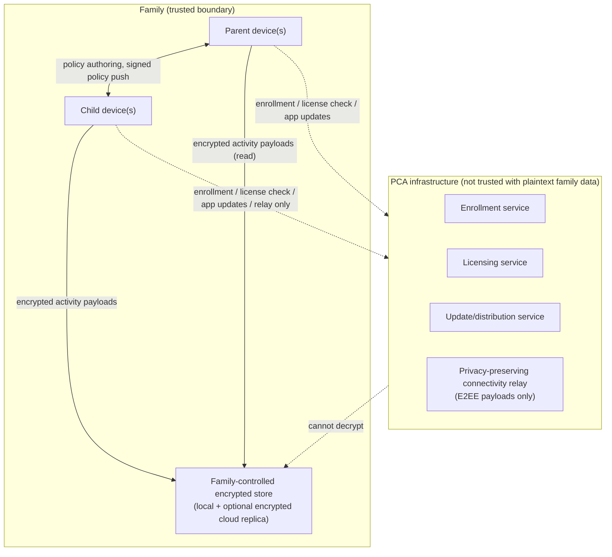

# 01 — Product Vision, Scope and Principles

Owning agent: **PCA-DOC-A**. Governed by doc 00 (Document Control).

**Package lifecycle:** `DRAFT_RECONCILIATION`. This is a design baseline, not evidence that a product capability is built, available, or accepted.

## 1. Purpose

Define what PCA is, the product principles that constrain every subsequent architecture decision, and the precise boundary between what PCA will and will not do. This document is the reference every other document must remain consistent with; where a lower-level document appears to expand PCA's data collection beyond what is described here, doc 00's authority order (Section 4) requires that conflict be raised, not silently implemented.

## 2. Vision

PCA helps parents and guardians set healthy digital boundaries for children while minimizing centralized collection of child data. The core architectural principle, restated precisely:

> The child device enforces the rules. The parent device (and the family's own encrypted store) owns the family activity data. PCA infrastructure only enables enrollment, licensing, updates and privacy-preserving connectivity.

PCA infrastructure must **never** become a central, PCA-readable database of child browsing history, location history, YouTube/app activity, photos, screenshots, messages, or behavioral profiles. This is a hard product boundary, not an implementation optimization — it is why doc 09 (Security/Privacy/E2EE) requires end-to-end encryption of family activity payloads rather than "encryption at rest with company key access."

## 3. Product promise

- Parents control family policies; PCA cannot silently change or override them.
- Child-device restrictions are transparent rather than hidden — the child always has a way to see that PCA is active and roughly what it does (see doc 26, Accessibility/Child UX, and PCA-FR-120/121 below).
- Monitoring history is retained under family control (locally on family-owned devices, or in encrypted form the family alone can decrypt), not as a readable PCA-company database.
- Arabic and English receive equal product quality — not a translated afterthought (see doc 20).
- Emergency access (SOS, emergency calling) remains available even during a break/lock state and even during a PCA cloud outage (PCA-NFR-023).
- Platform limitations are disclosed rather than disguised: where iOS or Android does not grant a capability, the UI says so rather than presenting a control that silently does nothing.

## 4. In scope

### 4.1 Parent functions

- enroll and remove child devices;
- configure screen-time and continuous-use rules (health-break engine, doc 12);
- configure app/category restrictions where the platform allows;
- configure web/content filtering (doc 14);
- view permitted activity summaries;
- view location/last-seen information (doc 16);
- configure prayer reminders (doc 17);
- approve temporary extra time / bonus-time requests;
- manage family parent roles (RBAC, doc 18);
- configure alerts/email destination (doc 19);
- select a data-retention policy (doc 11);
- delete history immediately;
- initiate authorized recovery/removal (doc 21);
- configure bedtime schedules, school-mode schedules, and per-app time limits;
- approve or deny new app installs on the child device where platform APIs support install visibility;
- configure family geofences;
- review a local/exportable family audit log of policy changes;
- export encrypted family data for the family's own backup purposes.

### 4.2 Child functions

- see remaining time and current rules;
- receive break/eye-distance/prayer reminders;
- request extra time (bonus-time request flow);
- understand what is being monitored (transparency, not covert);
- use emergency functions (SOS, emergency dialing) regardless of lock/break state;
- see protection status without secret surveillance behavior.

## 5. Out of scope

PCA will not:

- read private message contents by bypassing application security (no reading of third-party app message content via accessibility-service abuse or similar);
- record microphone conversations, ambient or otherwise;
- secretly record camera footage;
- defeat OS sandboxing, or root/jailbreak a device, or require the family to do so;
- decrypt HTTPS traffic by installing covert interception certificates (deterministic filtering and any classification operate on domain/metadata or content the app itself legitimately handles — see doc 14 Section on TLS boundaries);
- market itself for spouse/partner tracking, or any adult-on-adult covert surveillance use case;
- use family activity for advertising or commercial profiling of any kind;
- claim iOS/Android data access that the public, documented APIs do not actually provide (every capability claim in this package must carry a label per doc 00 Section 8);
- classify a person's sexual orientation, gender identity, religion, ethnicity, or any other protected characteristic as itself a harmful-content filter category. **Only explicit or otherwise age-inappropriate sexual material is filtered, and it is filtered based on content, independent of the identity or orientation of any person depicted or referenced.** This is a permanent product boundary — see PCA-FR-031A below and doc 14 Section on filter categories, and it must never be weakened by a future content-policy update without an explicit, recorded owner decision.

## 6. Product modes

### 6.1 Android Standard Mode

Normal consumer installation via standard app install (no device-owner/MDM provisioning). Provides the strongest controls available without fully managed provisioning: Usage Stats API-based app tracking, Accessibility-Service-assisted enforcement where the parent grants it, VPN-based or DNS-based local filtering, and Digital Wellbeing-adjacent scheduling. Hard, non-bypassable enforcement is **not** promised where Android does not grant it to a normal consumer app — a technically capable child with device administrator access to Settings can, in Standard Mode, uninstall or disable the app; doc 21 documents exactly what tamper-detection and parent notification exists to make that visible rather than silent. Label: `VERIFIED_WITH_LIMITATION` (capabilities real but bypassable by a sufficiently capable child without Protected Mode).

### 6.2 Android Protected Mode

Managed/device-owner-style provisioning where legitimately supported and distributable (e.g. via Android Enterprise "dedicated device" / COPE-style provisioning flows intended for organization-owned or family-owned devices, subject to Google's actual distribution terms for this use case). Provides stronger package-control, lock-task, and anti-uninstall mechanisms because the app can hold Device Policy Controller (DPC) privileges. This mode requires explicit compatibility and store/distribution validation before it can be advertised as available — label: `REQUIRES_FURTHER_OWNER_DECISION` pending confirmation that Google's Android Enterprise distribution terms permit a consumer parental-control app to provision itself as a DPC on a family-owned device outside a formal enterprise/EMM console relationship. See doc 06 and doc 21 for the detailed mechanism and doc 33 for the pending citation.

### 6.3 iOS Family Controls Mode

Uses Apple's Family Controls, Managed Settings, and Device Activity frameworks with parent/guardian authorization (`AuthorizationCenter` child-authorization flow) and the required distribution entitlement. Uses Apple's privacy-preserving opaque tokens (`ApplicationToken`/`WebDomainToken`/`ActivityCategoryToken`) and Managed Settings "shields" rather than unrestricted surveillance — Apple's design intentionally prevents even the controlling app from learning exactly which app/domain a token represents beyond what Apple's own picker UI shows the parent. Label: `REQUIRES_ENTITLEMENT` (the Family Controls entitlement is granted by Apple on request and is not automatically available to every developer account) — see doc 07 and doc 33.

### 6.4 Mode-selection and fallback principle

**PCA-FR-000A** The product MUST determine at runtime (per device, per OS version, per provisioning state) which mode is actually available and MUST NOT present a control whose backing capability is unavailable in the current mode without a clear "unavailable on this device" state, per doc 00 Section 8 and PCA-FR-044.

## 7. Commercial principle

Preferred model: family subscription or license (recurring or one-time family license), not a free-with-ads or data-monetization model. No behaviorally targeted advertising and no sale of child/family monitoring data, ever, to any party — including affiliates, analytics partners, or data brokers. This is reinforced by PCA-FR-123 and PCA-NFR-060–063.

## 8. Scope diagram

## 9. Assumptions

- Families have at least one adult (Family Owner) capable of completing strong authentication on a parent device.
- At least one parent device and at least one child device have periodic (not necessarily continuous) internet connectivity for enrollment, licensing, and policy/update distribution; offline operation of already-issued policy is required (PCA-NFR-020) but initial enrollment requires connectivity.
- The product is distributed through the Google Play Store and Apple App Store as the primary channels; sideloading/APK distribution for Android Protected Mode is a separate, explicitly validated distribution path (see doc 25).
- The family, not PCA, is the data controller for family activity data in applicable privacy-law senses; PCA is a processor/infrastructure provider only for enrollment, licensing, updates and encrypted relay metadata. This assumption requires legal review and is tracked as an open decision (Section 11).

## 10. Platform limitation summary (cross-reference)

| Claim area | Android Standard | Android Protected | iOS Family Controls |
|---|---|---|---|
| Hard anti-uninstall | `UNSUPPORTED` (visible only) | `VERIFIED_WITH_LIMITATION` (REQUIRES_MANAGED_DEVICE) | `VERIFIED_WITH_LIMITATION` (REQUIRES_ENTITLEMENT; child cannot delete app while authorized, but a device-passcode-level parent/guardian action can) |
| App usage duration | `VERIFIED_WITH_LIMITATION` (REQUIRES_USER_PERMISSION — Usage Access) | `VERIFIED_WITH_LIMITATION` | `VERIFIED_WITH_LIMITATION` (Device Activity Report, opaque tokens only) |
| Exact-video / complete account watch history in normal YouTube (Mode A) | `UNSUPPORTED` as a PCA product promise — Mode A is duration-only; see PCA-FR-051 | `UNSUPPORTED` as a PCA product promise | `UNSUPPORTED` as a PCA product promise |
| Location | `REQUIRES_USER_PERMISSION` | `REQUIRES_USER_PERMISSION` | `REQUIRES_USER_PERMISSION` |

Full detail lives in the platform-specific documents (06, 07) and the feature documents (12–17); this table exists only to keep doc 01's scope claims consistent with them.

## 11. Unresolved owner decisions

| Decision ID | Topic | Options | Recommendation | Status |
|---|---|---|---|---|
| PCA-DEC-001 | Legal data-controller role for family activity data | (a) Family is sole controller, PCA is processor only; (b) PCA is joint controller for enrollment metadata only, family is sole controller for activity payloads | (b) — cleanest split matching the technical E2EE boundary | PROPOSED |
| PCA-DEC-002 | Android Protected Mode distribution legality/mechanism (DPC provisioning for a consumer app outside formal EMM) | (a) Pursue Android Enterprise "dedicated device" provisioning; (b) Restrict Protected Mode to a documented ADB/QR device-owner provisioning flow at family setup time only; (c) Drop Protected Mode, ship Standard Mode only | (b) subject to documented, store-policy, and distribution validation; this is not a claim that consumer DPC distribution is currently approved | PROPOSED |
| PCA-DEC-003 | Default first-enrollment retention window (see also PCA-FR-101 in doc 03) | 14d / 1m / 3m / 6m / 9m | 1 month | PROPOSED |

## 12. Dependencies

- Doc 00 for governance/versioning rules this document must follow.
- Doc 02 for the persona/role definitions referenced in Section 4.
- Docs 06/07 for the platform-mode technical detail summarized in Section 6.
- Doc 09 for the E2EE mechanism that makes Section 2's "PCA cannot read" claim technically true rather than aspirational.

## 13. Future acceptance evidence

These are future evidence gates for independent review. They are intentionally unchecked while the package lifecycle is `DRAFT_RECONCILIATION`.

- [ ] No document in the package describes a PCA server-side capability to read plaintext family activity data.
- [ ] Every "out of scope" item in Section 5 has a corresponding enforcement or design control referenced in a downstream document (E2EE for message-reading, no-mic-access permission model for microphone, etc.).
- [ ] Section 6 mode claims match doc 06/07 exactly; any divergence is a defect against this document or against 06/07.
