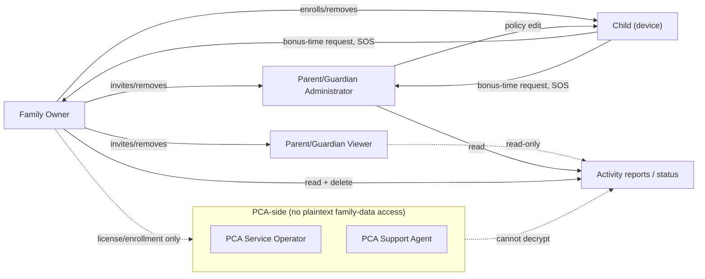

# 02 — Stakeholders, Personas and Roles

Owning agent: **PCA-DOC-A**. Governed by doc 00 (Document Control).

## 1. Purpose

Define every human role that interacts with PCA, the permissions each role holds, the trust boundary each role sits inside, and the persona context (goals, concerns, typical scenarios) that the functional requirements in doc 03 must serve. This document is the authority for role-based access control design in doc 18.

## 2. Scope

Covers family-side roles (Family Owner, Parent/Guardian Administrator, Parent/Guardian Viewer, Child) and PCA-side roles (Service Operator, Support Agent). Does not define UI copy or exact RBAC permission-matrix implementation (doc 18) — this document defines the *authoritative* permission set each role is entitled to; doc 18 must implement, not redefine, it.

## 3. Family roles

### 3.1 Family Owner

**Persona summary**: The adult who initiates the family (typically a parent), completes the first strong authentication, and holds ultimate recovery authority. Primary goal: set up protection quickly without becoming a permanent bottleneck for every family decision, while retaining the ability to recover control if something goes wrong (lost device, forgotten credentials, a co-parent leaving the household).

**Permissions**:
- all child devices;
- all policies;
- parent membership (invite/remove Parent Administrators and Viewers);
- recovery keys / recovery-flow initiation;
- billing/license settings;
- retention/deletion policy selection and immediate deletion;
- device removal (child device un-enrollment).

**PCA-FR-002A** A family MUST have exactly one Family Owner at any time; ownership transfer is a first-class, audited flow (not a role edit), covered in doc 21.

### 3.2 Parent/Guardian Administrator

**Persona summary**: A co-parent, or another adult guardian (e.g. grandparent, older sibling caregiver) who needs day-to-day policy control but is not the account's ultimate recovery authority.

**Permissions**: May manage child policies (screen-time, content filtering, bedtime/school mode, bonus-time approval) and review permitted reports (activity summaries, location/last-seen), but cannot transfer ownership or replace the family recovery authority unless explicitly delegated by the Family Owner through the ownership-transfer flow (doc 21).

### 3.3 Parent/Guardian Viewer

**Persona summary**: An adult who wants visibility (e.g. a non-custodial parent with agreed visibility rights, or a trusted relative) but should not be able to change policy.

**Permissions**: Read-only family status and activity reports. No policy changes, no billing access, no device removal, no recovery-key access.

### 3.4 Child

**Persona summary**: The subject of parental-control policies. Age range spans young children (who may not read fluently) through teenagers (who understand and may actively try to work around restrictions). The product must serve both without shaming or infantilizing older children — see doc 26 for age-appropriate UX tiers.

**Access**: transparency of what is monitored (PCA-FR-120/121), remaining-time and current-rule visibility, bonus-time request submission, emergency functions (SOS/emergency dial) regardless of lock state. **Cannot** receive parent-only secret credentials (recovery keys, parent authentication material) and cannot self-elevate to any parent role.

### 3.5 Non-family third parties (explicitly not a role)

PCA defines no role for a school, employer, or non-family institution to view family data, and no role for a partner/spouse to covertly monitor another adult. Any product surface that could be misused this way is a threat-model item (doc 24), not a supported role.

## 4. PCA-side roles

### 4.1 PCA Service Operator

**Persona summary**: Internal PCA staff responsible for keeping enrollment, licensing, and update-distribution infrastructure available.

**Permissions**: May administer service availability, license records, and software delivery (release channels, staged rollouts). **Must not** have technical access to decrypt family monitoring payloads — this is enforced architecturally (E2EE, doc 09), not merely by policy, so this role's permission boundary is a statement of what the *system* denies, not only what an operator is instructed not to do.

### 4.2 PCA Support Agent

**Persona summary**: Customer-support staff who help a parent with account/enrollment problems (lost device, license transfer, retention-setting confusion).

**Permissions**: May view account/enrollment metadata necessary for support (license state, device-enrollment status/timestamps, support-ticket history) but not family activity content (browsing/app/location history) and not family private keys. Where a support flow requires the family to demonstrate a problem (e.g. "my filter is blocking the wrong site"), the family shares specific evidence voluntarily and out-of-band (e.g. a screenshot the parent chooses to attach to a ticket) rather than the agent having standing query access to family data stores.

## 5. Family structure

A family may contain:
- 1 Family Owner;
- 0..N Parent/Guardian Administrators;
- 0..N Parent/Guardian Viewers;
- 1..N children;
- 1..N devices per child, subject to the family's subscription/license tier (doc 18 defines the exact tier-to-device-count mapping).

**PCA-FR-004A** The product MUST support at least 2 parent roles and at least 2 children with at least 1 device each on the base family tier, since single-parent-single-child is not the only common household shape.

## 6. Role-assignment rules

- Parent roles require adult authentication in the product flow (age assertion plus, where the jurisdiction/product tier requires it, stronger identity signal — exact mechanism is a doc 08/09 concern).
- Role changes are auditable locally to the family (recorded in the local/exportable family audit record, PCA-FR-124) — not silently applied.
- Removing the Family Owner requires the recovery/ownership-transfer flow (doc 21); it is never a simple "delete member" action.
- Child devices never become administrative authorities: no code path allows a child-role session to grant itself, or any other session, a parent permission.
- Parent-to-parent data synchronization uses family encryption keys (per doc 09's key hierarchy), not shared plaintext passwords copy-pasted between devices.

## 7. Trust boundaries

- **Parent device**: trusted for family-policy administration *after* strong authentication succeeds. Compromise of an authenticated parent device is treated as a family-security incident (doc 24), not a normal-operation case.
- **Child device**: trusted to enforce signed family policy, but assumed tamper-attemptable — a technically capable child (especially a teenager) is an expected adversary against the enforcement mechanism, not an edge case. Doc 21 designs specifically against this.
- **PCA servers**: trusted for availability and enrollment/licensing/update routing, **not** for confidentiality of family activity. This is the load-bearing trust statement the whole package must remain consistent with (doc 00 Section 4 authority order exists partly to protect this claim from erosion).

## 8. Role interaction diagram

## 9. Assumptions

- Age-of-majority for "adult" parent-role authentication follows the jurisdiction the family's account is registered in; PCA does not attempt independent legal age verification beyond what app-store account requirements already provide. Flagged as a compliance dependency in doc 25.
- A "Child" in this document means any family member under the Family Owner's parental authority who has a monitored device; PCA does not distinguish product behavior by exact age except where a feature (e.g. content-filter strictness defaults, doc 14/26) is explicitly age-tiered.

## 10. Failure modes

| Failure | Impact | Mitigation |
|---|---|---|
| Family Owner loses all authentication factors and recovery material | Family locked out of policy administration | Doc 21 recovery flow; if recovery material is also lost, family must re-enroll (data loss disclosed up front, not silently) |
| A Parent Administrator account is phished/compromised | Attacker can change policy, view reports | Audit log (PCA-FR-124) makes this visible to Owner/other Admins; Owner can revoke Admin role |
| Child obtains a Parent Administrator's credentials | Child could disable own restrictions | Tamper/degradation detection (doc 21, PCA-FR-081) notifies parents; strong-auth requirement raises the bar |
| Support Agent social-engineered into revealing account metadata to an impersonator | Account takeover risk | Support Agent's access is scoped to metadata only, not activity content or keys — bounds the blast radius |

## 11. Unresolved owner decisions

| Decision ID | Topic | Options | Recommendation | Status |
|---|---|---|---|---|
| PCA-DEC-004 | Exact adult-authentication strength required for a new Parent role invite (email confirm only vs. stronger identity signal) | (a) Email/SMS confirm only; (b) Add optional step-up (e.g. re-auth of inviting Family Owner) with no independent verification of invitee's adulthood | (b) — matches typical consumer parental-control product practice; full identity verification is out of scope | PROPOSED |
| PCA-DEC-005 | Whether a Parent/Guardian Viewer role is included in the base subscription tier or gated to a higher tier | (a) Included at base tier; (b) Gated | (a) — non-custodial-parent visibility is a common, non-premium use case | PROPOSED |

## 12. Dependencies

- Doc 03 (Functional Requirements) Section A (Enrollment) and Section J (Parent control panel) implement the role permissions defined here.
- Doc 18 (Parent Control Panel/RBAC) implements the concrete permission matrix; must not diverge from Sections 3–4 above without a recorded change per doc 00 Section 7.
- Doc 09 (Security/Privacy/E2EE) implements the key-hierarchy claim in Section 6.
- Doc 21 (Tamper Protection/Recovery) implements the ownership-transfer and recovery flows referenced in Sections 3.1, 6, and 10.

## 13. Acceptance criteria

- [ ] Every permission listed in Section 3–4 has a corresponding enforced check in doc 18's RBAC matrix (traced in doc 32).
- [ ] No role other than Family Owner (or a delegate explicitly named via the doc 21 transfer flow) can access recovery keys.
- [ ] PCA Service Operator and Support Agent roles have no code path in doc 09's key hierarchy that grants them a family's data-encryption key.
