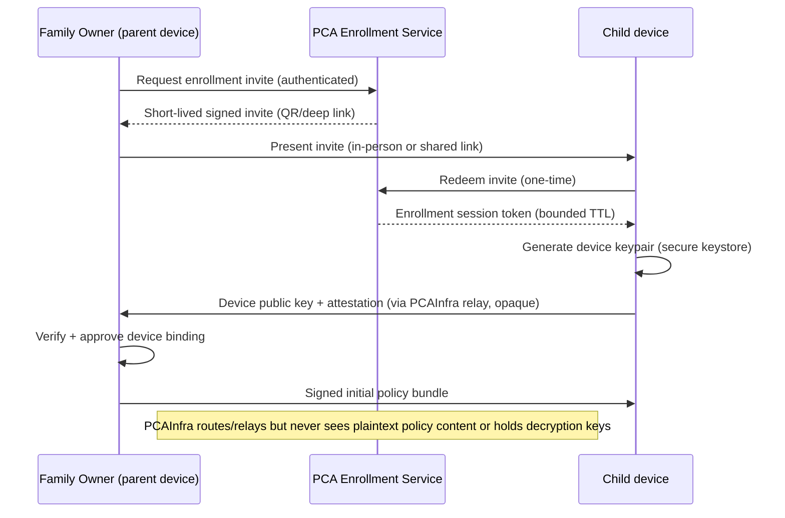
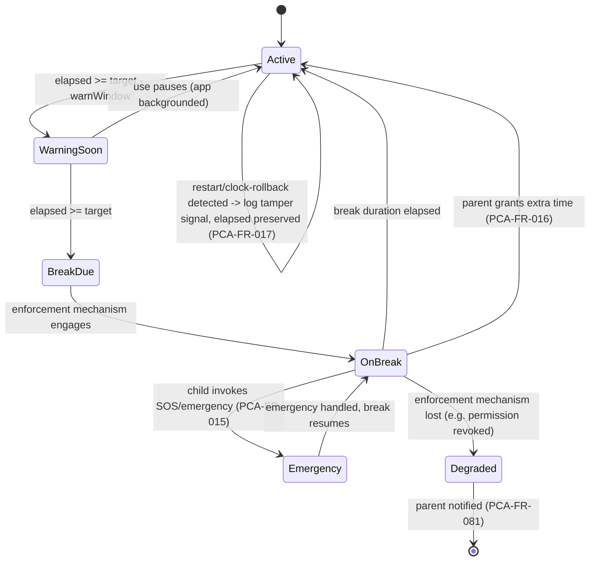
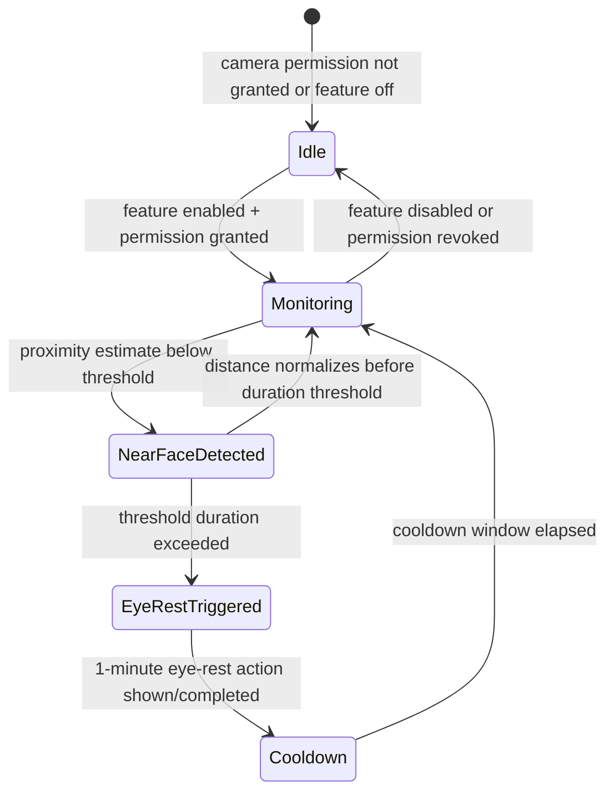

# 03 — Functional Requirements

Owning agent: **PCA-DOC-A**. Governed by doc 00 (Document Control). Personas/roles referenced below are defined in doc 02.

## 1. Purpose and scope

This document is the authoritative functional requirement set (`PCA-FR-*`) for PCA. Every requirement is mandatory unless explicitly labeled platform-dependent or tied to a specific product mode (doc 01 Section 6). Requirement numbering is grouped alphabetically by topic (A–O); numbers are never reused, and this revision extends existing groups with lettered sub-IDs (e.g. `PCA-FR-011A`) rather than renumbering, per doc 00 Section 7.

Each requirement below that depends on a platform capability carries a capability label per doc 00 Section 8. Requirements are traced to acceptance tests in doc 32 (Traceability/Acceptance Matrix) — this document states *what*, doc 28 states *how it is verified*, doc 32 links the two.

## 2. Requirement ID conventions used in this document

- `PCA-FR-xxx` — functional requirement, this document.
- `PCA-SEC-xxx` — security-flavored functional requirement (subset that is primarily about resisting misuse rather than delivering a feature), introduced in this revision within topic groups where security is the primary property being specified.
- `PCA-PRIV-xxx` — privacy-flavored functional requirement.
- `PCA-DATA-xxx` — data-handling requirement (retention/deletion/export mechanics).
- `PCA-TEST-xxx` — pointer to the specific acceptance test class in doc 28/32 for a requirement cluster, used only where the mapping is not 1:1 obvious.

These new series are scoped to *this document's* topic areas; other owning agents may introduce the same series prefixes for their own docs without collision because IDs are globally unique numbers, not per-doc-local numbers (see doc 00 Section 3 ownership table for which agent originates which series in which doc).

---

## A. Enrollment and family management

- **PCA-FR-001** Create a family with a Family Owner. `VERIFIED` (standard account-creation flow).
- **PCA-FR-002** Enroll child devices using short-lived QR/invite material. `VERIFIED_WITH_LIMITATION` — QR/invite material must expire (see PCA-SEC-001) and bind to a specific enrollment session, not be reusable.
- **PCA-FR-003** Bind devices using public-key identity, not reusable pairing passwords.
- **PCA-FR-004** Support multiple parent/guardian roles (Family Owner, Administrator, Viewer — doc 02 Section 3).
- **PCA-FR-005** Allow parent-authorized device removal and secure re-enrollment.
- **PCA-FR-006** Support offline recovery material controlled by the Family Owner (doc 21).
- **PCA-FR-007** Enrollment flow MUST present, before completion, a plain-language summary of what will and will not be monitored (links to PCA-FR-121 "What parents can see" page), so the Family Owner enrolls with informed consent rather than discovering scope later.
- **PCA-FR-008** Child-side enrollment MUST include an age/mode selection step (e.g. "young child" vs "teen" UX tier per doc 26) that adjusts default strictness of content filtering (doc 14) and break defaults (Section B below), without changing the underlying privacy guarantees.
- **PCA-SEC-001** Enrollment invite material (QR code / deep link / pairing code) MUST expire within a bounded window (recommended default: 15 minutes, parent-configurable up to 24 hours for asynchronous setup) and MUST be single-use.

### A.1 Enrollment sequence (reference)



---

## B. Screen time and health breaks

- **PCA-FR-010** Measure continuous interactive-screen use to the extent supported by the platform. `VERIFIED_WITH_LIMITATION` (Android: Usage Stats / accessibility foreground signal; iOS: Device Activity, opaque-token-based, doc 07).
- **PCA-FR-011** Default continuous-use target: 60 minutes, parent configurable.
- **PCA-FR-011A** Configurable range for the continuous-use target: minimum 15 minutes, maximum 180 minutes, in 5-minute increments, to prevent a misconfiguration that is either meaningless (too short to matter) or defeats the health purpose (too long).
- **PCA-FR-012** Default break target: 30 minutes, parent configurable.
- **PCA-FR-012A** Configurable range for the break duration: minimum 5 minutes, maximum 60 minutes, in 1-minute increments.
- **PCA-FR-013** Display a child-facing PCA Break experience when enforcement is technically available (see enforcement-mechanism ladder, Section B.2).
- **PCA-FR-014** Support optional Dhikr/remembrance-message content and a touch/counter interaction during the break screen (e.g. a tap-to-count dhikr counter), configurable on/off per family, with content sourced from a versioned, parent-reviewable content pack (not arbitrary remote content injected at break-time without prior approval).
- **PCA-FR-014A** Break content (Dhikr/remembrance messages) MUST be available in both Arabic and English and MUST respect the child device's selected language independent of the parent device's language (see PCA-FR-112).
- **PCA-FR-015** Emergency access (SOS, emergency dialing, and any OS-native emergency-call affordance) remains available during breaks, unconditionally, on every enforcement mechanism tier.
- **PCA-FR-016** Parent may grant temporary extra time, either proactively or in response to a child bonus-time request (Section N).
- **PCA-FR-017** Device restart/time-zone manipulation must not silently reset a running limit — elapsed-use tracking MUST be anchored to a monotonic/tamper-resistant time source (e.g. elapsed-realtime API on Android, not wall-clock) wherever the platform provides one, and any detected wall-clock rollback MUST be logged as a tamper-signal event (PCA-FR-080) rather than silently trusted.
- **PCA-FR-018** The touch counter/interaction in PCA-FR-014 MUST be purely local and MUST NOT transmit interaction content (e.g. specific dhikr text engaged with) to PCA infrastructure; only the fact that a break occurred and its duration is part of the local activity record.

### B.1 Enforcement-mechanism ladder (architecture decision)

Four distinct enforcement strengths exist and must not be conflated in product copy or in code:

1. **System-lock** — the OS itself prevents interaction with anything except the break screen (only achievable where the platform grants a true lock-task/kiosk primitive to the app, e.g. Android LockTask mode in Protected Mode, or an iOS Guided-Access-adjacent mechanism). `REQUIRES_MANAGED_DEVICE` on Android; largely `UNSUPPORTED` for a normal consumer app on iOS outside a supervised/MDM device.
2. **App-suspension** — the specific set of monitored apps is suspended/blocked from foreground while the break screen is shown, but the OS home screen or other unmonitored surfaces remain reachable. Achievable in both Standard and Protected Android modes via different mechanisms (Accessibility-service-assisted overlay vs DPC-level app suspension), and on iOS via Managed Settings shields (`REQUIRES_ENTITLEMENT`).
3. **Managed Settings shield (iOS-specific term)** — Apple's ManagedSettings framework presents a system-rendered "shield" UI over a restricted app/category; this is functionally closest to tier 2 but is documented separately because it is Apple's own UI, not PCA's break screen, and PCA cannot fully customize its content. `REQUIRES_ENTITLEMENT`.
4. **PCA break shield** — PCA's own overlay/full-screen break experience (the Dhikr/touch-counter UI in PCA-FR-014), used where the platform lets PCA draw over other apps (Android `SYSTEM_ALERT_WINDOW`-class permission) or where PCA fully controls the foreground app it launched (PCA-controlled YouTube experience, doc 15).
5. **Kiosk/DPC distinction** — "kiosk mode" in this document specifically means Android LockTask pinning under Device Owner/Profile Owner policy controlled by PCA's DPC component (Protected Mode only); it is not available in Standard Mode and must never be described as available there.

**Architecture decision AD-B-001**: PCA does not promise tier-1 system-lock enforcement in Android Standard Mode or default iOS mode. The product default is tier 2/3/4 (app-suspension / shield), with tier 1 offered only in Android Protected Mode. Alternative considered: promise tier-1-equivalent everywhere via aggressive Accessibility Service abuse (e.g. blocking the home button) — rejected because it depends on Accessibility Service permissions being used far beyond their intended purpose, which risks Play Store policy violation (doc 25) and is trivially reported as malware-like behavior; also rejected because it would materially misrepresent capability to parents in exactly the way doc 00 Section 8 forbids.

### B.2 Screen-time / break state machine



---

## C. Eye-distance protection

- **PCA-FR-020** Detect near-face/proximity events where hardware/API supports it. `REQUIRES_USER_PERMISSION` (camera permission, used only for local, ephemeral proximity estimation — see PCA-FR-022).
- **PCA-FR-021** Provide a one-minute eye-rest action when configured conditions are met and platform enforcement permits.
- **PCA-FR-021A** Eye-rest triggering conditions (near-face duration threshold, cooldown between triggers) MUST be parent-configurable, with a sane default (e.g. trigger after 3 continuous minutes of detected near-face distance, cooldown 10 minutes) to avoid nagging.
- **PCA-FR-022** Never store face frames, face crops, or face-recognition templates, locally or remotely — the only artifact of this feature that may persist is a derived boolean/duration signal ("near-face event, N seconds, timestamp"), never image data.
- **PCA-FR-023** Treat exact centimeter estimation as calibrated/approximate unless a reliable depth sensor is available. **The product MUST NOT claim medically precise centimeter-level distance measurement from an ordinary front-camera-based or ambient proximity-sensor-based estimate** — copy and internal documentation must describe this as an approximate "too close" heuristic, not a precise measurement, on any device without a dedicated depth sensor (e.g. structured-light/ToF front camera).
- **PCA-FR-024** All proximity-estimation processing MUST run on-device, in real time, with no retained frame buffer beyond what is needed for the current estimation cycle (target: no frame outlives the processing of the next frame).
- **PCA-PRIV-001** If the platform requires camera-permission grant for this feature, the permission request UI MUST clearly state the feature is proximity-only, no images are stored or transmitted, and the family may decline without losing any other PCA feature.

### C.1 Eye-distance state machine



---

## D. Web and content safety

- **PCA-FR-030** Provide local domain/category filtering.
- **PCA-FR-031** Support malware/phishing/scam and adult/explicit-content categories.
- **PCA-FR-031A** Content-category filtering MUST be based solely on the nature of the content itself (explicit sexual material, graphic violence, malware/phishing, scam/fraud, gambling, etc.) and **MUST NOT** define or offer any category that filters based on a protected characteristic (sexual orientation, gender identity, religion, ethnicity, disability) of any person depicted, mentioned, or associated with the content. This requirement is a permanent product boundary restated from doc 01 Section 5 and may not be weakened without a recorded major-version architecture change per doc 00 Section 6, with explicit owner sign-off.
- **PCA-FR-032** Provide allowlist/denylist overrides, per-child and per-family.
- **PCA-FR-033** Provide a strict PCA Safe Browser mode for families requiring full URL/title visibility inside PCA-controlled browsing (i.e., visibility is scoped to browsing that happens inside PCA's own browser surface, not omniscient visibility into every app's network traffic).
- **PCA-FR-034** Do not perform covert TLS interception (no MITM root-CA installation to decrypt third-party app/browser traffic without the user's fully informed, explicit, revocable configuration of such a mode, and even then such a mode is out of the default product — see doc 01 Section 5).
- **PCA-FR-035** Use deterministic rules first and on-device classification only for uncertain content PCA is legitimately processing (i.e., content already visible to the filtering layer via domain/URL/metadata or inside PCA Safe Browser — not content obtained via interception forbidden by PCA-FR-034).
- **PCA-FR-036** Record a reason code when PCA blocks content (e.g. `category:adult-explicit`, `category:malware`, `denylist:custom`), shown to the parent in the activity view and usable for the child's "why was this blocked" transparency surface (doc 26).
- **PCA-FR-037** Provide a parent-reviewable override/appeal path when a child believes a block is a false positive (submits a "request unblock" from the child device, resolved by any parent role with policy-edit permission).
- **PCA-PRIV-002** Deterministic filtering data (category lists, denylist/allowlist rules) MAY be fetched from PCA infrastructure (they are policy, not family activity data); classification *decisions* made about the child's specific browsing MUST NOT be reported to PCA infrastructure in identifiable form — only aggregate, non-family-identifying product-quality telemetry (e.g. "category X false-positive rate") may leave the device, and only if explicitly opted into by the family.

### D.1 Content decision flow

```mermaid
flowchart TD
    Request["Outbound request / URL navigation"] --> Deterministic{Matches deterministic\nrule (allow/deny/category)?}
    Deterministic -- "allow" --> Allow["Permit"]
    Deterministic -- "deny" --> Block["Block + reason code (PCA-FR-036)"]
    Deterministic -- "no match" --> Classify{On-device classification\navailable + content\nlegitimately visible?}
    Classify -- "no" --> Allow
    Classify -- "yes, confident safe" --> Allow
    Classify -- "yes, confident unsafe" --> Block
    Classify -- "uncertain" --> Conservative["Apply family's configured\ndefault-uncertain policy\n(default: allow + log for parent review)"]
    Block --> Log["Local activity log entry"]
    Allow --> LogAllow["Local activity log entry (if within scope of Section J reporting)"]
```

---

## E. App usage and application control

- **PCA-FR-040** Record application usage duration where platform APIs permit. `REQUIRES_USER_PERMISSION` on Android (Usage Access); `VERIFIED_WITH_LIMITATION` on iOS (Device Activity opaque tokens — durations reported per-token, not always mapped to a human-readable app name without the parent's own token-picker interaction, doc 07).
- **PCA-FR-041** Support daily/weekly app/category limits where platform APIs permit.
- **PCA-FR-042** Allow parent to block/allow selected apps/categories where supported.
- **PCA-FR-043** Provide a school-mode and bedtime schedule (time-window-based policy sets that override normal per-app limits during the window).
- **PCA-FR-043A** School-mode and bedtime schedules MUST support per-day-of-week configuration and a family-configured "override requires parent approval" toggle for the child to request a temporary exception during a locked window.
- **PCA-FR-044** Clearly label unavailable controls on unsupported platform/device combinations (no control is ever silently a no-op).
- **PCA-FR-045** Support parent approval for new app installs on the child device where platform APIs surface install events (e.g. Android install-broadcast visibility with Usage-Access-adjacent permission, or a Protected-Mode DPC install-restriction policy). `REQUIRES_MANAGED_DEVICE` for *blocking* an install pre-emptively on Android; Standard Mode can only report an install after the fact.

---

## F. YouTube

- **PCA-FR-050** Record YouTube app usage duration where platform usage APIs permit (same mechanism/limitations as PCA-FR-040, applied to the YouTube package specifically).
- **PCA-FR-051** Mode A (the normal YouTube application) MUST NOT offer, market, or infer an exact-video / complete Google-account watch-history feature. This is a product-boundary requirement, not a claim that every YouTube API surface is incapable of returning historical items. The official Data API sample documents a `watchHistory` related-playlist identifier for an authenticated user's channel and a playlist-items query pattern; that does not establish a family-authorized, complete, durable, policy-compliant monitoring feed. PCA therefore does not query or retain that account history in Mode A. `VERIFIED_WITH_LIMITATION`; official source: [YouTube Data API sample requests](https://developers.google.com/youtube/v3/sample_requests), verified 2026-08-10; required source-register handoff: `SRC-H-A-003` in doc 00 Section 10.1.
- **PCA-FR-052** Offer an optional PCA-controlled YouTube experience ("Mode B") if compliant with YouTube API Services Terms and policies, where PCA can record locally the videos started inside that controlled experience only (because it renders that specific playback surface itself) — this is categorically different from PCA-FR-051 and does not require the Data API watch-history claim to be true.
- **PCA-FR-053** Use available safe-search/restricted-content mechanisms where compliant (e.g. YouTube's Restricted Mode signal, where a compliant integration path exists).
- **PCA-FR-054** Support a "Mode A / Mode B" distinction visible to the parent: Mode A = normal YouTube app, usage-duration-only visibility (PCA-FR-050); Mode B = PCA-controlled experience with per-video-start local logging (PCA-FR-052) but reduced feature parity with the native app (e.g. no comments, no account-based recommendations, or only what a compliant embed/API surface allows). Parent chooses per child; product MUST show this as a real trade-off, not silently degrade one mode into looking like the other.
- **PCA-AI-001** If any on-device content classification is applied to Mode B video metadata (e.g. title/description-based safety heuristics) it follows the same rules as PCA-FR-035 (deterministic first, on-device classification only for content already legitimately visible, no data leaves device in identifiable form).

---

## G. Location and last seen

- **PCA-FR-060** Show latest child-device location when permission, OS state, and connectivity allow. `REQUIRES_USER_PERMISSION`.
- **PCA-FR-061** Show location timestamp and accuracy class (e.g. GPS/fine, network/coarse, cached/stale) — never present a stale or coarse fix as if it were fresh and precise.
- **PCA-FR-062** Show last successful PCA connection ("last seen") independent of location permission — a device can be "last seen" via any successful policy-sync/heartbeat contact even without location sharing enabled.
- **PCA-FR-063** Support optional family geofences subject to platform rules (background-location entitlement/permission tier requirements, doc 06/07), generating a local notification/alert on entry/exit (doc 19), not a continuous location stream.
- **PCA-FR-064** Never use location for advertising, analytics profiling, or any purpose other than the family-facing safety features described in this section.
- **PCA-FR-065** Support separate, shorter retention for location history than for general activity retention (see doc 11; location retention MUST NOT exceed the family's general activity-retention setting, PCA-FR-102).

---

## H. Prayer reminders

- **PCA-FR-070** Calculate daily prayer times locally using selected calculation method, location, and time zone. No prayer-time calculation depends on PCA server availability (see PCA-FR-074).
- **PCA-FR-071** Support Fajr, Sunrise, Dhuhr, Asr, Maghrib, and Isha display.
- **PCA-FR-072** Support calculation-method and Asr-method (Shafi'i/Hanafi) selection and manual minute adjustments per prayer.
- **PCA-FR-073** Support Arabic/English reminders and optional Adhan audio where platform/background-execution rules permit. `VERIFIED_WITH_LIMITATION` (background audio playback at a precise scheduled time is subject to OS background-execution limits on both Android and iOS; a scheduled local notification is the reliable baseline, audio playback at exact prayer time is best-effort).
- **PCA-FR-074** Continue prayer calculation offline using last known location/time-zone settings.
- **PCA-FR-074A** If the device travels a materially significant distance (e.g. >50km) while offline, the product MUST surface a "location may be stale, verify prayer times" notice once connectivity or GPS is available again, rather than silently continuing to use a now-inaccurate location.

---

## I. Anti-tamper and uninstall

- **PCA-FR-080** Detect loss of required permissions/capabilities (e.g. Usage Access revoked, Accessibility Service disabled, camera permission revoked, Family Controls authorization revoked).
- **PCA-FR-081** Notify parents when protection materially degrades (distinct from a routine permission the family chose not to grant at setup — see PCA-FR-044).
- **PCA-FR-082** In Android Protected Mode, use only supported device-policy mechanisms for stronger uninstall/app controls (no undocumented/private-API usage).
- **PCA-FR-083** On iOS child authorization, use Family Controls protections against child deletion when Apple provides them (`REQUIRES_ENTITLEMENT`; child-authorized profile prevents self-removal of the authorization by the child account, but not by an adult with the device passcode — see PCA-FR-084).
- **PCA-FR-084** An authorized parent must always have a supported removal/recovery route on every mode — **this document explicitly rejects any design where "cannot be uninstalled" is stated as a universal, unscoped claim.** Every anti-tamper claim in this package and in product copy must be scoped to the precise OS/management mode it applies to (see doc 01 Section 6, doc 21) and must always preserve a parent-accessible removal path (e.g. device-owner-mode removal via a documented parent recovery procedure, or Family-Controls-authorization removal via the parent's own Screen Time passcode on iOS).
- **PCA-FR-085** Tamper-signal detection (permission loss, clock rollback per PCA-FR-017, DPC policy removal attempt, Accessibility Service disabled) MUST generate a local, timestamped tamper-event record usable in the family audit log (PCA-FR-124) and MUST trigger the parent notification in PCA-FR-081 within a bounded delay appropriate to connectivity (immediate if online, on next connectivity if offline).

---

## J. Parent control panel

- **PCA-FR-090** Provide a family dashboard with child status, screen time, battery/last seen where available, and alerts.
- **PCA-FR-091** Provide per-child policy pages (screen-time, content filtering, app limits, bedtime/school mode, geofences, YouTube mode).
- **PCA-FR-092** Provide an activity timeline from locally held/E2EE family data (never from a PCA-server-side readable copy).
- **PCA-FR-093** Provide privacy/data-retention settings (doc 11) directly in the panel, not buried in a separate support flow.
- **PCA-FR-094** Provide alert and notification preferences including email destination (doc 19).
- **PCA-FR-095** Provide a role-management screen implementing doc 02's permission matrix (invite/remove Administrators and Viewers, initiate ownership transfer).
- **PCA-FR-096** Provide a "What parents can see" page reachable from the panel (duplicated cross-reference to PCA-FR-121, which is normative; this entry ensures panel navigation surfaces it).

---

## K. Data retention and deletion

- **PCA-FR-100** Supported retention choices: 14 days, 1 month, 3 months, 6 months, 9 months.
- **PCA-FR-101** Default first-enrollment choice is presented to the parent (not silently applied); architecture baseline default is **1 month** unless the owner changes this policy before implementation (tracked as PCA-DEC-003, doc 01 Section 11).
- **PCA-FR-102** Allow separate location-history retention no longer than general activity retention (cross-referenced from PCA-FR-065).
- **PCA-FR-103** Provide immediate "Delete activity history now", available without contacting support (cross-referenced from PCA-NFR-062).
- **PCA-FR-104** Deletion must remove expired records from local family stores and queued encrypted replicas (i.e., deletion propagates to any in-flight or not-yet-synced encrypted copy, not just the primary local store).
- **PCA-FR-105** Retention deletion must not remove essential enrollment keys/policies unless the parent selects full device/family removal (retention deletion and family/device removal are distinct, separately-confirmed actions).
- **PCA-DATA-001** Deletion is defined as cryptographic + storage deletion: for locally-held plaintext, secure overwrite/OS-delete of the record; for any encrypted replica PCA infrastructure has relayed or cached (e.g. an undelivered payload queued for an offline device), deletion of the ciphertext blob such that even PCA, which cannot decrypt it anyway, no longer retains the bytes past the family's retention window.
- **PCA-DATA-002** Full details of the retention/deletion mechanism (exact schedule granularity, deletion-job design, cascading rules across data types) are owned by doc 11; this document states the product-facing requirement only.

---

## L. Language and UX

- **PCA-FR-110** Full English LTR.
- **PCA-FR-111** Full Arabic RTL.
- **PCA-FR-112** Parent and child devices may use different languages simultaneously within the same family.
- **PCA-FR-113** All system-generated notices, reports, parental-control explanations, and deletion confirmations must be localized (no mixed-language notification where the body text falls back to English inside an otherwise-Arabic notification, or vice versa).
- **PCA-FR-114** Prayer-time, screen-time, and break-related terminology MUST use reviewed, contextually appropriate Arabic terms (not literal machine-translated strings) — this is a quality bar for doc 20 to implement and this document to require.

---

## M. Privacy and transparency

- **PCA-FR-120** Child device clearly indicates PCA protection is active (persistent, non-dismissible-without-parent-action indicator — exact platform mechanism per doc 06/07, e.g. Android persistent foreground-service notification, iOS Screen Time's own system indication of managed status).
- **PCA-FR-121** Provide a "What parents can see" page, written in plain language, enumerating exactly what data categories are visible to parents and which are not, kept in sync with this document's requirement set (change-controlled together, per doc 00 Section 7).
- **PCA-FR-122** PCA central services must not store readable child monitoring history — this is the E2EE guarantee from doc 09, restated here as a product-facing requirement.
- **PCA-FR-123** No behavioral advertising or sale of family monitoring data, restated from doc 01 Section 7 as an enforceable requirement (traced to a no-ads/no-data-broker SDK inventory check in doc 28).
- **PCA-FR-124** Provide a local/exportable family audit record for policy changes (role changes, policy edits, retention changes, deletions, tamper events).
- **PCA-FR-125** Provide an encrypted export of family data (activity history, audit log) that the family can download for their own backup/portability purposes, encrypted such that only the family's own key can open it (doc 09).
- **PCA-FR-126** No covert microphone or camera surveillance capability exists anywhere in the product (restated from doc 01 Section 5 as an enforceable, testable requirement — doc 28 must include a static/dynamic check that no microphone-recording or arbitrary-camera-capture code path exists outside the ephemeral, on-device-only eye-distance estimation in Section C).
- **PCA-FR-127** No ad-tracking SDKs and no third-party analytics SDK capable of correlating family activity across apps/devices may be integrated (restated from PCA-FR-123/PCA-NFR-012 as a build-time-checkable requirement).

---

## N. Trust features (bonus time, install approval, emergency/SOS, age profiles)

- **PCA-FR-130** Support a bonus-time request flow: child requests additional time from the break/limit screen; any parent role with policy-edit permission can approve, deny, or counter-offer a shorter duration; the decision and reason are recorded in the activity/audit view.
- **PCA-FR-131** Support install-approval workflow where platform APIs allow (cross-referenced from PCA-FR-045).
- **PCA-FR-132** Support an emergency/SOS action reachable from any lock/break/shield state, invoking the device's native emergency-call capability and, optionally, a configured trusted-contact notification, entirely independent of PCA cloud availability (cross-referenced from PCA-NFR-023).
- **PCA-FR-133** Support age-profile-driven defaults: content-filter strictness, break defaults, and available features (e.g. bonus-time request visibility) may vary by the age tier selected at enrollment (PCA-FR-008), while the underlying privacy guarantees (Sections C, D, M) never vary by age tier.
- **PCA-FR-134** Support per-app time limits distinct from the whole-device screen-time/break engine (Section B) — an app/category can have its own daily budget in addition to the continuous-use break cycle.
- **PCA-FR-135** Support geofence-triggered alerts as a trust feature, distinct from continuous location tracking (cross-referenced from PCA-FR-063; this entry frames it as parent-facing trust functionality rather than pure technical capability).

---

## 3. Assumptions

- Platform permission grants (camera, location, usage access, Family Controls authorization) are assumed revocable by the OS or user at any time; every requirement above that depends on such a grant has a corresponding degradation path (PCA-FR-080/081/044).
- "Parent role with policy-edit permission" in this document means Family Owner or Parent/Guardian Administrator per doc 02; Viewer never satisfies this condition.
- Requirement defaults (60/30 minute break cycle, 1-month retention, 15-minute invite TTL) are architecture-baseline defaults pending final owner sign-off tracked in doc 01 Section 11 and Section 5 below.

## 4. Dependencies

- Doc 02 for role definitions used throughout ("parent role", "Family Owner", "Child").
- Doc 04 for the non-functional constraints (security, privacy, reliability, performance) every requirement above must satisfy.
- Doc 06/07 for the platform-specific mechanism behind every `REQUIRES_*` label.
- Doc 09 for the E2EE mechanism behind PCA-FR-092, 122, 125.
- Doc 11 for retention/deletion mechanism detail behind Section K.
- Doc 12–17 for per-feature deep design behind Sections B, C, D, E/F, G, H.
- Doc 21 for tamper/recovery mechanism behind Section I.
- Doc 32 for the requirement-to-test traceability matrix.

## 5. Unresolved owner decisions

| Decision ID | Topic | Options | Recommendation | Status |
|---|---|---|---|---|
| PCA-DEC-006 | Whether PCA should ever use an authenticated child's YouTube account-history surface | (a) Never use it; Mode A remains duration-only; (b) evaluate a tightly scoped, separately authorized feature after legal/API-policy/privacy review | (a) for launch and the architecture baseline — it preserves the Mode A promise, avoids asserting completeness, and minimizes family data collection | PROPOSED |
| PCA-DEC-007 | Default-uncertain content policy (Section D.1) | (a) Allow + log for parent review; (b) Block + log, require parent unblock | (a) as documented default, but families may prefer (b) — expose as a family-level toggle | PROPOSED |
| PCA-DEC-008 | Whether Android Standard Mode ships install-approval (PCA-FR-045) as report-only or attempts best-effort pre-install interception via Accessibility Service | (a) Report-only, no interception; (b) Best-effort interception | (a) — matches AD-B-001's rejection of Accessibility-Service overreach | PROPOSED |

## 6. Acceptance criteria (package-level)

- [ ] Every `PCA-FR-*`/`PCA-SEC-*`/`PCA-PRIV-*`/`PCA-DATA-*` ID in this document appears exactly once in doc 32's traceability matrix.
- [ ] Every requirement carrying a `REQUIRES_*`/`VERIFIED_WITH_LIMITATION`/`UNSUPPORTED` label has a corresponding dated source-register entry in doc 33; `SRC-H-A-001` through `SRC-H-A-003` in doc 00 Section 10.1 are mandatory handoffs for this writer's current platform claims.
- [ ] No requirement in this document contradicts the out-of-scope list in doc 01 Section 5.
- [ ] Section D.1's content-category boundary (PCA-FR-031A) is reflected verbatim (no weaker wording) in doc 14.
