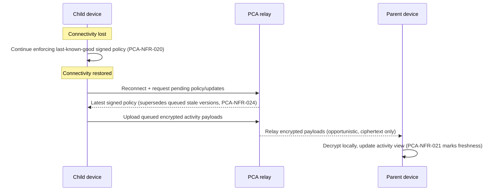

# 04 — Non-Functional Requirements

Owning agent: **PCA-DOC-A**. Governed by doc 00 (Document Control). Cross-references doc 03 functional requirements and doc 02 role/trust-boundary definitions.

**Package lifecycle:** `DRAFT_RECONCILIATION`. These quality constraints define future evidence expectations; they do not represent achieved service levels, measured performance, or an accepted production architecture.

## 1. Purpose and scope

This document is the authoritative non-functional requirement set (`PCA-NFR-*`) — the quality attributes every functional requirement in doc 03 must be delivered within: security, privacy, reliability, performance/battery, accessibility, maintainability, and trust. Non-functional requirements are as mandatory as functional ones; a feature that satisfies its `PCA-FR-*` but violates an applicable `PCA-NFR-*` is not complete.

Numbering is grouped by category; this revision extends existing IDs with lettered sub-items rather than renumbering, per doc 00 Section 7.

---

## 2. Security

- **PCA-NFR-001** Encryption in transit for every service connection (TLS 1.2+ minimum, TLS 1.3 preferred, for all PCA-infrastructure connections — enrollment, licensing, updates, relay).
- **PCA-NFR-002** End-to-end encryption for parent-child family payloads (activity data, policy content) such that PCA infrastructure handles ciphertext only.
- **PCA-NFR-003** Private keys generated/stored in platform secure key stores where supported (Android Keystore/StrongBox where available; iOS Keychain/Secure Enclave where available). `VERIFIED_WITH_LIMITATION` — availability of hardware-backed key storage varies by device tier; software-backed keystore fallback must still exist and must still meet PCA-NFR-005.
- **PCA-NFR-004** Signed policy messages with anti-replay counters/nonces (a captured-and-replayed old policy message must be rejected by the child device).
- **PCA-NFR-005** No hardcoded secrets or master decryption key anywhere in shipped binaries or PCA infrastructure that would allow bulk decryption of family payloads.
- **PCA-NFR-006** Dependency and mobile supply-chain scanning before release (SBOM generation, known-CVE gating in CI, doc 28/29).
- **PCA-NFR-007** Enrollment invite/session tokens (PCA-FR-002, PCA-SEC-001) are bound to a specific enrollment attempt and MUST be rejected if replayed after redemption or after expiry.
- **PCA-NFR-008** All administrative/parent-authentication sessions MUST support session expiry and remote/self revocation (a parent can invalidate a stolen session from another device).
- **PCA-NFR-009** Rate-limiting and lockout on parent authentication attempts, to resist credential-stuffing/brute-force against the account that ultimately controls a child's device.

### 2.1 Trust-boundary / threat-surface diagram (summary; full detail in doc 24)

```mermaid
flowchart LR
    subgraph Trusted["Trusted after strong auth"]
        Parent["Parent device"]
    end
    subgraph SemiTrusted["Trusted for policy enforcement, assumed tamper-attempted"]
        Child["Child device"]
    end
    subgraph Untrusted["Trusted for availability/routing only"]
        Infra["PCA infrastructure"]
    end

    Parent -- "signed policy (PCA-NFR-004)" --> Infra
    Infra -- "relay, ciphertext only (PCA-NFR-002)" --> Child
    Child -- "tamper signal (PCA-FR-085)" --> Infra
    Infra -- "cannot decrypt (PCA-NFR-011)" -.-> Child
    Attacker(["Adversary: capable child,\nnetwork attacker, or\ncompromised PCA infra node"]) -. "attempts" .-> Child
    Attacker -. "attempts" .-> Infra
```

---

## 3. Privacy

- **PCA-NFR-010** Data minimization by default — a feature must not collect a data category it does not need for its stated function (e.g. eye-distance protection collects proximity signals, not images, per PCA-FR-022/024).
- **PCA-NFR-011** Central service cannot decrypt child activity payloads (the technical mechanism behind PCA-FR-122).
- **PCA-NFR-012** Telemetry must exclude URLs, location coordinates, app-usage history, face images, and child content. Product-quality telemetry (crash reports, aggregate feature-usage counters) may exist but must be reviewed against this exclusion list before being added (doc 27 owns the telemetry inventory; this NFR is the constraint doc 27 must satisfy).
- **PCA-NFR-013** Retention enforcement is deterministic and testable (a given retention setting produces a predictable deletion schedule verifiable in doc 28's test suite, not a "best-effort, eventually" promise).
- **PCA-NFR-014** Any optional aggregate/anonymized product-telemetry opt-in (e.g. content-filter false-positive rate, PCA-PRIV-002 in doc 03) MUST be off by default and MUST be a distinct, separately revocable consent from account creation consent.
- **PCA-NFR-015** Support-access to account metadata (doc 02 Section 4.2) MUST be logged and MUST NOT be extensible, by any support tool, into a query surface over family activity content.

---

## 4. Reliability

- **PCA-NFR-020** Child enforcement continues offline for already-issued policies (a lost connection does not lift screen-time/content-filter enforcement).
- **PCA-NFR-021** Parent UI distinguishes live, cached, and unavailable data (e.g. "last seen 3 hours ago" rather than presenting stale data as current).
- **PCA-NFR-022** No silent fail-open for safety rules; degraded states are visible (if content filtering cannot evaluate a request — e.g. filter-list fetch failed — the product must not silently allow everything without at least a visible degraded-state indicator to the parent, per the family's configured default-uncertain policy in doc 03 Section D.1).
- **PCA-NFR-023** Emergency calls/SOS must not depend on PCA cloud availability (PCA-FR-132's independence requirement, restated as a testable reliability property).
- **PCA-NFR-024** Policy sync MUST be idempotent and MUST tolerate out-of-order delivery (a child device reconnecting after an extended offline period must converge to the latest policy state, not apply stale queued policies out of order).
- **PCA-NFR-025** A PCA infrastructure outage MUST NOT prevent a parent from viewing already-synced local/family-store activity data, nor prevent a child device from continuing to enforce its last-known-good policy.

### 4.1 Offline / reconnect flow (reference)



---

## 5. Performance and battery

- **PCA-NFR-030** Avoid continuous camera processing in the background (eye-distance estimation runs only in defined foreground/allowed contexts, never as a background always-on camera stream).
- **PCA-NFR-031** Sensor and usage processing uses event-driven/batched designs (not busy-polling).
- **PCA-NFR-032** Local filtering targets negligible user-perceived DNS/request latency (target: <20ms added latency for a local deterministic-rule decision on typical mid-tier hardware; classification-tier decisions may take longer but must not block the request indefinitely — apply the default-uncertain policy, doc 03 Section D.1, if classification does not return within a bounded timeout, recommended 250ms).
- **PCA-NFR-033** Background work obeys Android/iOS platform scheduling constraints (Doze/App Standby buckets on Android, BGTaskScheduler budget on iOS) rather than fighting them with wakelocks/undocumented workarounds.
- **PCA-NFR-034** The always-on components of the product (foreground enforcement service on Android, Device Activity monitoring on iOS) target a battery-impact budget disclosed to the family (e.g. "typically under X% additional daily battery drain") — exact budget number is a `REQUIRES_FURTHER_OWNER_DECISION` pending device-class benchmarking, tracked in Section 9.

---

## 6. Accessibility

- **PCA-NFR-040** Dynamic type/font scaling supported on both parent and child UI.
- **PCA-NFR-041** Screen-reader labels in Arabic and English (VoiceOver/TalkBack parity).
- **PCA-NFR-042** Color is not the only status indicator (e.g. break-due state uses icon/text in addition to color).
- **PCA-NFR-043** RTL layouts pass mirrored-navigation testing (doc 20/26 own the detailed test matrix; this NFR is the constraint).
- **PCA-NFR-044** Child-facing UI meets an age-appropriate reading-level bar for its target age tier (doc 26 defines the tiers referenced from PCA-FR-008/133).
- **PCA-NFR-045** Minimum touch-target sizing and contrast ratios meet WCAG 2.1 AA on both parent and child surfaces.

---

## 7. Maintainability

- **PCA-NFR-050** Policy/domain logic separated from OS-specific adapters (a portable core enforcement/decision engine, with thin Android/iOS adapters — supports consistent behavior and testability across platforms).
- **PCA-NFR-051** Every requirement maps to tests (doc 28/32 traceability requirement, restated here as the constraint on the codebase/test-suite, not just the documentation).
- **PCA-NFR-052** Architecture decision records accompany material changes (per doc 00 Section 7 change-control process).
- **PCA-NFR-053** Content rules and AI models are versioned, signed, and rollbackable (a bad content-classification model update or a bad filter-list update can be rolled back without a full app release).
- **PCA-NFR-054** Configuration/default values called out in doc 03 as "architecture baseline default pending owner sign-off" (break durations, retention default, invite TTL) MUST be implemented as configuration, not hardcoded literals, so a later owner decision does not require a code change to take effect.

---

## 8. Trust

- **PCA-NFR-060** No hidden monitoring mode (every capability in doc 03 is discoverable via PCA-FR-121's "What parents can see" page; no undocumented data collection exists anywhere in the shipped product).
- **PCA-NFR-061** Privacy policy explains each permission and data path (maps 1:1 to the permission list actually requested by the app on each platform).
- **PCA-NFR-062** Parent can delete family monitoring history without contacting support (restated from PCA-FR-103 as the trust-facing framing of the same capability).
- **PCA-NFR-063** Support staff cannot bypass E2EE to read family activity (restated from doc 02 Section 4.2 / PCA-NFR-011 as a trust commitment, not just a technical one).
- **PCA-NFR-064** Any third-party SDK integrated into the product (crash reporting, payment processing, push notification delivery) MUST be individually listed in the "What parents can see" page or an equivalent SDK-disclosure page, with the specific data category each SDK can access.

---

## 9. Assumptions

- "Family payloads" throughout this document means activity history, policy content, and audit-log content; it does not mean account/billing/enrollment metadata necessary for PCA to operate the service (license state, device count, enrollment timestamps) — that metadata is handled under PCA-NFR-015's logged-access model, not E2EE, because PCA legitimately needs it to function.
- Performance targets in Section 5 assume a mid-tier Android device (released within the last ~4 years) and a currently-supported iOS device; older/low-end hardware may see materially different numbers, tracked as a device-support-matrix concern in doc 06/07.

## 10. Dependencies

- Doc 03 for the functional requirements each NFR constrains.
- Doc 09 for the full E2EE/key-hierarchy design behind Section 2/3.
- Doc 24 for the full threat model behind Section 2.1's summary diagram.
- Doc 27 for the telemetry inventory constrained by PCA-NFR-012/014.
- Doc 28 for the test/verification strategy that makes PCA-NFR-013/051 checkable rather than aspirational.

## 11. Unresolved owner decisions

| Decision ID | Topic | Options | Recommendation | Status |
|---|---|---|---|---|
| PCA-DEC-009 | Battery-impact disclosure number (PCA-NFR-034) | (a) Publish a specific percentage after benchmarking; (b) Publish only a qualitative statement pending benchmarking | (b) until real device benchmarking exists, then move to (a) | PROPOSED |
| PCA-DEC-010 | Default-uncertain classification timeout (PCA-NFR-032) | 100ms / 250ms / 500ms | 250ms — balances responsiveness against giving the on-device classifier a fair chance | PROPOSED |
| PCA-DEC-011 | Minimum TLS version floor (PCA-NFR-001) if a supported OS/device combination cannot do TLS 1.3 | (a) Hard-require TLS 1.3, drop support for devices that can't; (b) Accept TLS 1.2 floor with modern cipher suites | (b), reviewed periodically as device-support matrix evolves | PROPOSED |

## 12. Future acceptance evidence (package-level)

All items below are future traceability and independent-review evidence gates. Their unchecked state is intentional in `DRAFT_RECONCILIATION`; none is a current-complete claim.

- [ ] Every `PCA-NFR-*` ID in this document appears in doc 32's traceability matrix, mapped to at least one functional requirement or one standalone quality test in doc 28.
- [ ] No functional requirement in doc 03 has an implementation that violates PCA-NFR-002/011 (spot-checked in doc 24's threat model and doc 28's security test suite).
- [ ] Section 5's performance targets have corresponding measurable test cases in doc 28 once implementation begins (targets are placeholders for measurement, not just prose, until then).
- [ ] Every third-party SDK inventoried in doc 27 has a corresponding disclosure entry satisfying PCA-NFR-064.
