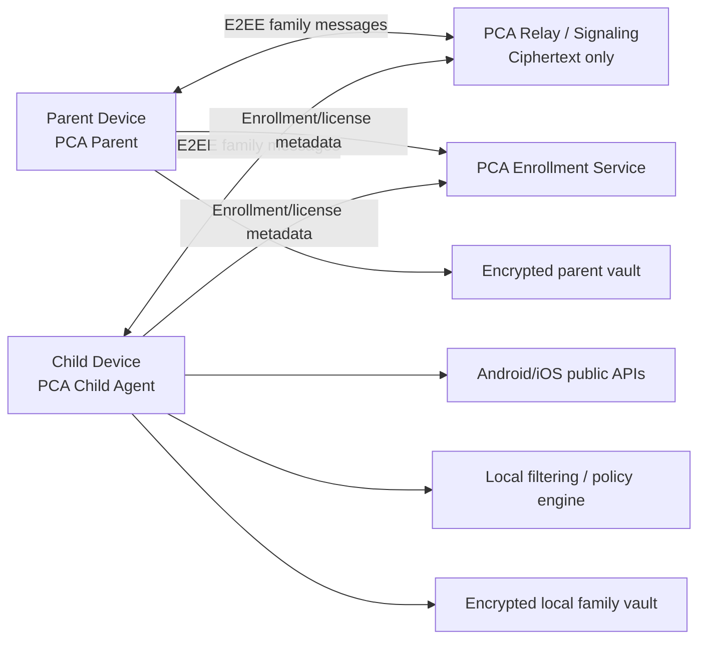

# 05 — System Context and Architecture

## 1. Context

## 2. Components

### PCA Parent
- policy editor;
- family role management;
- reports/dashboard;
- location requests;
- retention/deletion controls;
- recovery.

### PCA Child Agent
- policy executor;
- usage/sensor event normalizer;
- content filtering controls;
- local activity vault;
- prayer engine;
- tamper monitor;
- E2EE sync agent.

### Enrollment Service
Allowed data:
- opaque family/account identifier;
- device enrollment identifier;
- public keys;
- device platform/app version;
- license/subscription status;
- push-routing token when required;
- security/revocation metadata.

Forbidden readable data:
- browsing history;
- YouTube history;
- app usage history;
- precise location history;
- child screenshots/photos;
- prayer activity;
- content-block event details.

### Relay
- routes encrypted envelopes;
- supports short-lived queued ciphertext only when required for offline delivery;
- cannot decrypt payloads;
- expires undelivered ciphertext on a short server TTL independent of family history retention.

## 3. Data ownership

- Child device is source of enforcement and most raw events.
- Parent device is the family reporting authority.
- Central PCA infrastructure is not an activity-data warehouse.

## 4. Sync model

1. Parent changes a rule.
2. Parent signs and encrypts a policy envelope to the child device.
3. Relay routes ciphertext.
4. Child verifies sender role, signature, policy version and expiry.
5. Child applies policy and returns signed status receipt.
6. Activity summaries flow back E2EE according to parent retention settings.

## 5. Offline-first

Child enforcement continues with the latest valid signed policy. A parent dashboard must show “offline / last seen” instead of pretending it has live state.
