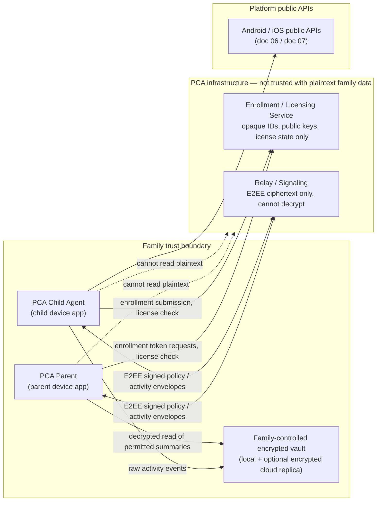
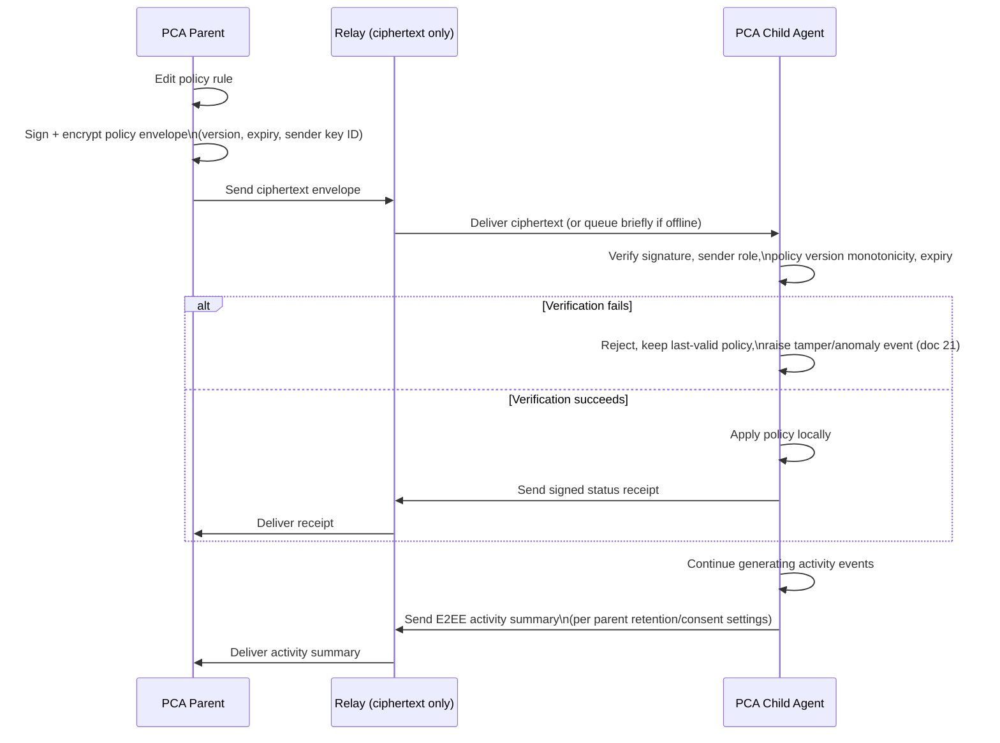

# 05 — System Context and Architecture

Owning agent: **PCA-DOC-B**. Governed by doc 00 (Document Control).

## 1. Purpose

Define the end-to-end system context for PCA: the small, fixed set of conceptual components, what each one is allowed to know, how they talk to each other, and why the architecture keeps PCA's own infrastructure structurally incapable of becoming a readable warehouse of child activity data. This document is the architectural restatement of doc 01 Section 2's core principle and is the document every platform-specific (06/07) and lifecycle (08) document must remain consistent with for cross-component boundaries.

## 2. Scope

In scope: the four conceptual components (PCA Parent app, PCA Child Agent, Enrollment/Licensing Service, privacy-preserving Relay/signaling), what data class flows on each edge, sync/offline behavior, and the system-level trust boundary. Out of scope: platform-specific implementation (06 Android, 07 iOS), cryptographic primitive selection (09), per-feature data models (10), and lifecycle state transitions (08, referenced but not owned here).

## 3. Architecture — the four components

PCA is deliberately kept to four conceptual components. Adding a fifth "central family database" component is an explicit non-goal (doc 01 Section 5) — any future proposal to add server-side family-activity storage must be raised as a doc 00 Section 9 conflict, not merged silently.

### 3.1 PCA Parent (parent device app)

- policy authoring/editing (screen-time, filtering, retention, geofences, prayer, RBAC);
- family role management (invite/remove parent roles, doc 18);
- reports/dashboard rendering from locally-decrypted activity payloads;
- location/last-seen requests and geofence configuration (doc 16);
- retention/deletion control surface (doc 11);
- recovery initiation (doc 08 Section 5, doc 21);
- holder of the Parent Device Identity Key and (for the Family Owner) custodian of the Family Root Recovery Secret at generation time (doc 09 Section 2).

### 3.2 PCA Child Agent (child device app)

- policy executor — applies the latest verified signed policy regardless of connectivity (Section 6);
- usage/sensor event normalizer — converts platform-specific signals (doc 06/07) into a common local event model (doc 10);
- content-filtering control point (doc 14);
- local activity vault — the actual system of record for raw child activity (Section 4);
- health-break and eye-distance engines (doc 12, doc 13);
- prayer-time engine (doc 17);
- tamper monitor (doc 21) — observes local platform/permission state and raises signed tamper events;
- E2EE sync agent — encrypts outbound activity summaries and decrypts inbound signed policy envelopes.

### 3.3 Enrollment/Licensing Service

The only central service PCA operates that any device talks to routinely outside the Relay. It is deliberately minimal — see Section 4 for the allow/forbid data boundary. It issues enrollment tokens (doc 08 Section 2), validates license/subscription state, and distributes app updates (or defers to the platform store for updates, per doc 29).

**PCA-FR-136** The Enrollment/Licensing Service MUST be implementable and operable without ever receiving a schema, table, or API field capable of holding family activity payloads (URLs, app-usage events, locations, prayer events, screenshots, message content) — this is an architectural constraint on the service's data model, not merely an operating policy, so that a future engineer cannot accidentally add such a field without it being a visible schema change flagged under doc 00 Section 9.

### 3.4 Relay / signaling

A privacy-preserving store-and-forward relay for E2EE family-control messages (signed policy pushes, activity-summary uploads, revocation commands, push-wake triggers). It:

- routes encrypted envelopes between authorized family device keys;
- supports short-lived ciphertext queuing only to bridge offline delivery, not as durable storage;
- cannot decrypt payloads (doc 09 Section 4) — it has no access to Family Data Encryption Keys;
- expires undelivered ciphertext on a short server TTL independent of the family's own activity-retention setting (PCA-FR-100/101) — an undelivered message aging out server-side is a delivery-reliability concern, not a retention-policy concern, and the two MUST NOT be conflated in implementation.

**PCA-FR-137** The Relay's server-side logs and metrics MUST be limited to routing metadata (sender/recipient opaque device IDs, message size class, timestamp, delivery outcome) sufficient for operability; logs MUST NOT capture plaintext payload, decrypted content, or any field that would let PCA operations staff reconstruct family activity from log data (cross-referenced from PCA-FR-122).

## 4. Context diagram

## 5. Data ownership

| Data class | System of record | Rationale |
|---|---|---|
| Raw child activity events (usage, filtering decisions, location samples, prayer log) | Child device local vault | Doc 01 Section 2 — child device enforces and originates; PCA infra never holds plaintext |
| Family reporting/aggregated view | Parent device (decrypted) + parent's own encrypted replica | Parent is the family reporting authority, not PCA |
| Policy (rules, RBAC, retention settings) | Authored on parent device, signed, distributed E2EE | Parent authorship must be tamper-evident end to end (doc 09 Section 3) |
| Enrollment/license metadata (Section 4) | Enrollment/Licensing Service | Minimal central state needed to enable pairing and entitlement, nothing else |
| Relay routing metadata | Relay, short TTL | Operability only, not a data store |

PCA-owned central infrastructure is, by design, not an activity-data warehouse (doc 01 Section 2, doc 09 Section 4). This is verified structurally (no schema field exists to hold it) rather than only by policy, satisfying PCA-FR-136.

## 6. Sync model

Policy version monotonicity (the child MUST reject a policy envelope whose version is not strictly newer than the last applied version, except for an explicitly signed rollback) is required to prevent a captured-but-stale envelope from being replayed to downgrade protection; this is stated here as a system-level requirement and implemented cryptographically in doc 09 Section 3.

**PCA-FR-138** A policy envelope MUST carry an explicit expiry; the Child Agent MUST NOT apply an expired envelope even if it is otherwise validly signed, and MUST fall back to the last-applied non-expired policy while surfacing a "policy sync overdue" state to the parent (Section 7).

## 7. Offline-first behavior

Child enforcement continues under the latest valid signed policy with no connectivity requirement (PCA-NFR-020). The parent dashboard MUST distinguish, and MUST NOT visually conflate:

- **Live** — activity summary received within the expected sync interval;
- **Offline / last seen `<timestamp>`** — no successful sync since that time; policy still enforced locally on the child device using the last applied version;
- **Sync overdue / policy stale** — connectivity gap has exceeded a threshold long enough that the parent should be told enforcement may be running an outdated ruleset (threshold value: `REQUIRES_FURTHER_OWNER_DECISION`, tracked as PCA-DEC-012 below, pending a product decision on acceptable staleness before surfacing a warning versus a hard alert).

**PCA-FR-139** The parent UI MUST NOT present a device as actively enforcing a policy edit made after that device's last confirmed status receipt; it MUST show the edit as "pending delivery" until a signed receipt is received.

## 8. Failure modes

| Failure | Detection | Behavior |
|---|---|---|
| Relay unreachable | Send/receive timeout on both apps | Parent/Child continue local operation; queued outbound messages retried with backoff; UI shows Offline (Section 7) |
| Enrollment/Licensing Service unreachable | Request timeout | Enrollment cannot start/complete (requires connectivity, doc 01 Section 9); already-enrolled devices are unaffected — license grace period defined in doc 29 |
| Relay compromise (server-side) | N/A to family confidentiality — ciphertext only | Attacker gains routing metadata and undelivered ciphertext, not plaintext (doc 09 Section 4); still a privacy exposure for metadata and is in scope for doc 24 threat modeling |
| Malformed/forged policy envelope | Signature/version/expiry verification (Section 6) | Rejected, last-valid policy retained, tamper/anomaly event raised (doc 21) |
| Clock skew between devices | Expiry/issued-at field implausible relative to local clock | Envelope treated as suspect per doc 21's clock-rollback detection; does not silently accept |
| Duplicate/replayed envelope | Replay-resistant nonce/sequence (doc 09 Section 3) | Rejected as replay |

## 9. Security/privacy implications

- The Enrollment/Licensing Service and Relay are both explicitly modeled as **not trusted with plaintext** (Section 4, doc 09 Section 1). Any implementation change that would let either component decrypt family activity payloads is a breaking architectural change requiring doc 00 Section 9 conflict resolution, not a routine schema migration.
- Central infrastructure compromise (Section 8) degrades to metadata exposure (who talked to whom, when, license state) — this is still a real privacy concern (traffic analysis, family-existence disclosure) and must be carried into doc 24's threat model rather than dismissed because payloads are encrypted.
- The context diagram (Section 4) is the canonical diagram other documents should reference rather than redrawing with different trust boundaries.

## 10. Assumptions

- At least one parent device and the enrolling child device have periodic connectivity for enrollment/licensing (doc 01 Section 9); this document assumes that precondition rather than re-deriving it.
- The Relay is operated by PCA or a subprocessor bound by the same no-plaintext-access design constraint; a third-party relay operator does not change the trust boundary because the payload is E2EE regardless of operator (doc 09).
- Family devices' local clocks are approximately correct; doc 21 owns the detailed clock-rollback tamper signal, this document only assumes envelope expiry checking is meaningful.

## 11. Platform limitations

Not directly applicable at the system-context level (platform capability limitations are owned by docs 06/07); this document's only platform-facing claim is that the Child Agent's OS integration (Section 4, "Platform public APIs") is bounded by whatever docs 06/07 establish as `VERIFIED` for the current device/OS/provisioning state — this document does not itself assert Android/iOS capability.

## 12. Unresolved owner decisions

| Decision ID | Topic | Options | Recommendation | Status |
|---|---|---|---|---|
| PCA-DEC-012 | "Sync overdue / policy stale" warning threshold (Section 7) | (a) Fixed threshold (e.g. 48h) regardless of family's chosen sync cadence; (b) Threshold relative to the family's configured policy-review cadence; (c) Two-tier: soft warning at 24h, hard alert at 72h | (c) — gives early signal without alert fatigue, matches typical consumer parental-control UX | PROPOSED |
| PCA-DEC-013 | Whether Relay operation may be delegated to a third-party managed-relay subprocessor vs. PCA-operated only | (a) PCA-operated only; (b) Subprocessor permitted if contractually bound to the no-plaintext-access constraint and disclosed in doc 01's data-controller decision (PCA-DEC-001) | (a) for initial launch, revisit (b) at scale | PROPOSED |

## 13. Dependencies

- Doc 01 Section 2/8 for the product principle and scope diagram this document elaborates.
- Doc 09 for the cryptographic mechanism backing every "cannot decrypt" claim in Sections 3–6.
- Docs 06/07 for the platform-specific detail behind "Platform public APIs" in Section 4.
- Doc 08 for the enrollment-token issuance flow referenced in Section 3.3.
- Doc 21 for tamper-event and clock-rollback detection referenced in Sections 6 and 8.
- Doc 24 for threat-model treatment of the metadata-exposure failure mode in Section 8/9.
- Doc 11 for the retention-window semantics distinguished from Relay TTL in Section 3.4.

## 14. Acceptance criteria

- [ ] The four-component list in Section 3 matches every other document's references to "system components" exactly (no document introduces a fifth central component).
- [ ] No document in the package describes an Enrollment/Licensing Service or Relay schema field capable of holding a family activity payload (PCA-FR-136).
- [ ] The context diagram (Section 4) trust boundary matches doc 01 Section 8's scope diagram and doc 09 Section 1's security goals.
- [ ] Parent UI acceptance test exists (traced in doc 32) verifying Live / Offline / Sync overdue states are visually distinct (Section 7) and that a pending policy edit is never shown as enforced before a signed receipt (PCA-FR-139).
- [ ] PCA-DEC-012 and PCA-DEC-013 are resolved before doc 30's implementation phase that builds the sync-status UI and Relay hosting decision respectively.
