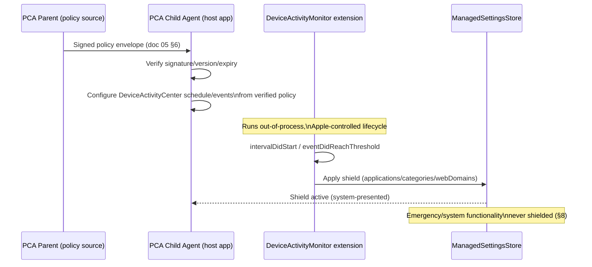

# 07 — iOS Architecture

Owning agent: **PCA-DOC-B**. Governed by doc 00 (Document Control).

## 1. Purpose

Define the iOS-specific technical architecture of the PCA Child Agent (and PCA Parent's iOS-facing configuration UI), built strictly within Apple's Screen Time API family (Family Controls, Managed Settings, Device Activity) and public frameworks (Keychain, Core ML). Every capability claim carries a doc 00 Section 8 label. iOS's architecture is structurally different from Android's (doc 06): Apple's model is opaque-token-based and privacy-preserving by design, and this document's central discipline is to never claim a capability beyond what those opaque tokens and public APIs actually expose.

## 2. Scope

In scope: native technology choice, Family Controls authorization, Managed Settings restrictions/shields, Device Activity schedules/thresholds, Keychain key storage, Core ML placement for on-device inference, anti-removal mechanics, and App Store distribution/entitlement constraints. Out of scope: Android (06), enrollment token protocol (08 — this document covers only the iOS-side child-authorization step within that flow), cryptographic primitive selection (09), and per-feature behavior detail (12–17), for which this document describes only the iOS platform mechanism.

## 3. Native technology

Recommended client: **Swift + SwiftUI**, with the required Screen Time API app extensions: a `DeviceActivityMonitor` extension (schedule/threshold callbacks run out-of-process from the main app, per Apple's design) and, where a custom shield UI is used, a `ManagedSettingsUI` `ShieldConfiguration`/`ShieldActionExtension` pair. Rationale: SwiftUI plus the extension-based Screen Time architecture is Apple's only supported integration path for this capability class — there is no viable alternative framework, since Family Controls/Managed Settings/Device Activity are Apple-native APIs with no cross-platform binding, and any attempt to reimplement equivalent restriction behavior outside these frameworks would fall outside Apple's public API surface (doc 01 Section 5's "no unsupported device manipulation" boundary).

## 4. Core frameworks

- **Family Controls** (`FamilyControls`) — parent/guardian authorization (`AuthorizationCenter.shared.requestAuthorization(for: .child)`) and the authorized host UI's `FamilyActivityPicker` for selecting apps/categories/web domains. It returns opaque `FamilyActivitySelection` tokens (`ApplicationToken`/`ActivityCategoryToken`/`WebDomainToken`) rather than a general-purpose readable inventory to the requesting app. Label: `REQUIRES_ENTITLEMENT`.
- **Managed Settings** (`ManagedSettings`) — applies restrictions ("shields") to the tokens selected via Family Controls: `ManagedSettingsStore().shield.applications`/`.applicationCategories`/`.webDomains`, plus non-shield restrictions (e.g. account/App Store restrictions) where applicable to the product's scope. Label: `REQUIRES_ENTITLEMENT`.
- **Device Activity** (`DeviceActivity`) — defines monitoring schedules (`DeviceActivitySchedule`) and threshold-based event callbacks (`DeviceActivityEvent`) delivered to the `DeviceActivityMonitor` extension (e.g. "N minutes of category X reached"), and `DeviceActivityReport` for privacy-preserving usage reporting UI rendered inside an extension the host app cannot directly read raw data from. Label: `REQUIRES_ENTITLEMENT`.
- **Managed Settings UI** (`ManagedSettingsUI`) — customized shield presentation (`ShieldConfiguration`) where Apple's API surface supports customization; the underlying shield-triggered UI is otherwise a system-presented screen PCA does not fully control. Label: `REQUIRES_ENTITLEMENT`; VERIFIED_WITH_LIMITATION on the degree of customization (Apple controls the shield's base presentation).

Distribution requires Apple to grant the Family Controls entitlement to the app (and, for the child-authorized-account flow, the app's extensions) on request; entitlement is not automatically available to every developer account (doc 01 Section 6.3, doc 33).

## 5. Privacy boundary

Apple's model intentionally uses opaque tokens and privacy-preserving restriction primitives rather than exposing raw identifiers. PCA MUST NOT assume, claim, or design around unrestricted access to another app's URLs, private in-app content, or an arbitrary cross-app activity history. Concretely:

- `ApplicationToken`/`WebDomainToken`/`ActivityCategoryToken` are opaque even to the requesting app in the general case — the app that requested the `FamilyActivityPicker` selection can re-present the same tokens back through Apple's own UI (e.g. to show "here is what you selected"), but cannot reliably reverse a token into an arbitrary human-readable app name/domain string on every OS version/config without Apple-provided display APIs, and MUST NOT attempt to defeat that opacity via non-public means.
- `DeviceActivityReport` is rendered by an extension that Apple restricts the host app's raw-data access to — the host app receives what the report extension is permitted to compute/display, not a raw exportable dataset, per Apple's documented report-extension model. `VERIFIED_WITH_LIMITATION`.
- This privacy boundary is a deliberate constraint PCA's iOS reporting UI (doc 15) must be designed around, not a limitation to work around via undocumented behavior.

**PCA-IOS-001** No iOS code path in the Child Agent or its extensions may call a private/undocumented API (including via runtime introspection or symbol lookup) to obtain data Apple's public Screen Time API surface does not expose; any feature that would require this MUST be redesigned to fit the public API boundary or explicitly marked `UNSUPPORTED` on iOS rather than implemented via a private-API path that risks App Store rejection and reintroduces exactly the "claims access the OS doesn't grant" problem doc 01 Section 5 prohibits.

## 6. Anti-removal

For a child account authorized by a parent/guardian through Family Controls, Apple documents that authorization prevents the child user from deleting the app that provides parental controls. Label: `VERIFIED_WITH_LIMITATION` (`REQUIRES_ENTITLEMENT`; scoped precisely to an active child authorization approved by a parent/guardian in the required Family Sharing relationship). This is not a universal "cannot be uninstalled" claim and does not prevent an authorized adult recovery/removal action.

This MUST be implemented only through Apple-supported authorization (`AuthorizationCenter` child flow) — no jailbreak, MDM-adjacent unsupported device manipulation, or attempt to hook into `SpringBoard`/deletion APIs outside the public framework. PCA's authorized removal flow MUST call the documented authorization-revocation API where available, verify the resulting authorization state, and clearly direct the authorized parent/guardian to Apple's supported account-recovery path if that revocation cannot complete. It must never promise that PCA can silently remove system restrictions without that authorization state changing.

**PCA-IOS-002** The product's marketing and in-app copy MUST state the anti-removal claim with its precise scope (child-account authorization active, via Family Controls) and MUST NOT generalize it to "cannot be removed from the device" without qualification, consistent with the binding constraint that no platform's anti-removal claim may be stated as universal.

## 7. Screen-time enforcement

Device Activity schedules and thresholds trigger the `DeviceActivityMonitor` extension's callbacks (`intervalDidStart`/`intervalDidEnd`/`eventDidReachThreshold`, etc.); the extension applies/removes Managed Settings shields (app/category/domain) in response. The product must remain strictly within Apple's public API and entitlement boundaries — no attempt to poll or intercept outside the documented callback model, since Device Activity extensions run in a separate, Apple-controlled process specifically to prevent the host app from continuously observing raw activity in real time (part of the same privacy-by-design boundary as Section 5).

## 8. App and web visibility

- Selected apps/categories/domains are represented through privacy-preserving tokens (Section 5), not identifiable strings, wherever Apple's API returns tokens.
- Detailed cross-device or historical reporting MUST be designed only around data Apple explicitly exposes through `DeviceActivityReport`/`DeviceActivity` extensions — PCA MUST NOT design a reporting feature on iOS that assumes a raw, exportable per-URL or per-app timestamped event log unless a specific, cited Apple API is confirmed to provide it.
- PCA Safe Browser (doc 06 Section 6's Android equivalent applies identically on iOS) may maintain its own local history for activity that occurs inside PCA's own in-house browser surface — this is first-party data PCA's own app legitimately handles, not third-party interception.
- PCA MUST NOT promise a general Safari/other-app full URL history on iOS unless a public API is confirmed to expressly support it for the deployment target; absent that confirmation this capability is `UNSUPPORTED` on iOS outside PCA Safe Browser, consistent with doc 15's ownership of the detailed claim.

## 9. Eye-distance behavior

Apple provides a system **Screen Distance** feature on supported TrueDepth-camera devices, which warns the user when a device is held too close. PCA may explain/recommend enabling this system feature to the family but cannot claim control over it, cannot read its state via private API, and cannot present it as a PCA-built capability. Label: `UNSUPPORTED` as a PCA-controlled feature; `VERIFIED` only as "PCA can point the family to a system setting that exists."

Within PCA's own foreground experience (i.e. only while the PCA app itself is the active, user-facing app), public proximity/TrueDepth-adjacent APIs may be used for PCA's own eye-distance estimation feature (doc 13) when justified and permissioned, subject to this document's binding constraint: **estimated proximity from a front-facing camera or TrueDepth sensor is an approximate signal, not a medically precise centimeter measurement**, and doc 13's UI/claims MUST reflect that (no clinical-precision wording). Cross-app continuous camera monitoring is explicitly not part of this architecture — the estimation only runs while PCA is the foreground app the child is actively using, per doc 01 Section 5's no-covert-camera-surveillance boundary.

## 10. Emergency behavior

Managed Settings shields MUST NOT intentionally block emergency/SOS calling or other OS-required emergency functionality. This is implemented by never including Phone/Emergency SOS/FaceTime-emergency-adjacent system functionality in a shield's applied-restriction set, mirroring doc 06 Section 8's Android emergency-allowlist floor.

**PCA-IOS-003** A policy envelope that would configure a shield covering the system Phone/Emergency-SOS surface MUST be rejected client-side regardless of signature validity — the same local, non-overridable safety floor pattern as PCA-AND-003 (doc 06), applied to the iOS shield model.

## 11. Entitlement fallback

If Apple's Family Controls distribution entitlement approval is unavailable or delayed:
- No fake/unsupported parental-control implementation may substitute for it (no private-API workaround, per PCA-IOS-001).
- The iOS release is limited to whatever features are supported without that entitlement (e.g. informational content, account/family management UI, features that do not require Screen Time restriction capability) until entitlement is granted.
- The Android release (doc 06) may proceed independently only if separately accepted as a standalone launch by the product owner (cross-referenced, not decided, in this document).
- Marketing and store-listing copy MUST reflect the reduced iOS capability set for as long as the entitlement is unavailable — no claim of iOS parity with the entitled feature set.

## 12. Key storage

Parent/Child Device Identity Keys and any locally-held Family Data Encryption Key material (doc 09 Section 2) MUST be stored via iOS **Keychain** with an access-control level appropriate to the key's sensitivity (e.g. `kSecAttrAccessibleWhenUnlockedThisDeviceOnly` or stronger, non-synchronizable to iCloud Keychain unless a specific, deliberate multi-device key-sync design is adopted and reviewed under doc 09) — this document states the placement constraint; doc 09 owns the key-hierarchy and rotation design itself.

## 13. On-device inference

Where on-device content classification (doc 14) requires local inference on iOS, implementation uses **Core ML** (optionally via the Vision framework for image-adjacent preprocessing) so that classification runs on-device with no network egress for the classification path itself — the same placement constraint as doc 06 Section 11 (Android), stated here for iOS; PCA-PRIV-002 applies identically on both platforms. Model architecture and runtime specifics belong to doc 23.

## 14. Failure modes

| Failure | Detection | Behavior |
|---|---|---|
| Family Controls authorization revoked by an authorized parent/guardian or through the documented revocation flow | `AuthorizationCenter` status check | Shields/monitoring stop being enforceable; app surfaces this to the parent as an out-of-band change rather than silently reporting stale "protected" status |
| `DeviceActivityMonitor` extension fails to receive scheduled callback (OS resource constraints) | Missed-callback detection via expected-vs-actual schedule reconciliation on next host-app foreground | Treated as a degraded-signal event (parallel to doc 06 Section 12's OEM-throttling case), not silently reported as full compliance |
| Family Controls authorization is unavailable after install/update | Authorization-status check and attempted schedule start | App MUST degrade to Section 11's fallback state, not crash or silently disable protection without informing the parent |
| Shield misconfiguration accidentally covers emergency surface | Client-side allowlist validation (Section 10) | Rejected before application (PCA-IOS-003) |

## 15. Security/privacy implications

- The entire iOS architecture is built around Apple's opaque-token privacy model (Section 5); this is treated as a feature to preserve, not friction to engineer around, consistent with doc 09 Section 1's confidentiality goals and doc 01 Section 5's scope boundary.
- PCA-IOS-001's prohibition on private-API use is both a store-policy risk control and a direct privacy control — a private-API path that reveals token identities would itself be a confidentiality regression against doc 09.
- Eye-distance estimation (Section 9) is scoped tightly (foreground-only, PCA's own app, approximate signal only) specifically to avoid the two named prohibited claims from the task brief: no clinical-precision claim, no cross-app camera surveillance claim.

## 16. Assumptions

- The family has configured the Apple Family Sharing relationship and child account required for Family Controls child authorization; a child device without this setup is `REQUIRES_FURTHER_OWNER_DECISION` for iOS support scope (PCA-DEC-016 below).
- Target iOS minimum version is set during doc 30's implementation programme; Section 4's framework availability assumes a currently-supported iOS version and requires revalidation if the minimum changes.

## 17. Platform limitations summary

| Claim | Label |
|---|---|
| Prevent child from deleting the app while child-account authorization is active | `VERIFIED_WITH_LIMITATION` (REQUIRES_ENTITLEMENT, scoped per Section 6) |
| Full raw per-app/per-URL historical event log outside PCA Safe Browser | `UNSUPPORTED` unless a specific Apple API is cited confirming otherwise |
| Real-time continuous cross-app camera-based proximity monitoring | `UNSUPPORTED` / explicitly out of scope (Section 9) |
| Medically precise eye-distance measurement | `UNSUPPORTED` as a precision claim; approximate signal only (Section 9) |
| Shield/restriction enforcement without the Family Controls entitlement | `UNSUPPORTED` (Section 11 fallback applies) |

## 18. Unresolved owner decisions

| Decision ID | Topic | Options | Recommendation | Status |
|---|---|---|---|---|
| PCA-DEC-016 | iOS support scope for a child device without a configured Apple child account (Section 16) | (a) Unsupported, require child-account setup before enrollment completes; (b) Reduced-feature mode without Family Controls (informational only) | (a) — the entitlement-gated capability set is the product's core iOS value; a reduced mode risks the same false-capability-claim problem this document exists to prevent | PROPOSED |
| PCA-DEC-017 | Whether to pursue `ManagedSettingsUI` custom shield branding at launch vs. accept Apple's default shield presentation | (a) Custom shield at launch; (b) Default Apple shield at launch, custom shield as a fast-follow | (b) — reduces initial entitlement/review surface area | PROPOSED |

## 19. Dependencies

- Doc 01 Section 6.3 for the product-level iOS mode definition this document implements technically.
- Doc 05 Section 6 for the signed-policy-envelope model consumed in Section 7's sequence diagram.
- Doc 08 for the child-authorization step's place in the overall enrollment flow.
- Doc 09 for key-hierarchy/rotation design behind Section 12's Keychain placement.
- Doc 13 for the eye-distance feature's detailed behavior built on Section 9's platform constraint.
- Doc 14/15 for filtering and app/YouTube-visibility claims built on Sections 5/8's platform boundary.
- Doc 23 for on-device model/runtime selection referenced in Section 13.
- Doc 33 for pending citations (Family Controls entitlement process, Device Activity Report data-exposure boundary, Screen Distance feature documentation).

## 19A. Communication safety boundary (PCA-FR-043C, PCA-FR-015A)

iOS source must preserve emergency/SOS behavior and must not claim that a normal consumer app can independently keep the Phone or Messages surfaces available during every managed restriction. Where public Family Controls/Managed Settings APIs expose a supported exception, PCA may model the communication exception; otherwise the requirement is `UNSUPPORTED` or `REQUIRES_ENTITLEMENT` and remains a real-device/external capability gate. PCA must never use private APIs, Accessibility abuse, or a hardcoded OEM-style package assumption. SMS receipt and incoming-call answer/end behavior require later physical-device UAT; source tests must not be presented as telephony evidence.

### 19A.1 Four-requirement iOS source classification

| Requirement | Classification | Source-side boundary |
|---|---|---|
| PCA-FR-043B | `SOURCE_COMPLETE_EXTERNAL_GATE` | Device Activity schedules plus Managed Settings shields can model the non-weakenable bedtime baseline; Family Controls entitlement, extension delivery, and physical-device enforcement remain external gates. |
| PCA-FR-043C | `PARTIAL_SOURCE_GAP` | Emergency/SOS is preserved through the shield floor, but public iOS APIs do not give PCA a general Android-style package/call-state observer that proves native incoming-call exception reachability. Real telephony behavior remains external UAT. |
| PCA-FR-015A | `PLATFORM_UNSUPPORTED_WITH_HONEST_DEGRADATION` | PCA can model a monotonic recovery timer in its own source, but cannot promise that a public iOS API will pause it on every external answered-call lifecycle while a Managed Settings shield remains active. The app must keep the break active rather than silently shortening it. |
| PCA-AND-003A | `PLATFORM_UNSUPPORTED_WITH_HONEST_DEGRADATION` | Android package-token resolution has no iOS equivalent. iOS uses the system emergency-surface floor and opaque Family Controls selections; it must not invent package identifiers or claim SMS foreground exemptions. |

## 20. Acceptance criteria

- [ ] Every capability claim in this document carries a doc 00 Section 8 label and matches doc 01 Section 10's cross-reference table.
- [ ] No UI or marketing string generalizes Section 6's anti-removal claim beyond its stated scope (PCA-IOS-002).
- [ ] No code path violates PCA-IOS-001 (private-API use); covered by a static-analysis/App-Review-readiness check in doc 28.
- [ ] PCA-IOS-003's emergency-shield floor is covered by a test asserting a malformed policy envelope covering Phone/Emergency SOS is rejected.
- [ ] Doc 13's eye-distance copy is reviewed against Section 9's precision/scope constraints before release.
- [ ] PCA-DEC-016 and PCA-DEC-017 are resolved before doc 30's iOS implementation phase begins.
