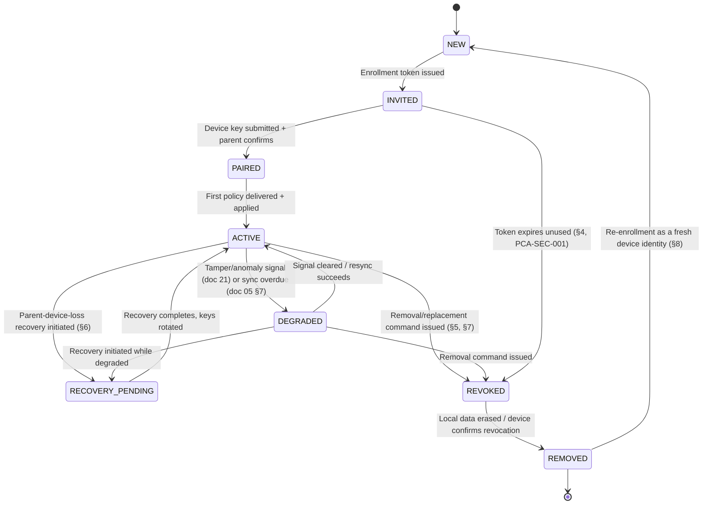
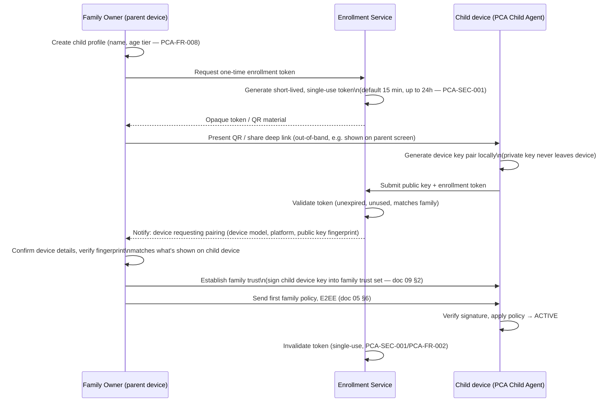

# 08 — Enrollment and Device Lifecycle

Owning agent: **PCA-DOC-B**. Governed by doc 00 (Document Control).

## 1. Purpose

Define the full device lifecycle for both parent and child devices — pairing/binding, public-key device identity establishment, multi-parent role handling, device replacement, offline recovery material, removal/re-enrollment, and factory-reset implications — as a state machine and set of flows that docs 06/07 plug their platform-specific mechanics into and doc 09 supplies the cryptographic primitives for.

## 2. Scope

In scope: device lifecycle states and transitions, the pairing/enrollment protocol flow (token issuance through policy delivery), device replacement and parent-device replacement flows, removal semantics, offline/lost-device handling, and factory-reset interaction. Out of scope: cryptographic primitive selection and key-hierarchy detail (owned by doc 09 — this document references Family Root Recovery Secret, device identity keys, etc. as already-defined concepts and only describes when/how they are established or rotated during lifecycle events), platform-specific provisioning mechanics (Android Protected Mode provisioning detail is doc 06 Section 7; iOS child-authorization detail is doc 07 Section 6 — this document covers only where those steps sit in the overall flow), and retention/deletion policy content (doc 11).

## 3. Device lifecycle states

**PCA-FR-140** Every state transition in Section 3 MUST be recorded in the family audit log (PCA-FR-124, doc 03) with actor, timestamp, and transition reason, so that "why is this device in DEGRADED" is always answerable from the audit trail rather than only from live device state.

## 4. Pairing / enrollment flow

**PCA-FR-141** The parent device MUST display the newly-submitted device's public-key fingerprint (or an equivalent short authentication string / QR-based confirmation) for the Family Owner to visually confirm against the child device before trust is established (Section 4, "Establish family trust" step), so that pairing is not blind trust-on-first-use of whatever key the Enrollment Service relays — this mitigates an Enrollment Service compromise or a token-interception attack from silently substituting an attacker's device key (cross-referenced to doc 24's threat model, which owns the full attack-tree treatment).

No family private key material (Family Root Recovery Secret, any device identity private key) is ever uploaded to the Enrollment Service in plaintext or otherwise recoverable form — the service only ever receives and stores public keys (doc 05 Section 4).

**PCA-FR-142** Enrollment MUST present, before token generation, the same plain-language monitoring-scope summary required at general enrollment completion (PCA-FR-007, doc 03) specifically at the point a *new device* is added to an existing family — re-enrollment of an additional or replacement device MUST NOT skip informed-consent disclosure on the theory that the family "already agreed" during original setup, since the device being added may be used by a different child or the family's expectations may have changed.

## 5. Multi-parent roles

A family may have more than one Parent role (Family Owner plus additional Parent/Guardian roles per doc 02/doc 18 RBAC). Lifecycle implications:

- Each parent device establishes its own Parent Device Identity Key (doc 09 Section 2) via its own device-level pairing to the family, distinct from child-device pairing but following the same public-key confirmation discipline (Section 4's PCA-FR-141 pattern applies symmetrically to a new parent device joining).
- A new parent device is added via an **invite**, not the QR-enrollment-token flow used for child devices — the inviting Family Owner (or a Parent role with the family-role-management permission per doc 18) issues an invite bound to the invitee's account/email, distinct from the anonymous-until-confirmed child-device token flow, because a parent invite carries an implicit adulthood/authority claim that a child-device pairing does not.
- **PCA-FR-143** Removing a Parent role (not the Family Owner) MUST revoke that parent device's ability to issue new signed policy envelopes immediately upon the removal command's propagation to child devices (doc 05 Section 6's signature-verification model naturally enforces this once the removed parent's key is dropped from the family trust set), and MUST be distinct from, and not require, a full device REVOKED/REMOVED lifecycle transition for the *child* device — removing a parent's authority never implicitly revokes any child device.
- The Family Owner role itself cannot be removed by another Parent role (doc 02 RBAC boundary; referenced, not re-specified, here) — Family Owner transfer/succession is out of this document's scope and tracked as PCA-DEC-018 below if not already covered by doc 02/18.

## 6. Parent-phone replacement (parent device recovery)

Unlike child-device replacement (Section 7), a parent losing their device must recover *authority*, not just re-pair a fresh executor. Flow:

1. Parent (or Family Owner, if a non-owner parent's device is lost and the parent cannot self-recover) initiates recovery using the offline **Family Root Recovery Secret** (doc 09 Section 2) established at family setup, combined with a second factor / authorized-parent approval (e.g. another surviving parent device co-signs the recovery, where a second parent device exists).
2. Recovery generates a fresh Parent Device Identity Key on the new device and, using the Family Root Recovery Secret, re-derives/re-wraps access to the Family Data Encryption Key(s) (doc 09 Section 2) so the new device can decrypt existing family history within the family's retention window.
3. The lost device's prior Parent Device Identity Key is explicitly revoked from the family trust set.
4. All active child devices are notified of the updated family trust set on next sync (doc 05 Section 6) so they no longer accept policy signed by the revoked key.

**PCA-FR-144** If no second parent device exists to co-sign recovery (single-parent family) and the Family Root Recovery Secret is also lost, family recovery is **not possible** by design (doc 09's architecture deliberately holds no centrally-recoverable plaintext copy of the secret, per doc 09 Section 1's "support staff cannot recover family plaintext" goal) — the family's only recourse is starting a new family enrollment; this MUST be disclosed to the Family Owner in plain language at the point the Family Root Recovery Secret is first generated (Section 4 profile-creation step), not discovered only during a failed recovery attempt.

## 7. Device replacement (child device)

- A new/replacement child device uses a **fresh key pair** and goes through the full Section 4 pairing flow as a new device — a replacement is not a key-transfer, it is a new PAIRED device that inherits the family's policy and, per parent choice, its history access.
- The old device is **explicitly revoked** (Section 3: ACTIVE/DEGRADED → REVOKED), not merely left inactive — an un-revoked lost device retains valid keys and could otherwise still receive/decrypt future policy or history sync traffic.
- The parent chooses, per family retention settings (doc 11), whether previously-retained family history is made available to (decryptable by) the new device — this is a deliberate choice point, not an automatic carry-over, since a replacement device might belong to a different child in some family reorganizations.
- A revoked device can no longer decrypt new policy or history messages once the family trust set updates (doc 09's key-rotation mechanism enforces this cryptographically, not just by an application-level flag).

## 8. Removal and factory-reset implications

Authorized family removal sequence (device or entire family):

1. Confirm strong parent authentication (step-up beyond ordinary session auth — exact strength is a doc 02-owned decision, PCA-DEC-004, referenced here not re-decided).
2. Send a signed removal/revoke command to the target device (doc 05 Section 6 envelope model, with a `removal` message type).
3. Export or delete history per parent choice (doc 11 governs retention semantics; this document only sequences the choice point).
4. Release platform parental-control authority through supported APIs only — Android: relinquish device-owner or profile-owner status only through `DevicePolicyManager`'s supported removal path (doc 06 Section 7), rather than leaving stale DPC state; iOS: revoke the Family Controls authorization only through Apple's documented authorization-revocation flow and confirm the resulting status (doc 07 Section 6), rather than claiming PCA can remove a shield independently of that authorization.
5. Revoke device certificates/keys from the family trust set (doc 09).
6. Erase family data from the removed device when technically possible (local vault wipe); where the device is offline at removal time, see Section 9 (lost/offline handling) for how this is completed later.

**PCA-FR-145** Step 4's platform-authority release MUST be attempted and its outcome (succeeded / failed / not-applicable-to-this-mode) recorded in the audit log (PCA-FR-140) — a removal that revokes keys but silently fails to release Android device-owner status or iOS Family Controls authorization would leave the device in a confusing state where PCA cryptographic access is gone but OS-level restriction UI may persist. The parent MUST be told explicitly when Apple's authorization state needs an authorized-parent recovery action; PCA must not name or rely on an undocumented system-settings route.

**Factory reset implications**: A factory reset of a child device unconditionally destroys the local family vault and the device's private key material, which is equivalent in effect to REMOVED from the family's perspective (the device can never decrypt family data again) but does **not**, by itself, deliver a clean removal signal to the family trust set or notify other devices — this is why Section 9's lost/offline handling exists: the family-side revocation must be initiated explicitly rather than assumed from device-side silence, since silence is also consistent with "device is just offline."

## 9. Lost / offline child device

The Enrollment/relay service records **revocation intent** (a signed revoke command queued for delivery, doc 05 Section 3.4's short-TTL queuing applies to delivery attempts, not to the intent record itself, which persists in the family trust set until acknowledged). The child device rejects future service access and applies revocation as soon as it next reconnects (it cannot be forced to revoke while genuinely offline — there is no remote-wipe capability that operates without any connectivity, and this document does not claim one). The parent UI MUST clearly show a **pending revocation** status distinct from a completed one, consistent with doc 05 Section 7's Live/Offline/Sync-overdue state discipline.

**PCA-FR-146** If a lost child device never reconnects, its keys remain permanently excluded from the family trust set (the revocation intent has no expiry) — this is sufficient to prevent the lost device from receiving *future* family data, but this document makes no claim about remotely deleting data already resident on a lost, never-reconnecting device (no remote-wipe-without-connectivity capability exists, consistent with doc 01 Section 5's boundary against claiming OS access PCA does not have).

## 10. Re-enrollment

A REMOVED device may re-enroll as a **fresh device identity** (Section 3: REMOVED → NEW), going through the full Section 4 flow again with a new key pair — re-enrollment is never a resurrection of the old device's prior trust or history access. If the same physical device is being re-enrolled into the same family (e.g. after an accidental removal), the parent experience should make this efficient (Section 4's flow still applies in full — no shortcut that skips public-key re-confirmation, since skipping it would reintroduce the trust-on-first-use risk PCA-FR-141 exists to prevent).

## 11. Failure modes

| Failure | Detection | Behavior |
|---|---|---|
| Enrollment token intercepted/guessed before legitimate use | Single-use + short TTL (PCA-SEC-001) | Second redemption attempt rejected; legitimate parent sees "token already used," should re-issue and investigate |
| Enrollment Service compromised, attacker relays substitute device key | Fingerprint confirmation step (PCA-FR-141) | Family Owner visually detects mismatch and aborts pairing before trust is established |
| Recovery attempted with lost Family Root Recovery Secret, no second parent | Recovery flow validation (Section 6) | Recovery blocked; family informed at recovery-secret generation time this scenario is unrecoverable (PCA-FR-144) |
| Removal command sent to an offline device | Delivery timeout | Revocation intent persists (Section 9); parent UI shows pending, not completed |
| Platform-authority release (Section 8 step 4) fails silently | Explicit outcome check + audit record (PCA-FR-145) | Parent notified of required manual follow-up rather than assuming clean removal |
| Factory reset without explicit family-side removal first | No signal reaches family trust set from device silence alone | Parent must explicitly initiate removal (Section 8) if a device is known to be reset/discarded; UI documentation should recommend "remove from family" before disposing of a device |

## 12. Security/privacy implications

- The public-key confirmation step (PCA-FR-141) is this document's primary defense against an Enrollment Service compromise being escalated into a family trust compromise — it keeps the Enrollment Service's role limited to relaying material the parent still independently verifies, consistent with doc 05 Section 4's "Enrollment Service is not trusted with plaintext, and here is also not blindly trusted with key relay" posture.
- The deliberate unrecoverability documented in PCA-FR-144 is a direct consequence of doc 09 Section 1's "support staff cannot recover family plaintext" goal; this document surfaces the user-facing cost of that guarantee (permanent data loss on dual failure) rather than letting it be discovered only during an incident.
- Removal (Section 8) and factory reset (Section 8) are kept conceptually distinct: only an explicit, authenticated removal command updates the family trust set and audit log; a bare factory reset is data destruction on the device side only.

## 13. Assumptions

- The Enrollment Service (doc 05 Section 3.3) is reachable during Section 4's pairing flow; enrollment is not designed to work fully offline (doc 01 Section 9).
- At least one parent device retains a working copy of, or access to, the Family Root Recovery Secret material in the recommended offline form (e.g. printed/exported recovery sheet) — doc 09 owns the exact export/display mechanism; this document assumes it exists and is usable when Section 6 is invoked.
- Multi-parent families will, in practice, often have exactly one primary Family Owner and zero-to-few additional Parent roles; Section 5's co-signing recovery path assumes at least one other live parent device for the "second parent co-signs" branch and explicitly documents the no-second-parent failure case (PCA-FR-144).

## 14. Platform limitations

| Claim | Label |
|---|---|
| Clean platform-authority release on removal (Android device-owner relinquish, iOS Family Controls authorization removal) | `VERIFIED_WITH_LIMITATION` — supported APIs exist (docs 06 §7, 07 §6) but success is not unconditionally guaranteed on every OS/state combination, hence PCA-FR-145's explicit outcome tracking |
| Remote wipe of a lost, never-reconnecting device | `UNSUPPORTED` (Section 9/PCA-FR-146) |
| Recovery without Family Root Recovery Secret and without a second parent device | `UNSUPPORTED` by design (PCA-FR-144) |

## 15. Unresolved owner decisions

| Decision ID | Topic | Options | Recommendation | Status |
|---|---|---|---|---|
| PCA-DEC-018 | Family Owner role transfer/succession (e.g. Family Owner's own device and account are both lost) | (a) Not supported in v1 — family must re-enroll as new; (b) Support a designated successor-parent mechanism established at family setup | (a) for initial launch, given Section 6's already-significant recovery-flow complexity; revisit (b) once base recovery flow is validated in production | PROPOSED |
| PCA-DEC-019 | Whether a new parent-device invite (Section 5) requires the invitee to complete any identity check beyond email/account confirmation | Mirrors PCA-DEC-004 (doc 02) | Defer to doc 02's resolution of PCA-DEC-004; no independent recommendation from this document | PROPOSED |

## 16. Dependencies

- Doc 05 Section 6 for the signed-policy-envelope model reused throughout pairing, removal, and recovery.
- Doc 09 for the Family Root Recovery Secret, device identity key, and Family Data Encryption Key concepts this document sequences lifecycle events around.
- Doc 06 Section 7 / doc 07 Section 6 for the platform-specific mechanics of Section 8 step 4.
- Doc 02/18 for RBAC role definitions and the PCA-DEC-004 identity-check decision referenced in Section 5.
- Doc 11 for retention/deletion semantics referenced in Section 7/8.
- Doc 21 for tamper/anomaly signals that drive ACTIVE → DEGRADED transitions (Section 3).
- Doc 24 for the full threat-model treatment of the Enrollment Service compromise scenario introduced in Section 4/11.

## 17. Acceptance criteria

- [ ] The state machine in Section 3 matches every other document's references to device lifecycle states exactly.
- [ ] PCA-FR-141 (fingerprint confirmation) is implemented and covered by a test simulating a substituted device key at pairing time.
- [ ] PCA-FR-144's unrecoverability disclosure is shown at Family Root Recovery Secret generation time, verified by a UI acceptance test (doc 28), not only documented here.
- [ ] PCA-FR-145's audit record exists for every removal attempt, including failed platform-authority-release outcomes.
- [ ] Every transition in Section 3 has a corresponding audit-log entry type (PCA-FR-140), traced in doc 32.
- [ ] PCA-DEC-018 and PCA-DEC-019 are resolved before doc 30's account-recovery implementation phase begins.
