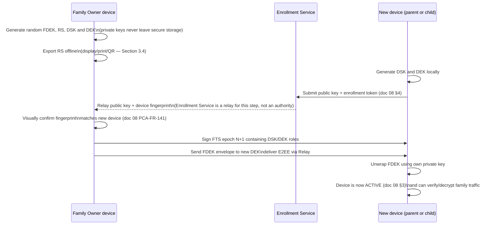

# 09 — Security, Privacy and End-to-End Encryption

Owning agent: **PCA-DOC-C**. Governed by doc 00 (Document Control).

## 1. Purpose and scope

This document is the authoritative cryptographic design for PCA: the key hierarchy, message/envelope security properties, and — most importantly — the precise boundary of what PCA infrastructure (Enrollment/Licensing Service and Relay, doc 05 Section 3) MAY and MUST NOT see. Every other document's "E2EE", "cannot decrypt", or "signed policy" claim resolves here. Docs 05 and 08 already reference this document's Section 1 (security goals), Section 2 (key hierarchy), Section 3 (message properties/replay protection) and Section 4 (server knowledge boundary) by number; those four section numbers are treated as stable anchors and are not renumbered by this revision.

In scope: key hierarchy (generation, storage, rotation, revocation), message/envelope security properties, replay protection, the server-knowledge allow/forbid boundary, push-notification payload constraints, local-encryption-at-rest posture, backup handling, and encrypted export. Out of scope: platform-specific secure-storage APIs (Android Keystore/StrongBox — doc 06; iOS Keychain/Secure Enclave — doc 07), device lifecycle sequencing of when keys are established/rotated (doc 08, which consumes this document's key concepts), the local data model itself (doc 10), and retention/deletion mechanics (doc 11, which this document only bounds via "deletion of ciphertext PCA cannot read anyway is still required by the family's retention window").

This document intentionally avoids the unqualified phrase "zero knowledge." Every confidentiality claim below is stated as "PCA infrastructure cannot read `<specific data class>`" together with the precise mechanism (Section 4) — a reader must be able to check each claim against a specific boundary, not against a marketing term.

## 2. Security goals

- **PCA-SEC-010** Family monitoring content (activity payloads, policy content) MUST be confidential from PCA infrastructure end to end — the Enrollment/Licensing Service and Relay (doc 05 Section 3) handle ciphertext only.
- **PCA-SEC-011** Only authorized family roles (doc 02 Section 3, enforced via doc 18 RBAC) can issue policy or read permitted reports; a device outside the family trust set (Section 3.2) cannot produce a policy envelope a child device will accept.
- **PCA-SEC-012** A child device's effective policy MUST NOT be silently downgraded by a network attacker, a compromised Relay node, or a captured-and-replayed old message (Section 3).
- **PCA-SEC-013** Lost or compromised parent/child devices MUST be revocable, cryptographically (not just by an application-level flag) and without requiring cooperation from the lost device.
- **PCA-SEC-014** Activity retention (doc 11) MUST be enforceable locally by the device that holds the plaintext; PCA infrastructure holding no plaintext means it also cannot be the enforcement point for retention of family activity content — enforcement is a Parent/Child Agent responsibility, not a server-side job, for that data class.
- **PCA-SEC-015** PCA support/operations staff MUST NOT be able to recover family plaintext under any support workflow — no key-escrow, no support-side master key, no "temporarily decrypt for troubleshooting" capability (doc 27 owns the support-tooling boundary this constrains).

These goals are the acceptance bar for Sections 3–8; a design that satisfies the letter of a section below but violates one of these goals is not compliant.

## 3. Key hierarchy

### 3.1 Conceptual keys

| Key | Type | Generated | Held by | Purpose |
|---|---|---|---|---|
| **Recovery Secret (RS)** | High-entropy, offline recovery material, distinct from all device keys | Once at family creation | Family Owner only, offline/exported; never plaintext to PCA | Inputs a reviewed KDF to make a **Recovery Wrapping Key (RWK)**. It does **not** derive an FDEK. |
| **Device Signing Key Pair (DSK)** | Dedicated asymmetric signing pair | Per device, at pairing/identity rotation | Private key stays in platform secure storage; public verification key is in the signed trust set | Signs trust-set epochs, policy/control envelopes, receipts and recovery authorization. It is never used for key agreement or wrapping. |
| **Device Key-Agreement / Encryption Key Pair (DEK)** | Dedicated recipient encryption/KEM pair | Per device, at pairing/cryptographic rotation | Private key stays in platform secure storage; public recipient key is in the signed trust set | Receives FDEK envelopes. It is never used to sign policy or trust-state. |
| **Family Data Encryption Key (FDEK)** | Random symmetric content key, identified by `keyEpoch` | At family creation and every security rotation | Only family devices, via device-targeted envelopes; PCA never holds a decryptable copy | Encrypts family activity/policy payloads. Random generation is mandatory; no recovery secret is represented as an FDEK derivation input. |
| **Recovery Wrapping Key (RWK)** | Ephemeral KDF output from RS, with family binding and recovery-envelope salt | Only while creating/opening a recovery envelope | Family Owner/recovery transaction only; zeroized afterwards | Opens the recovery envelope containing wrapped FDEK/key/trust material. |
| **Message/Session Keys** | Ephemeral, derived per-envelope or per-session (e.g. via an authenticated-encryption construction keyed from the FDEK and a per-message nonce) | Per envelope/session | Not persisted beyond the envelope's processing | Confidentiality + integrity of the transport payload; bounds the blast radius of any single derived-key exposure |

Concrete cryptographic primitives (curve choice, AEAD construction, KDF) are selected during a dedicated security implementation review from current, platform-supported, non-deprecated libraries (e.g. platform-native crypto providers or a maintained, audited open-source library); **custom/home-grown cryptographic primitives are prohibited** (PCA-SEC-016). This document intentionally does not pin a specific algorithm suite so that the security review is not constrained by a documentation choice made before implementation-time library/OS support is confirmed; it does pin the *properties* every candidate suite must have (Section 3.6).

### 3.2 Family trust set

The **Family Trust Set (FTS)** is a signed, versioned family object, not a server ACL. Each epoch contains: `familyId`; `trustSetEpoch`; authorized parent and child device entries; for each entry `deviceId`, role, DSK key ID/public key, DEK key ID/public key, status (`ACTIVE | ROTATION_PENDING | DEVICE_OFFLINE | REVOKED | EPOCH_STALE | RECOVERY_REQUIRED`); `keyEpoch`; `issuedAt`; `supersedesEpoch`; authorization rule and signature(s). It is signed by the currently authorized owner DSK (or by the recovery transaction defined in Section 10). A recipient verifies the FTS before accepting an envelope; the Relay is only a distributor.

**PCA-SEC-017** Every device MUST independently verify envelope signatures against its own locally-held copy of the family trust set; a device MUST NOT treat "the Relay delivered this message" as any form of authentication.

### 3.3 Key establishment and confirmation

This diagram elaborates doc 08 Section 4's pairing sequence from the cryptographic side; doc 08 owns lifecycle-state sequencing, this document owns what each cryptographic step actually does.

### 3.4 Recovery Secret export and recovery envelope

**PCA-SEC-018** The RS MUST be presented offline at creation with explicit acknowledgement that loss of both RS and all active parent devices makes recovery permanently impossible. PCA infrastructure never receives RS, an escrow share, or a recoverable derivative. The recovery envelope is an authenticated-encrypted object containing only: `familyId`, envelope format/KDF suite IDs, salt, recovery-envelope ID, creation/key/trust-set epochs, encrypted FDEK(s) and the minimum signed FTS material needed to start recovery. The associated data binds `familyId`, envelope ID, epochs and suite IDs. It contains no activity plaintext. An opaque copy MAY be retained by PCA solely for delivery/availability; it is not decryptable by PCA.

The RWK is produced from RS with the recorded reviewed KDF and salt, then used only to open this envelope. Recovery never "re-derives" the random FDEK. Candidate pattern: RFC 9180 HPKE for device envelopes plus a reviewed password/recovery-key KDF and AEAD for the RS-protected envelope; DSK/DEK role separation is architectural choice, while exact suites require specialist cryptographic approval, platform-library review and test vectors before implementation.

### 3.5 Rotation and revocation

Key rotation and device revocation are two related but distinct operations:

- **Rotation** (scheduled, or triggered by suspected compromise) generates a fresh FDEK and re-wraps it to every device still in the trust set at rotation time using that device's encryption/encapsulation public key. Rotation alone does not remove any device from the trust set.
- **Revocation** (doc 08 Sections 6–8: device replacement, parent-phone recovery, removal) removes a device's public key from the family trust set. A revoked device's already-held FDEK copy remains locally on that device (it cannot be remotely deleted from a device with no connectivity, per doc 08 Section 9/PCA-FR-146) but becomes cryptographically useless for **future** traffic because revocation is always followed by rotation (**PCA-SEC-019**: every revocation MUST trigger an FDEK rotation to every remaining trusted device, not merely a trust-set edit, so a revoked device cannot decrypt anything encrypted after its revocation even if it retains its last-known FDEK copy).

**PCA-SEC-020** This distributed transition is **not atomic**. Owner signs FTS epoch N+1, marks the removed device `REVOKED`, creates FDEK key epoch N+1, and sends FDEK envelopes only to active remaining DEKs. Online devices verify/adopt N+1 before they accept new control or activity envelopes; a device without N+1 is `EPOCH_STALE`/`DEVICE_OFFLINE`, must not exercise new control authority, and displays pending convergence to the parent. Receivers reject messages signed by revoked keys and reject future data/control whose FTS/key epoch is older than their accepted minimum. A revoked offline endpoint can retain already-held historical data and pre-revocation FDEK material; PCA makes no retroactive remote-erasure claim. The goal is loss of **new** data access and **new** control authority after convergence.

### 3.6 Required cryptographic properties (implementation-review constraints)

Whatever concrete algorithm suite is chosen (Section 3.1) MUST provide:

- authenticated encryption (confidentiality + integrity in one construction) for envelope payloads — no encrypt-then-forget without an integrity tag;
- forward-secrecy consideration for session/message keys where the chosen construction supports it, so a single derived-key compromise does not retroactively expose prior traffic (`REQUIRES_FURTHER_OWNER_DECISION` — full ratchet-style forward secrecy vs. a simpler per-envelope AEAD keyed from the FDEK is a cost/complexity trade-off for the security implementation review, tracked as PCA-DEC-020 below);
- signature verification for every envelope's authorship claim (Section 4);
- a KDF (not raw key reuse) wherever a session/message key is derived from the FDEK, so envelope keys are not directly the long-lived FDEK.

The implementation security review MUST record the selected suite, library version, platform availability, nonce-generation strategy, key separation, and test-vector/interoperability evidence before any production data is handled. The review uses RFC 5116 for the authenticated-encryption interface/property baseline and NIST SP 800-57 Part 1 Rev. 5 for key-management lifecycle review; neither source is treated as a license to design a custom protocol.

## 4. Message properties

Every family-control message (policy push, activity-summary upload, revocation command, status receipt, tamper event — doc 05 Section 6) MUST include:

- protocol version;
- family/device opaque IDs (doc 10 Section 4 — never a value that also appears in a readable central schema);
- sender key ID (identifies which trust-set entry signed the message, Section 3.2);
- message type;
- a monotonic sequence number or replay-resistant nonce per sender-key (**PCA-SEC-021**: a receiving device MUST reject any message whose sequence/nonce it has already processed for that sender key, closing the replay path independently of the policy-version check below);
- issued-at and expiry fields (doc 05 PCA-FR-138: an expired envelope MUST NOT be applied even if validly signed);
- policy/data version, checked for strict monotonicity on the receiving device except for an explicitly signed rollback message type (doc 05 Section 6 — this is the mechanism behind PCA-SEC-012's anti-downgrade goal);
- `trustSetEpoch` and `keyEpoch`, so a recipient can reject traffic from a revoked trust set or pre-rotation FDEK even if the envelope otherwise verifies;
- the authenticated-encrypted payload itself;
- the sender's signature over the entire envelope (not just the payload), so envelope metadata (version, expiry, sequence) cannot be stripped or altered in transit without invalidating the signature.

**PCA-SEC-022** A receiving device MUST reject an envelope that fails *any* of: signature verification, sequence/nonce replay check, expiry check, or version-monotonicity check — verification failures are independent checks, not a single combined "looks fine" heuristic, so that a single-property attack (e.g. a valid-signature-but-replayed message) is still caught.

For delayed delivery, receivers maintain a bounded per-sender replay ledger and process messages by semantic dependency rather than arrival order: an envelope for a future policy version may remain pending only until its signed predecessors arrive or its expiry passes; it MUST NOT cause the recipient to skip a version. A rollback is not an ordinary lower-version policy: it is a distinct, signed, time-bounded recovery envelope naming the exact target version, current `trustSetEpoch`/`keyEpoch`, reason, and one-time rollback identifier. It is accepted only by an explicitly authorized parent role and is itself entered in `ParentActionAudit`; no Relay instruction can create an implicit rollback.

On rejection, the child device keeps its last-valid policy and raises a tamper/anomaly event (doc 21), consistent with doc 05 Section 6's rejection branch.

## 5. Server knowledge boundary

This is the section every other document's "PCA cannot read X" claim traces back to.

### 5.1 What PCA infrastructure MAY know

| Data class | Held by | Rationale |
|---|---|---|
| Account/license relationship (which account owns which family, subscription state) | Enrollment/Licensing Service | Required to gate the product commercially (doc 05 Section 3.3) |
| Public keys (parent and child device identity keys) | Enrollment/Licensing Service, Relay | Public by definition; needed to relay envelopes and confirm enrollment, not sensitive on their own |
| Platform/app versions | Enrollment/Licensing Service | Needed for update distribution and compatibility gating (doc 29) |
| Push routing tokens (FCM/APNs) | Enrollment/Licensing Service, Relay | Needed to wake the correct device (Section 6) |
| Last relay connection timestamp, coarse delivery outcome | Relay | Operability/health only (doc 05 PCA-FR-137) |
| Enrollment invitation state (issued/redeemed/expired) | Enrollment/Licensing Service | Needed to enforce doc 03 PCA-SEC-001's single-use/expiry requirement |
| Child-profile membership (that an opaque, server-minted `childProfileId` exists and belongs to an opaque `familyId`) | Enrollment/Licensing Service | Needed so a child profile outlives the single invitation it was minted for, and so a parent action naming a child profile belonging to another family can be refused (doc 39, doc 10 Section 7). The record is two opaque identifiers, a timestamp, and an operational idempotency value — an existence/ownership edge, not a child profile. **No readable child-profile content is permitted in the central service**: no name, nickname, date of birth, age or age tier, gender, school, avatar/photo, wellbeing, location, or usage/activity (doc 10 Section 7.1's closed field list; the child's readable profile is `FamilyMember`, doc 10 Section 3.2, local plaintext and E2EE only). Membership status must never be answered in a way that distinguishes "belongs to another family" from "does not exist" (doc 39 Section 5) |
| Revocation intent record (a device key is queued for removal from the trust set) | Relay/Enrollment Service | Needed to deliver the revocation to an eventually-reconnecting device (doc 08 Section 9); the record itself is an opaque instruction, not activity content |
| Short-lived undelivered ciphertext (ciphertext blob only) | Relay, bounded TTL (doc 11 Section 7) | Needed to bridge offline delivery (doc 05 Section 3.4); PCA cannot decrypt it (Section 5.2) regardless of how long it is retained |
| Routing metadata (opaque sender/recipient device IDs, message size class, timestamp, delivery outcome) | Relay logs (doc 05 PCA-FR-137) | Needed for operability; explicitly bounded to exclude anything payload-derived |

### 5.2 What PCA infrastructure MUST NOT know — readable

- URLs/browsing history (doc 14, doc 10 `WebVisit`);
- app-usage events, per-app time, YouTube activity (doc 15, doc 10 `UsageSession`);
- precise or historical locations (doc 16, doc 10 `LocationPoint`);
- content-block classifications tied to an identifiable child (doc 14, doc 10 `ContentBlockEvent`) beyond what is needed for anonymized, opt-in, aggregate product telemetry under PCA-NFR-014's separate-consent rule (doc 04 Section 3) — and even then, never tied to a specific family/child ID;
- prayer-time activity (doc 17, doc 10 `PrayerReminderEvent`);
- child photos, face frames, or any biometric template (doc 13 — no such data is ever generated for transmission in the first place; Section 5.3 below);
- message/communication content, screenshots, microphone/camera captures (doc 01 Section 5 — no such collection capability exists at all, so there is nothing of this class to protect at the transport layer; this is a stronger guarantee than encryption-in-transit, it is absence of the data path);
- the plaintext of any policy content (screen-time rules, filter lists, RBAC assignments) — PCA relays signed ciphertext only;
- readable child-profile content — a child's `displayName`/nickname, date of birth, age or age tier, gender, school, avatar/photo, wellbeing state, location, or usage/activity (doc 10 Section 3.2 already tags `FamilyMember.displayName` *(sensitive — local plaintext only; never included in any central-service-visible field)*; this bullet restates that existing prohibition here so Section 5.1's opaque child-profile membership row cannot be read as licence for the content). This is case (b) of Section 5.3: the data is generated locally and leaves the device only as authenticated-encrypted payload under a FDEK PCA infrastructure never holds. Central knowledge of a child is bounded to the opaque identifier and its family edge; a central database compromise must yield opaque relationships, never a family directory.

**PCA-SEC-023** No Enrollment/Licensing Service or Relay schema, table, log field, or API contract may be capable of holding any Section 5.2 data class in readable form — this is restated from doc 05 PCA-FR-136 as the cryptographic-boundary half of that architectural constraint (doc 05 owns the schema-level restatement; this document owns *why* it's structurally true: the payload is authenticated-encrypted before it ever reaches PCA infrastructure, and PCA infrastructure holds none of the keys needed to open it — Section 3.1's FDEK is wrapped only to family device keys, never to any PCA-operated key).

### 5.3 Why this list is exhaustive, not aspirational

Each Section 5.2 item is either (a) never generated on a path that leaves the originating device (e.g. eye-distance proximity signals are consumed locally and never serialized into an outbound envelope, doc 13), or (b) generated locally and then only ever transmitted as an authenticated-encrypted payload under a FDEK PCA infrastructure never holds (Section 3.1). Both are structural properties checkable in the implementation (no serialization path exists in case (a); no PCA-held decryption key exists in case (b)), not policy promises — this is the precise sense in which this document avoids the word "zero-knowledge" while still making a falsifiable claim.

## 6. Push notifications

FCM/APNs payloads MUST contain only opaque wake/reference information (e.g. "new envelope available, fetch from Relay") or a generic, non-family-specific notification string (e.g. a platform-templated "PCA has an update for you"). Sensitive alert detail (which policy changed, which child, what the tamper event was) is retrieved and decrypted in-app after the wake, never placed in the push payload itself — push infrastructure (Google/Apple) is a third party outside the family trust boundary and MUST be treated with the same "cannot read family content" constraint as PCA's own Relay (Section 5.2).

## 7. Local encryption at rest

Sensitive local databases (activity vault, doc 10) use OS-backed key protection: Android Keystore/StrongBox where available (doc 06), iOS Keychain/Secure Enclave where available (doc 07). `VERIFIED_WITH_LIMITATION` — hardware-backed key storage availability varies by device tier; a software-backed keystore fallback must still exist and must still satisfy the "no hardcoded/recoverable master key" property below.

**PCA-SEC-024** Local database encryption MUST NOT rely solely on an application-level hardcoded password or a key derivable from static, reverse-engineerable app constants — the local vault's encryption key MUST itself be protected by the platform secure-key facility. Hardware backing is preferred where the device reports it; where it is unavailable, the application MUST label the weaker assurance accurately and MUST NOT claim a hardware-bound/non-exportable guarantee it cannot evidence, consistent with doc 04 PCA-NFR-003/PCA-NFR-005.

## 8. Backup policy

**PCA-SEC-025** Device/cloud backup behavior (Android Auto Backup, iOS iCloud/Finder backup) MUST be explicitly configured (allow-list or exclusion rules per platform mechanism, doc 06/07) so that private keys and the local encrypted vault are not swept into a general-purpose backup in an insecure or trivially-recoverable form. Where a platform backup mechanism cannot be scoped precisely enough to exclude only the sensitive material, the safer default is to exclude the entire app data directory from platform auto-backup and rely on this document's own encrypted-export mechanism (Section 9) for any family-initiated portability need.

## 9. Data export

**PCA-SEC-026** A parent-requested export is generated and encrypted entirely on the parent device (never proxied through, or generated by, PCA infrastructure) and is encrypted such that only the family's own key material can open it — restated from doc 03 PCA-FR-125. Exports include an explicit retention scope (which window of data is included) and a creation timestamp, so an old export cannot be mistaken for current data. Export handling is otherwise governed by doc 11 Section 10 (retention/deletion semantics for copies once they leave app-managed storage are the family's responsibility, disclosed at export time).

## 10. Authenticated recovery transaction

Recovery is a controlled trust transition, not a support reset. The Family Owner starts it on a new parent device, generates new DSK/DEK pairs, retrieves the opaque recovery envelope, derives RWK locally from RS, and verifies the envelope's family binding, format and anti-replay fields. The recovery transaction creates FTS epoch N+1, enrolls the new parent, revokes lost/replaced parent keys, creates a fresh FDEK key epoch N+1 and re-wraps it only to the new/remaining authorized DEKs. It is signed by the new recovery-authorized identity and recorded with an immutable `recoveryTransactionId`; Relay accepts each transaction ID once and returns a signed/authoritative delivery receipt, preventing replay. A second active parent may instead authorize an ordinary replacement through the current FTS; it still triggers an epoch/key rotation.

| Case | Required behavior |
|---|---|
| Recovery-code loss and no active parent | `RECOVERY_REQUIRED` but unrecoverable; no support-agent bypass or alternate account proof can decrypt family material. |
| Recovery-code theft | Treat as compromise: initiate recovery from an active parent if possible, rotate RS/recovery envelope, FTS and FDEK; disclose that theft plus a lost device may permit takeover. |
| Replaced/lost parent | Revoke its DSK/DEK in N+1; status stays `ROTATION_PENDING` until active devices acknowledge N+1. |
| Server compromise | Attacker may obtain opaque envelope, public keys and routing metadata, but not RS/RWK/FDEK plaintext; device fingerprint/FTS signature verification remains mandatory. |
| Offline device | It adopts N+1 at reconnect; until then UI says `DEVICE_OFFLINE` and its local historical content cannot be remotely erased. |

No recovery transaction exposes recovery plaintext to PCA staff. Full lifecycle UI sequencing remains in docs 08 and 21; those documents must consume this exact model.

## 11. Failure modes

| Failure | Detection | Behavior |
|---|---|---|
| Relay compromised (server-side) | N/A to payload confidentiality — ciphertext only (Section 5.2) | Attacker gains routing metadata and undelivered ciphertext (Section 5.1), not plaintext; still a metadata-exposure concern carried into doc 24 |
| Enrollment Service compromised, attempts to relay a substitute device public key | Fingerprint confirmation at pairing (doc 08 PCA-FR-141) | Family Owner detects mismatch and aborts before the substitute key ever enters the trust set (Section 3.2/3.3) |
| Envelope replayed by a network attacker | Sequence/nonce check (PCA-SEC-021) and version monotonicity (Section 4) | Rejected independently by either check; tamper/anomaly event raised (doc 21) |
| Device revoked while another device is offline | FTS epoch acknowledgements and status values | No atomicity claim: online devices use N+1; offline device is `DEVICE_OFFLINE`/`EPOCH_STALE` until it receives N+1, and cannot be remotely stripped of historic content |
| RS lost with no second parent device | Recovery transaction validation | Recovery blocked by design (PCA-SEC-015); disclosed at RS generation |
| RS stolen | Parent-reported compromise or suspicious recovery attempt | Active parent rotates recovery envelope, trust set and FDEK; no support master bypass exists |
| Local vault key protection unavailable (low-end device, no hardware keystore) | Platform capability check at first run (doc 06/07) | Software-backed fallback used (Section 7); device is not silently left with a weaker guarantee than the parent is told about — doc 26/27 own the exact user-facing disclosure |
| Push provider (FCM/APNs) compromised or subpoenaed | N/A to family content — opaque payload only (Section 6) | Attacker/requester learns only that a wake event occurred, not its content |

## 12. Security/privacy implications

- Section 5 is the canonical answer to "what does PCA know about my family" and MUST stay in sync with doc 03 Section M (PCA-FR-120–127) and doc 03's "What parents can see" page content — a change to Section 5.1/5.2 without a corresponding doc 03 change is a doc 00 Section 9 conflict, not a routine edit.
- The RS (Section 3.1/3.4) is deliberately separate from DSK, DEK and FDEK: it opens an envelope containing random key material; it is not a disguised deterministic family master key.
- Metadata exposure (Section 5.1's "MAY know" list) is still a real privacy consideration (traffic analysis, family-existence disclosure, rough activity-timing inference from message-size/timing patterns) and is explicitly carried into doc 24's threat model rather than dismissed because payloads are encrypted.

## 13. Assumptions

- At least one security implementation review occurs before any cryptographic primitive is pinned in code (Section 3.1); this document defines required properties (Section 3.6), not a final algorithm list.
- Platform secure key stores (Android Keystore/StrongBox, iOS Keychain/Secure Enclave) are available on the large majority of target devices, with a documented software fallback for the remainder (Section 7).
- The Relay (doc 05 Section 3.4) is either PCA-operated or a subprocessor contractually bound to the same no-plaintext-access constraint (doc 05 PCA-DEC-013) — this document's guarantees hold regardless of operator because they are cryptographic, not contractual, but the contractual binding is still assumed for the metadata-handling constraints in Section 5.1.
- Family devices' local clocks are approximately correct for expiry/issued-at checks (Section 4); doc 21 owns detailed clock-rollback tamper detection.

## 14. Platform limitations

| Claim | Label |
|---|---|
| Hardware-backed key storage (Android Keystore/StrongBox, iOS Secure Enclave) | `VERIFIED_WITH_LIMITATION` — available on the large majority of modern devices but not universally guaranteed on every device tier; software-backed fallback required (Section 7) |
| Forward secrecy for every message/session key | `REQUIRES_FURTHER_OWNER_DECISION` — depends on the algorithm suite chosen at implementation-review time (Section 3.6, PCA-DEC-020) |
| Remote revocation reaching an offline device immediately | `UNSUPPORTED` — consistent with doc 08 Section 9/PCA-FR-146; revocation is enforced on next reconnect, not instantaneously against a genuinely offline device |
| Backup-exclusion mechanisms (Android Auto Backup rules, iOS backup exclusion attributes) | `VERIFIED_WITH_LIMITATION` — platform mechanisms exist (doc 33) but must be explicitly configured per Section 8; a missing configuration is an implementation defect, not a platform gap |

## 15. Unresolved owner decisions

| Decision ID | Topic | Options | Recommendation | Status |
|---|---|---|---|---|
| PCA-DEC-020 | Forward-secrecy construction for message/session keys (Section 3.6) | (a) Full ratchet-style forward secrecy (e.g. Double-Ratchet-like construction) per envelope; (b) Simpler per-envelope AEAD keyed from the current FDEK with periodic FDEK rotation as the primary mitigation (Section 3.5) | (b) for initial launch — lower implementation risk, rotation-on-revocation (PCA-SEC-019) already bounds exposure; revisit (a) once base E2EE is validated in production | PROPOSED |
| PCA-DEC-021 | Exact RS encoding/recovery KDF and whether a threshold recovery option is offered | (a) single high-entropy RS; (b) reviewed threshold construction | (a) initially; do not implement either without cryptographic review | PROPOSED |

## 16. Dependencies

- Doc 05 Sections 3–6 for the four-component system context and envelope/sync model this document supplies cryptographic primitives for.
- Doc 08 for lifecycle sequencing of every key-establishment, rotation, and revocation event described conceptually in Section 3.
- Doc 06/07 for platform-specific secure key store APIs referenced in Section 7.
- Doc 10 for the local data model this document's encryption-at-rest and server-knowledge-boundary claims apply to.
- Doc 11 for retention/deletion semantics of the ciphertext classes referenced in Section 5.1's Relay TTL row.
- Doc 21 for the full recovery-flow UX and tamper-event handling this document's primitives feed into.
- Doc 24 for full threat-model treatment of Relay/Enrollment Service compromise scenarios referenced in Section 11.
- Doc 33 for citation of platform secure-key-store documentation backing Section 7's capability labels.

## 17. Acceptance criteria

- [ ] Every "PCA cannot read X" or "E2EE" claim anywhere in the package resolves to a specific row in Section 5.1/5.2, not to an unqualified "zero-knowledge" assertion.
- [ ] PCA-SEC-019/PCA-SEC-020 are covered by doc 28 tests for online adoption, offline `EPOCH_STALE` convergence, rejected revoked signatures and a revoked device's failure to decrypt post-rotation traffic.
- [ ] PCA-SEC-021/PCA-SEC-022 (replay/verification independence) are covered by a doc 28 test that replays a validly-signed, previously-processed envelope and confirms rejection.
- [ ] No Enrollment/Licensing Service or Relay schema field introduced during implementation violates PCA-SEC-023, verified by the same schema-review gate doc 05 PCA-FR-136 requires.
- [ ] PCA-DEC-020 is resolved before the security implementation review (Section 3.1) pins a final algorithm suite.
- [ ] PCA-DEC-021 is resolved before doc 08 Section 6's recovery-flow implementation begins.
