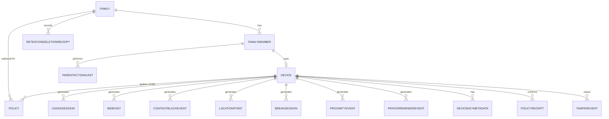

# 10 — Logical Data Model and Local Storage

Owning agent: **PCA-DOC-C**. Governed by doc 00 (Document Control).

## 1. Purpose and scope

This is a **logical model, not an implementation schema** — entity names, fields, and types below express intent and boundary, not a final DDL. Its job is to make precise *where each data class lives* (child device, parent device, transiently in transit, or the deliberately minimal central-service model) so that doc 05's "PCA infrastructure is not an activity-data warehouse" claim and doc 09 Section 5's server-knowledge boundary are traceable down to specific entities rather than asserted only at the architecture-narrative level.

In scope: family configuration entities, activity/event entities, security/audit entities, the deliberately minimal central-service model, and the local-storage/encryption-at-rest boundary as it applies to schema shape (doc 09 Section 7 owns the encryption mechanism itself). Out of scope: cryptographic primitives (doc 09), retention/deletion scheduling mechanics (doc 11, though this document defines the fields — e.g. `retentionPolicy`, `expiresAt` — those mechanics operate on), and platform-specific storage APIs (Room/SQLCipher-equivalent on Android doc 06, Core Data/SQLite-equivalent on iOS doc 07 — this document does not pick a storage engine).

## 2. Design principles

- **PCA-DATA-010** Every entity below is tagged with its system of record (doc 05 Section 5): child-device-local, parent-device-local (decrypted view + own encrypted replica), or central-service (Section 4). An entity with no tag is assumed child-device-local by default, since that is where family activity originates (doc 05 Section 3.2).
- **PCA-DATA-011** No entity in Section 4 (activity entities) may have a central-service equivalent table — this is the schema-level instance of doc 05 PCA-FR-136 and doc 09 PCA-SEC-023; Section 7 enumerates the complete, deliberately minimal central-service model and nothing else may be added to it without a doc 00 Section 9 conflict entry.
- **PCA-DATA-012** Identifiers that cross the family/PCA-infrastructure boundary (any ID visible to the Enrollment Service or Relay, doc 09 Section 5.1) MUST be opaque (non-guessable, not derived from or reversible to a human-meaningful value like a child's name or a real device serial) — an opaque `familyId`/`deviceId` leaking to PCA infrastructure logs must not itself disclose family-identifying information beyond "a family/device with this opaque ID exists."
- Fields marked *(sensitive — local plaintext only)* MUST NOT appear in any envelope field PCA infrastructure can read (doc 09 Section 4's envelope structure carries only the encrypted payload plus the non-sensitive envelope metadata already enumerated there).

## 3. Family configuration entities

*(Child-device-local copy + parent-device-local copy, both derived from the parent-authored, signed source of truth — doc 05 Section 5 "Policy" row. Central service holds none of these in readable form.)*

### 3.1 Family
- `familyId` (opaque, PCA-DATA-012)
- `createdAt`
- `defaultLanguage` (doc 20)
- `defaultRetentionPolicy` (doc 11 Section 1 — one of the five supported windows)
- `ownerParentDeviceId` (points to current owner DSK holder, doc 09 Section 3.2)
- `recoverySecretGeneratedAt` *(the Recovery Secret itself is never a database field; only the offline owner retains it, doc 09 Section 3.4)*

### 3.2 FamilyMember
- `memberId`
- `role`: `OWNER | ADMIN | VIEWER | CHILD` (maps to doc 02 Section 3's Family Owner / Parent-Guardian Administrator / Parent-Guardian Viewer / Child roles respectively)
- `displayName` *(sensitive — local plaintext only; never included in any central-service-visible field, consistent with doc 09 Section 5.2)*
- `status`: `ACTIVE | REMOVED` (doc 08 Section 3 lifecycle applies to the associated `Device`, not directly to `FamilyMember`, since a member can exist without a currently-paired device, e.g. between device replacement steps)
- `ageTier` (doc 03 PCA-FR-008 — drives content-filter/break defaults per doc 14/12, never varies the privacy guarantees per doc 03 PCA-FR-133)

### 3.3 Device
- `deviceId` (opaque, PCA-DATA-012)
- `memberId` (FK to FamilyMember)
- `platform`: `ANDROID | IOS`
- `platformVersion`, `appVersion`
- `signingKeyId`/`signingPublicKey` and `encryptionKeyId`/`encryptionPublicKey` (distinct DSK and DEK roles, doc 09 Section 3.1; private keys never appear in this or any entity)
- `trustSetEpoch`, `keyEpoch`, `trustState` (`ACTIVE | ROTATION_PENDING | DEVICE_OFFLINE | REVOKED | EPOCH_STALE | RECOVERY_REQUIRED`)
- `enrollmentState`: mirrors doc 08 Section 3's lifecycle state machine (`NEW | INVITED | PAIRED | ACTIVE | DEGRADED | RECOVERY_PENDING | REVOKED | REMOVED`) exactly — this document does not maintain a second, divergent state enum
- `lastSeenAt` (doc 05 Section 7's Live/Offline/Sync-overdue distinction is computed from this field, not stored as a separate derived status, so the UI cannot show a stale cached status label)
- `capabilityProfile` (which optional platform capabilities are currently granted — e.g. usage-access, location permission, Family Controls authorization — feeds doc 21's tamper monitor)

### 3.4 Policy
- `policyId`
- `childDeviceId`
- `version` (strictly monotonic per doc 05 Section 6/doc 09 Section 4 — this is the field the version-monotonicity check operates on)
- `effectiveFrom`, `expiresAt` (optional; doc 05 PCA-FR-138)
- `screenTimePolicy` (doc 12), `contentPolicy` (doc 14), `appPolicy` (doc 15), `locationPolicy` (doc 16), `prayerPolicy` (doc 17), `retentionPolicy` (doc 11)
- `signedBy` (device key ID of the authoring parent, doc 09 Section 4)

## 4. Activity entities

*(Child-device-local; system of record per doc 05 Section 5. A parent-device copy exists only as the parent's own decrypted view plus its own encrypted replica of summaries selected by the current signed family policy and platform-permitted collection. The parent device is not a second independent collection system; it mirrors data the child agent has legitimately collected and synchronized under doc 05 Section 6.)*

### 4.1 UsageSession
- local id
- `deviceId`
- app/category token or identifier, as platform APIs permit (doc 06 UsageStatsManager / doc 07 Family Controls-equivalent — exact granularity is platform-labeled in doc 06/07, not re-asserted here)
- `startedAt`, `endedAt`, `duration`
- `sourceConfidence`: `PLATFORM_API | HEURISTIC` — distinguishes a value read directly from a platform usage API from one PCA had to infer, so the parent UI (doc 18) never presents an inferred value with the same confidence as a platform-reported one

### 4.2 WebVisit
Only populated for browsing contexts where PCA legitimately obtains the URL (doc 14's PCA Safe Browser / VPN-based filtering mode — not a claim of visibility into every third-party browser, doc 31 residual-risk row).
- local id
- `domain`
- `url` (optional, mode-dependent per doc 14)
- `title` (optional)
- `classification` (doc 14/23 category + rule/model version)
- `action`: `ALLOWED | BLOCKED`
- timestamps

### 4.3 ContentBlockEvent
- `category`
- `ruleOrModelVersion`
- `reasonCode`
- `confidenceBucket` (only if AI-assisted classification was used, doc 23 — coarse bucket, not a raw model score, to avoid over-precise-looking numbers the parent can't meaningfully act on)
- `timestamp`
- **No prohibited raw media retention by default** — a block decision is recorded, the blocked content itself is not archived, consistent with doc 01 Section 5's no-content-hoarding principle.

### 4.4 LocationPoint
- `timestamp`
- `latitude`/`longitude`
- `accuracy`
- `source` (platform location API tier, doc 16)
- Subject to doc 11 Section 3's shorter-or-equal retention rule, enforced structurally by giving this entity its own `retentionPolicy` reference distinct from the family's general `defaultRetentionPolicy` (Section 3.1), not by a runtime-only check.

### 4.5 BreakSession
- `triggerType` (doc 12)
- `continuousUseDuration`
- `breakStart`/`breakEnd`
- `completionReason`
- `optionalCounterTotal`

### 4.6 ProximityEvent
- `timestamp`
- `nearFarOrApproximateDistanceBucket` (doc 13 — a bucketed value, e.g. `NEAR | FAR | UNKNOWN`, never a claimed-precise centimeter measurement; ordinary phone proximity/ambient sensors are not medically precise distance sensors and this entity's type deliberately reflects that, doc 13 owns the full limitation)
- `action` (e.g. eye-rest prompt shown)
- **No face image, no face template, no biometric derivative of any kind** — doc 13's on-device estimation never produces a value serializable into this entity beyond the bucketed distance/action, consistent with doc 09 Section 5.3's structural (not just policy) guarantee.

### 4.7 PrayerReminderEvent
- `prayerKey`
- `scheduledAt`
- `deliveryState`

## 5. Security/audit entities

*(Child-device-local and/or parent-device-local as noted; these are the entities doc 09's cryptographic events and doc 08's lifecycle events materialize into.)*

- **DeviceKeyMetadata** — `deviceId`, `publicKeyId`, `keyState` (`ACTIVE | ROTATED_OUT | REVOKED`, doc 09 Section 3.5), `establishedAt`. Never stores a private key.
- **PolicyReceipt** — signed status receipt (doc 05 Section 6) confirming a specific `Policy.version` was verified and applied by a specific device; this is the entity that lets the parent UI distinguish "edit sent" from "edit confirmed applied" (doc 05 PCA-FR-139).
- **TamperEvent** — doc 21's monitored-condition list materialized as records: `conditionType`, `detectedAt`, `deviceId`, `resolvedAt` (nullable).
- **ParentActionAudit** — doc 03 PCA-FR-124's audit record: `actorMemberId`, `actionType` (role change, policy edit, retention change, deletion, device lifecycle transition per doc 08 PCA-FR-140), `targetEntity`, `timestamp`, `reason` (optional, free text).
- **RetentionDeletionReceipt** — doc 11 Section 5's non-sensitive deletion receipt: counts/categories/time only, never the deleted content itself (see doc 11 Section 5 for the full field set).

**PCA-DATA-013** `ParentActionAudit` and `TamperEvent` records are themselves subject to a *separate, longer* retention floor than general activity data (doc 11 Section 2's non-deletion list) — an audit trail that expires on the same short cycle as the activity it was meant to explain would defeat its own purpose; doc 11 Section 2 is the normative statement of this, this entity definition is where it is structurally anchored.

## 6. Transient / in-flight data

Data that exists only briefly outside the two device-local stores above, and is never itself a system of record:

- **Message/session-key material** (doc 09 Section 3.1) — exists only for the duration of encrypting/decrypting a single envelope; not persisted.
- **Relay-queued ciphertext envelopes** (doc 09 Section 5.1) — short server-side TTL (doc 11 Section 7), opaque to PCA infrastructure, deleted from the Relay once delivered or once the TTL expires, whichever comes first.
- **Push wake payloads** (doc 09 Section 6) — opaque reference only, not a data class with retention semantics of its own beyond the push provider's own (third-party, non-PCA-controlled) short-lived delivery queue.

**PCA-DATA-014** No transient/in-flight data class in this section may be promoted to durable central-service storage without a doc 00 Section 9 conflict entry — "just cache it a bit longer for reliability" is exactly the kind of scope creep Section 2's PCA-DATA-011 boundary exists to prevent, and this document calls it out explicitly here as the most likely place such creep would first appear (a relay operator under load reaching for "let's just keep queued messages longer").

## 7. Central-service model

Central service (Enrollment/Licensing Service + Relay, doc 05 Section 3.3/3.4) has a deliberately separate, minimal model — this table is the complete list; nothing else is added without a doc 00 Section 9 conflict entry (PCA-DATA-011):

| Central entity | Fields (illustrative, not exhaustive DDL) | Corresponds to |
|---|---|---|
| Account/license | account ID, subscription/plan state, billing reference (out of this document's scope beyond existence) | doc 05 Section 3.3 |
| Family (opaque) | `familyId` only — no name, no member list beyond count if needed for licensing tiers | Section 3.1's `familyId`, opaque per PCA-DATA-012 |
| Device registration | `deviceId`, DSK/DEK public key IDs, platform, last-seen (coarse), trust/key epoch, enrollment state (coarse: pending/active/revoked) | Section 3.3 |
| Enrollment invitation | token hash, issued-at, expires-at, redeemed (bool) — doc 03 PCA-SEC-001 | doc 08 Section 4 |
| Push routing metadata | opaque push token per device | doc 09 Section 6 |
| Revocation status (coarse) | `deviceId`, revoked (bool), revoked-at | doc 08 Section 9 |
| Software/rule-package metadata | version numbers, release channel, checksum — not rule *content* (filter-list content itself, if centrally distributed as a base package rather than family-authored policy, is a public non-family-specific artifact, doc 14) | doc 29 |
| Short-lived encrypted relay envelopes | ciphertext blob, opaque sender/recipient device ID, size class, TTL expiry | Section 6, doc 09 Section 5.1 |

**No central `web_visits`, `locations`, `usage_sessions`, `content_block_events`, `prayer_events`, or any other readable family-activity-history table is allowed under any name** — this is the schema-level restatement of doc 05 PCA-FR-136 and doc 09 PCA-SEC-023; a table matching this description appearing anywhere in an implementation is a release-blocking architecture violation, not a normal schema addition.

## 7A. Canonical privacy and data-flow inventory

This is the package's single canonical data-flow inventory. `Child`/`Parent` mean app-managed encrypted local storage where applicable; `E2EE` means payload ciphertext only; `PCA readable` explicitly includes infrastructure metadata. Retention classes: `FAMILY` = doc 11 selected window, `LOC` = shorter/equal location rule, `OPS` = operational minimum/TTL, `ACCOUNT` = account/legal lifecycle, `NONE` = not retained.

| Data class | Generated on | Child | Parent | E2EE | PCA readable / server retention | Provider metadata | Exportable | Retention / deletion / notes |
|---|---|---|---|---|---|---|---|---|
| Web domain, full URL, page title, search query | Child browser/filter | Yes | Policy-selected replica | Yes | No / relay ciphertext max 7d | Push: wake timing/token only | Yes | FAMILY; delete locally/replica; URL/title mode-dependent |
| YouTube video ID, YouTube title | Controlled player where available | Yes | Policy-selected replica | Yes | No / ciphertext max 7d | Push metadata only | Yes | FAMILY; no claim of normal-app complete history |
| App usage, screen session | Child platform/app | Yes | Yes | Yes | No / ciphertext max 7d | Push metadata only | Yes | FAMILY; delete all device copies per doc 11 |
| Location, geofence, battery, last seen | Child device | Yes | Yes | Yes except coarse last-seen | Coarse connection/last-seen and opaque device ID / OPS; no coordinates | Push token/timing; IP may be seen by PCA network | Location: Yes; health/status: limited export | LOC for coordinates/geofence; battery/last-seen OPS; delete app copies |
| Eye-distance event | Child local estimator | Bucket only | Optional summary | Yes if synced | No / ciphertext max 7d | None beyond routing | Yes, bucket only | FAMILY; no raw media |
| Camera frame, face landmarks | Child transient estimator | No durable storage | No | No | No / NONE | None | No | NONE; prohibited from sync/export/logs |
| Dhikr counter, prayer settings | Child/parent | Yes | Yes | Yes | No / ciphertext max 7d | Push generic wake only | Yes | FAMILY/configuration lifecycle; deletion per doc 11 or family removal |
| Policy | Parent | Yes | Yes | Yes | No plaintext / ciphertext max 7d | Push token/timing | Yes | Current policy retained; superseded versions/audits per doc 11 |
| Parent email | Parent account entry | Optional local account profile | Yes | Account channel TLS, not family payload | Account/license service / ACCOUNT | Email provider: address, delivery metadata | Account export where supported | ACCOUNT; delete on account/family removal subject to legal obligation |
| Device opaque ID, public keys, push token, IP address | Device/network | ID/keys yes; token local | ID/keys yes | IDs/keys in signed/encrypted protocol as applicable | IDs/public keys/tokens/IP/connection time readable / OPS or ACCOUNT | Push provider: token, delivery/timing; email provider as above | Limited device/account export | Remove/revoke at lifecycle end; IP logs bounded OPS |
| Subscription/license | Account service | Entitlement cache | Entitlement cache | Not a family activity payload | Account/license readable / ACCOUNT | Payment provider data outside PCA family vault | Account export where supported | ACCOUNT/legal deletion schedule |
| Recovery envelope | Owner device | Opaque copy only | Opaque copy only | Yes (RS-protected) | Opaque blob/metadata / ACCOUNT or recovery lifecycle | None beyond routing | No by default | Replace on recovery/RS rotation; PCA never has RS/plaintext |
| Audit event, crash log, diagnostic log | Device/app | Audit yes; diagnostics minimized | Audit yes | Audit sync if configured | No activity plaintext; crash/diagnostic may expose only approved OPS metadata / OPS | Push none | Audit limited; diagnostics no | Audit floor per doc 11; diagnostics bounded OPS; redact URLs/locations/keys/secrets |
| Encrypted export | Parent device | Optional local file | Yes at creation | Family-key encrypted | No unless family independently uploads it / NONE | Any chosen external provider metadata is outside PCA control | It is the export | `EXPORT_EXISTS_EXTERNALLY`; app deletion cannot delete external copies |

Any new field or flow must add a row here before implementation. Docs 09 and 11 are normative for crypto and deletion respectively; docs 19 and 27 must reference this matrix for notification and observability boundaries.

## 8. Data model diagram (logical, not physical)

All entities above are child-device-local or parent-device-local (Section 2's default) except where Section 7 explicitly lists a central-service counterpart — the diagram deliberately omits any central-service entity relationship, because none of these activity/config entities have one (PCA-DATA-011).

## 9. Failure modes

| Failure | Detection | Behavior |
|---|---|---|
| An implementation adds a central-service field capable of holding Section 3/4 data (schema drift) | Schema-review gate (doc 05 PCA-FR-136, doc 28) | Release-blocked; treated as a doc 00 Section 9 conflict, not a normal migration |
| `Device.enrollmentState` diverges from doc 08's state machine (a second, ad hoc status field introduced during implementation) | Doc 32 traceability cross-check | Implementation defect; this document's PCA-DATA-010-adjacent rule (Section 3.3) is the single source of truth for the enum |
| `LocationPoint` retention accidentally inherits the general `defaultRetentionPolicy` instead of its own shorter policy | Retention-config review (doc 11 Section 3) | Structural fix required: `LocationPoint` must reference its own `retentionPolicy`, not fall back silently |
| A `displayName`-class *(sensitive — local plaintext only)* field is accidentally included in an outbound envelope's cleartext metadata | Envelope-structure review (doc 09 Section 4) | Implementation defect; doc 09 Section 4's envelope field list is exhaustive and does not include arbitrary entity fields |

## 10. Security/privacy implications

- Section 7's central-service table is the schema-level ground truth for doc 09 Section 5.1's "what PCA infrastructure MAY know" list — the two MUST be kept in sync; a Section 7 addition without a corresponding doc 09 Section 5.1 update (or vice versa) is a doc 00 Section 9 conflict.
- *(sensitive — local plaintext only)* field tags throughout Sections 3–5 are this document's mechanism for making doc 09 Section 5.2's "MUST NOT know, readable" list checkable against specific fields rather than only against category names.
- The `ContentBlockEvent`/`ProximityEvent` "no raw media / no face data" notes (Sections 4.3, 4.6) are the data-model-level enforcement of doc 01 Section 5's no-covert-surveillance principle and doc 03 PCA-FR-126's testable requirement.

## 11. Assumptions

- The parent device's "own encrypted replica" (Section 4's framing note) is populated only from data the child agent has legitimately collected and selected for synchronization under the family's current signed policy, retention settings, and platform permissions. This document assumes doc 05 Section 6's sync model is the only path activity data reaches a parent device; there is no separate parent-side collection path.
- Storage-engine selection (SQLite/Room/SQLCipher-equivalent on Android, Core Data/SQLite-equivalent on iOS) is a doc 06/07 implementation decision; this document's entities are engine-agnostic.
- Field-level encryption-at-rest (doc 09 Section 7) is assumed to apply to the entire local database file/container, not selectively per field — this document does not assume or require field-level encryption granularity beyond the *(sensitive)* tagging used here for documentation clarity.

## 12. Platform limitations

| Claim | Label |
|---|---|
| `UsageSession` app/category granularity matches platform UsageStats/Family-Controls exactly | `VERIFIED_WITH_LIMITATION` — full detail and any deviation is owned by doc 06/07, this document only defines the entity shape |
| `WebVisit.url` populated for all browsing | `UNSUPPORTED` as a universal claim — mode-dependent per doc 14 (PCA Safe Browser vs. system-browser-with-VPN-filtering modes differ in URL visibility); doc 14 owns the precise capability matrix |
| `ProximityEvent` distance bucket precision | `VERIFIED_WITH_LIMITATION` — bucketed near/far signal from ordinary sensors, not a medically precise centimeter measurement (doc 13 owns the full sensor-capability treatment) |

## 13. Unresolved owner decisions

| Decision ID | Topic | Options | Recommendation | Status |
|---|---|---|---|---|
| PCA-DEC-022 | Whether `WebVisit`/`UsageSession` local storage should support field-level encryption granularity (e.g. `url` encrypted with a separate, more restrictively-scoped key than the rest of the row) vs. whole-database encryption only (Section 11) | (a) Whole-database encryption only (simpler, doc 09 Section 7's current baseline); (b) Additional field-level encryption for the most sensitive fields as defense-in-depth | (a) for initial launch — whole-database encryption under a platform-secured key already meets doc 09's goals; revisit (b) only if a specific threat-model finding in doc 24 justifies the added complexity | PROPOSED |

## 14. Dependencies

- Doc 05 Section 5 for the data-ownership table this document's system-of-record tags implement.
- Doc 08 for the `Device.enrollmentState` lifecycle enum this document reuses exactly (Section 3.3).
- Doc 09 for the cryptographic envelope structure, key entities' relationship to `DeviceKeyMetadata`, and the server-knowledge boundary Section 7 must stay in sync with.
- Doc 11 for the retention-policy semantics operating on this document's `retentionPolicy`/`expiresAt` fields.
- Docs 12–17 for the feature-specific policy/event sub-structures referenced but not fully specified in Sections 3.4 and 4.
- Doc 02/18 for the `FamilyMember.role` enum's authoritative permission meaning.

## 15. Acceptance criteria

- [ ] Section 7's central-service table is the only place in any implementation where a central-service schema is defined; no other document or code path introduces an additional central table.
- [ ] Every activity entity in Section 4 can be selected by doc 11's retention algorithm through its event timestamp plus the applicable signed policy (general or shorter location policy); no activity entity is omitted from that scope by lack of a retention mapping.
- [ ] `Device.enrollmentState` values match doc 08 Section 3's state machine exactly, checked in doc 32's traceability matrix.
- [ ] No *(sensitive — local plaintext only)* tagged field appears in any doc 09 Section 4 envelope-metadata field list, verified by a doc 28 static/schema check.
- [ ] PCA-DEC-022 is resolved before doc 30's local-storage implementation phase begins.
