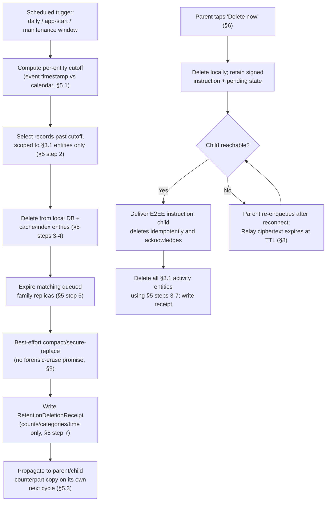

# 11 — Data Retention and Deletion

Owning agent: **PCA-DOC-C**. Governed by doc 00 (Document Control).

## 1. Purpose and scope

This document is the authoritative mechanism specification for retention and deletion — restated at the product-requirement level in doc 03 Section K (PCA-FR-100–105, PCA-DATA-001/002), owned in mechanism detail here. It defines the parent-selectable retention windows, exactly which entities (doc 10) each window applies to, the shorter location-retention rule, the deletion algorithm, "delete now," family removal, offline-device deferral, tombstones, secure-deletion limits, and backup/export copy handling. Out of scope: the cryptographic deletion mechanism for Relay-queued ciphertext beyond stating its TTL (doc 09 Section 5.1 owns why PCA cannot read it regardless of retention), and the local data model's entity shapes (doc 10, which this document's retention rules operate on).

## 2. Parent-selectable policies

Supported activity-retention choices (doc 03 PCA-FR-100):

- **14 days**
- **1 month**
- **3 months**
- **6 months**
- **9 months**

Architecture default at first enrollment: **1 month**, shown explicitly for parent confirmation, not silently applied (doc 03 PCA-FR-101, tracked as PCA-DEC-003 in doc 01 Section 11 for whether this default itself should change before implementation).

**Authoritative clock rule (PCA-DATA-030).** `14 days` is an exact elapsed interval of 14 × 24 hours from the UTC event instant. `1`, `3`, `6`, and `9 months` are calendar-month intervals: calculate the expiry calendar date/time in the family's policy timezone using a calendar library and convert that result to a UTC instant; if the target month lacks the source day, use that month's final day at the corresponding local time. Store every event and policy change as a UTC instant plus the IANA timezone used for presentation/policy context. The timezone is not an elapsed-time authority. Active screen/session duration uses a monotonic clock and is not derived from this retention clock.

## 3. Scope of retention

### 3.1 Subject to the general retention window (`defaultRetentionPolicy`, doc 10 Section 3.1)

- web/PCA browser history (`WebVisit`, doc 10 Section 4.2);
- content-block history (`ContentBlockEvent`, doc 10 Section 4.3);
- app-usage sessions (`UsageSession`, doc 10 Section 4.1);
- PCA-controlled YouTube activity (doc 15 — subject to the same window as `UsageSession`/`WebVisit`, whichever entity the specific YouTube visibility mode populates);
- screen-time/break sessions (`BreakSession`, doc 10 Section 4.5);
- proximity/eye-distance events (`ProximityEvent`, doc 10 Section 4.6);
- location history (`LocationPoint`, doc 10 Section 4.4) — **subject additionally to Section 4's shorter-or-equal rule below**;
- non-essential routine device activity not otherwise itemized (e.g. connectivity/heartbeat logs beyond what doc 05 Section 7's Live/Offline status needs to compute from `Device.lastSeenAt`, doc 10 Section 3.3).

### 3.2 MUST NOT be automatically deleted by retention cycling (doc 03 PCA-FR-105)

- current enrollment/family relationship (`Family`, `FamilyMember`, `Device` at their current, non-historical state — doc 10 Sections 3.1–3.3);
- current device keys / key metadata (`DeviceKeyMetadata` for `ACTIVE` keys, doc 10 Section 5; doc 09 Section 3);
- current policies/schedules (`Policy` at its currently-effective version, doc 10 Section 3.4);
- parent roles (`FamilyMember.role` assignments, doc 10 Section 3.2);
- recovery configuration (the Recovery Secret's *existence/generation timestamp* record, doc 10 Section 3.1's `recoverySecretGeneratedAt` — the secret itself is never stored centrally or in a local database field, doc 09 Section 3.4);
- active license metadata (doc 05 Section 3.3);
- **audit trail** — `ParentActionAudit` and `TamperEvent` (doc 10 Section 5, PCA-DATA-013) are exempt from the *general activity* retention window and instead use their own, longer-lived retention floor (Section 3.3) — an audit record that vanished on the same cycle as the activity it documents would defeat the audit trail's purpose.

**PCA-DATA-020** Retention deletion (Section 5) and the "MUST NOT delete" list in Section 3.2 are enforced by the deletion algorithm's entity scope (Section 5 step 2) targeting only Section 3.1's entity classes — this is a scope restriction on *which tables the deletion job is allowed to touch*, not a per-record exception list, so the two categories cannot be accidentally conflated by a future implementation change to a single entity's fields.

### 3.3 Audit-trail retention floor

**PCA-DATA-021** `ParentActionAudit` and `TamperEvent` records are retained for a minimum of the family's currently-configured general activity retention window **or 12 months, whichever is longer**, and are only deleted earlier than that floor via Section 6's family-removal flow (never via ordinary retention cycling) or an explicit separate audit-retention control if the family chooses to shorten it (`REQUIRES_FURTHER_OWNER_DECISION` — whether audit-trail retention should be independently parent-configurable at all, vs. fixed at the 12-month floor, tracked as PCA-DEC-023 below).

## 4. Location special rule

Location history (`LocationPoint`) may use a **shorter or equal** retention window than the general policy (`defaultRetentionPolicy`), **never longer** (doc 03 PCA-FR-102). The parent may also select **"current/last location only"** — no historical location trail is retained at all; only the single most-recent `LocationPoint` is kept, and every prior point is deleted as soon as a new one is recorded (a rolling one-record retention, not a time-window retention).

**PCA-DATA-022** The child device MUST reject any `Policy.locationPolicy.retentionPolicy` value received via a signed envelope that is longer than that policy's general window. This semantic verification occurs on-device; a malformed policy is not silently clamped or partially applied.

## 5. Deletion algorithm

At least daily, and opportunistically at app start and other maintenance windows (each child and parent device runs this locally against its own store — this is not a central-service job, consistent with doc 09 Section 5.2/PCA-SEC-014). Network connectivity is not a prerequisite for local expiry deletion; it is required only to deliver a deletion instruction or synchronize a counterpart's acknowledgement:

1. **Compute expiry cut-off** using authoritative local calendar/time rules (Section 5.1's event-timestamp semantics) for each entity class independently (general window for Section 3.1 entities, the entity's own shorter window for `LocationPoint` per Section 4).
2. **Select records** older than the entity's retention boundary, scoped strictly to Section 3.1's entity classes (PCA-DATA-020) — the selection query MUST NOT be capable of matching a Section 3.2 entity.
3. **Delete from the active local database.**
4. **Remove associated local cache/index entries** (search indices, report-precomputation caches, thumbnails if any exist for non-prohibited categories) so no residual copy remains queryable after the primary record is gone.
5. **Expire queued family replicas** that are no longer permitted — if a `PolicyReceipt`-confirmed sync has queued a not-yet-delivered activity summary for a device that is currently offline (doc 05 Section 3.4), and that summary's underlying records have since aged past retention, the queued replica is withdrawn/expunged rather than delivered late (Section 7 governs the Relay-side TTL that independently bounds this).
6. **Compact/securely replace storage** where the platform/database engine permits (doc 06/07); **do not promise forensic secure erase on flash storage where the OS cannot guarantee it** — this document does not claim a stronger physical-erasure guarantee than the underlying platform storage stack provides (Section 9).
7. **Create a non-sensitive deletion receipt** (`RetentionDeletionReceipt`, doc 10 Section 5) with counts/categories/time — the receipt itself contains no content, only "N `WebVisit` records older than `<cutoff>` deleted at `<timestamp>`"-shaped metadata, so the receipt cannot become a second copy of the data it documents having deleted.

### 5.1 Event-timestamp, clock anomaly, and deletion state machine

**PCA-DATA-023** Retention cut-off computation uses the **event's own timestamp** (e.g. `WebVisit.timestamp`, `UsageSession.startedAt`) compared against **wall-clock calendar time** at evaluation time, using calendar-accurate month/day arithmetic (a "1 month" window from a March 31 evaluation resolves to the correct prior-month boundary per platform calendar libraries, not a naive `30 * 86400` seconds approximation) — this avoids retention silently drifting shorter or longer than the parent's selected label implies across months of different length, daylight-saving transitions, or leap years.

Each replica and deletion request uses one durable state machine: `ACTIVE → EXPIRY_DUE → DELETE_REQUESTED → DELETED_LOCAL → DELETION_CONFIRMED`; a counterpart that cannot be contacted is `DELETE_PENDING_REMOTE_DEVICE`; a generated export is additionally marked `EXPORT_EXISTS_EXTERNALLY` and is never represented as app-deletable. State transitions are idempotent and carry record/deletion-request IDs, policy version and UTC timestamp. `DELETION_CONFIRMED` means every currently reachable in-scope app-managed copy acknowledged deletion; it never means a removed/offline endpoint, flash remnant, platform backup, or external export was erased.

Each device persists a last accepted wall-clock/trusted-time high-water mark. If wall clock moves backwards beyond tolerance, it does not move an expired/deleted record back to `ACTIVE`, does not extend expiry, and emits a clock-anomaly event. It continues deletion based on the maximum of its accepted high-water mark and any authenticated server-time anchor; anchors are used only to detect/correct time anomalies and contain no activity plaintext. On reboot, monotonic elapsed-duration values are reset/reconstructed from UTC bounds, never treated as continuous across boot.

### 5.2 Scheduled cleanup and offline-device deferral

**PCA-DATA-024** The deletion algorithm (Section 5) runs against **whatever store is locally reachable** — a child device that has been offline for longer than its retention window still runs its own local deletion cycle on next app-foreground/maintenance-window opportunity using its own local clock, and does not wait for a server-issued "please delete now" signal (consistent with doc 09 Section 5.2/PCA-SEC-014: PCA infrastructure cannot enforce retention on data it cannot read, so enforcement must be self-scheduled per device). A device offline for an extended period will therefore run one deletion cycle covering the entire elapsed backlog on its next opportunity, rather than having "missed" cycles queued individually.

### 5.3 Parent/child copy synchronization

**PCA-DATA-025** When the child device's local deletion cycle removes a record, the parent device's own encrypted replica (doc 10 Section 4's framing note) of that same record is deleted by the parent's independently scheduled local cycle using the same cut-off computation (Section 5.1). The two devices are not required to delete in the same instant: each may be unavailable to its own maintenance scheduler. They MUST converge to the same retained set once both have run a cycle, since both compute the identical cut-off from the same `Policy.retentionPolicy` value and the same underlying event timestamps; network reconnection is needed only for status synchronization, not for the deletion itself.

Policy changes apply immediately to all still-held activity data. A reduction (for example 9 months → 14 days) marks every newly out-of-window record `EXPIRY_DUE` and deletes it on the next local cycle; queued ciphertext is withdrawn and an offline copy remains `DELETE_PENDING_REMOTE_DEVICE`. An increase (14 days → 9 months) affects only records that are still `ACTIVE`; it cannot resurrect `DELETED_LOCAL`, expired queued data, or any external export.

### 5.4 Tombstones

**PCA-DATA-026** A deleted record leaves, at most, a minimal **tombstone** (record ID + deletion timestamp, no content fields) only where needed to prevent a late-arriving, already-expired sync replica from resurrecting deleted data (Section 5 step 5's "expire queued replicas" is the primary defense; a tombstone is the fallback if a replica somehow arrives after local deletion has already run). Tombstones are themselves subject to a short, bounded lifetime (recommended default: no longer than the shortest supported retention window, 14 days) and are never a substitute for a full content record — a tombstone MUST NOT accumulate metadata beyond ID and deletion timestamp, or it becomes a second, lower-fidelity copy of the deleted data's existence.

## 6. "Delete now"

The parent may immediately delete all activity history (doc 03 PCA-FR-103) without contacting support. The confirmation dialog explains, in plain language:

- which Section 3.1 entity classes will be deleted;
- that Section 3.2 entities (enrollment, keys, policies, roles, recovery config, license) are **not** affected;
- that the action cannot be undone (no soft-delete/undo window is offered for activity content, consistent with Section 9's storage-level limits meaning a later "undo" could not be honestly guaranteed anyway);
- that "delete now" runs the same algorithm as Section 5 (steps 2–7), scoped to *all* records regardless of age rather than only records past the retention cut-off.

**PCA-DATA-027** "Delete now" triggered on one device (typically a parent device) MUST propagate a signed deletion-instruction envelope (doc 09 Section 4's envelope structure, a new message type distinct from a `policy` push) to the relevant child device(s) so the child-side local store — the actual system of record (doc 05 Section 5) — performs the real deletion, rather than the parent-side "delete now" only clearing the parent's own decrypted view while leaving the child device's local vault intact.

The requesting parent retains the signed deletion instruction and its completion state locally until every target device returns a signed acknowledgement or is removed from the family. The Relay may hold only its normal short-lived ciphertext copy (Section 8); it is not the durable source of a deletion request. If the Relay TTL expires while a child is offline, the parent device re-enqueues the same one-time instruction when it next has connectivity. If the parent device is lost before acknowledgement, recovery requires another authorized parent or the FRRS recovery flow (doc 08/doc 09); the UI MUST report the child deletion as **pending**, never completed. A child that receives a valid duplicate instruction treats it idempotently, records only a non-sensitive completion receipt, and must not restore an activity record covered by the instruction.

## 7. Family removal

A separate **"Remove family/device"** flow (doc 08 Section 8) deletes configuration and revokes cryptographic trust after strong parent confirmation — this is explicitly distinct from "delete now" (Section 6): "delete now" clears activity content only and preserves the family relationship; family/device removal ends the family relationship itself (Section 3.2's normally-protected entities) and is sequenced in full by doc 08 Section 8, which this document does not re-specify. Doc 08 Section 8 step 3 ("export or delete history per parent choice") is the point where this document's Section 6 mechanics are invoked as a sub-step of a full removal, if the parent chooses deletion over export at that point.

## 8. Server relay retention

Encrypted undelivered relay envelopes (doc 09 Section 5.1, doc 05 Section 3.4) use a short operational TTL, proposed maximum **7 days**, independent of family-history retention (Section 2's windows) — this is a delivery-reliability bound, not a privacy-retention promise, and Section 2's windows and this TTL MUST NOT be conflated in implementation (restated from doc 05 Section 3.4). The Relay cannot inspect contents (doc 09 Section 5.2) regardless of how long the TTL is set, so this TTL exists purely to bound how long PCA infrastructure operationally stores opaque ciphertext blobs it cannot itself act on, not to bound anything about what a family can access.

## 9. Secure-deletion limits on flash storage

**PCA-DATA-028** This document does not claim forensic-grade secure erase (guaranteed unrecoverable overwrite of physical storage cells) on flash-based storage (the near-universal case on mobile devices), because wear-leveling and controller-level remapping on modern flash storage mean an OS-level "delete" or even an application-level overwrite is not guaranteed to physically overwrite the original cells (`VERIFIED_WITH_LIMITATION` — this is a widely understood property of flash storage generally, not a PCA-specific gap; the mitigations below are what the architecture can actually guarantee). Mitigations:

- the local database itself is encrypted at rest (doc 09 Section 7) — a deleted-but-physically-recoverable flash cell still yields ciphertext, not plaintext, absent the device's key;
- Section 5 step 6 uses whatever platform/database-level secure-delete or vacuum/compact mechanism is available, on a best-effort basis, layered on top of (not a substitute for) the encryption-at-rest guarantee;
- key rotation (doc 09 Section 3.5) periodically re-encrypts going-forward data under a fresh FDEK, which does not itself erase old ciphertext but does mean an old FDEK compromise does not expose data encrypted after rotation.

## 10. Backup and export copy handling

**PCA-DATA-029** Retention/deletion applies to app-managed child copies, parent replicas, and queued ciphertext. It does not reach a previous encrypted export once placed outside app-managed storage; mark it `EXPORT_EXISTS_EXTERNALLY` and disclose that limitation at creation. Sensitive vault/key material is excluded from platform backup by doc 09 Section 8. If an excluded/legacy backup nevertheless exists, it is `DELETE_PENDING_REMOTE_DEVICE` in the user's backup domain: PCA cannot delete it, and the family must remove/overwrite it using the platform backup controls. Removed devices are revoked and retain the same honest limitation; removed children/families invoke deletion requests to every known in-scope device, revoke trust/keys, and report unacknowledged offline copies as pending rather than erased.

## 11. Deletion flow diagram

## 12. Failure modes

| Failure | Detection | Behavior |
|---|---|---|
| Device offline past its retention window | Local clock check on next foreground/maintenance window (§5.2) | One deletion cycle covers the full elapsed backlog at the next local execution opportunity; network reconnection is not required for local expiry deletion |
| "Delete now" issued on parent device while child device is offline | Parent-local signed instruction and pending acknowledgement state; Relay TTL is only a delivery attempt (§6/§8) | Parent re-enqueues after connectivity returns; UI shows pending, not completed. If no authorized parent/recovery material remains, the limitation is disclosed rather than silently treated as remote deletion |
| Location retention policy value wider than general window | Client-side semantic validation (PCA-DATA-022) | Reject whole envelope, retain last valid policy, and raise anomaly where appropriate |
| Deletion job crashes mid-cycle | Next scheduled run re-evaluates from current state (idempotent: Section 5's cutoff computation is deterministic and re-computable, not a stateful multi-step transaction that can be "half done" in a way that loses records) | Next run completes any remaining eligible deletions; no data loss beyond what was already correctly identified for deletion |
| Family removal (doc 08 Section 8) interrupted after key revocation but before local vault wipe | Doc 08 PCA-FR-145's outcome tracking | Parent informed of required manual follow-up (doc 08); this document's Section 7 deletion sub-step is retried/resumed under the same removal flow, not silently abandoned |
| Export or backup copy exists outside app-managed storage | Not detectable by the app (§10) | Disclosed proactively at export/backup-configuration time rather than discovered as a gap during an incident |

## 13. Security/privacy implications

- Section 3.2's "MUST NOT auto-delete" list exists because retention cycling is a privacy control for *activity content*, not a mechanism for silently degrading the family's ability to administer or recover their own account — conflating the two would turn a privacy feature into an availability bug.
- Section 5's "runs locally, on each device's own clock, against its own store" design (PCA-DATA-024) is the retention-side consequence of doc 09 Section 5.2/PCA-SEC-014: because PCA infrastructure cannot read the data, it structurally cannot be the retention-enforcement point either — this document's algorithm is deliberately client-side for that reason, not merely as an implementation convenience.
- Section 9's honest limitation about flash-storage secure erase is a deliberate instance of doc 00 Section 8's "no unsupported claim accepted as complete" rule — this document could have claimed forensic erase and been more reassuring-sounding, and does not, because the claim would not be true.

## 14. Assumptions

- Each device's local clock is approximately correct for Section 5.1's calendar-based cutoff computation (doc 09 Section 13 makes the same assumption for envelope expiry; this document relies on it identically).
- The child device is the enforcement point for its own local vault's retention (Section 5), and the parent device separately enforces retention over its own replica (Section 5.3) — neither device enforces retention on the other's store directly, only via the signed deletion-instruction/sync mechanism (Section 6).
- Platform database engines provide at least a best-effort compact/vacuum or secure-delete primitive (Section 5 step 6, Section 9) even where a forensic guarantee is not available.

## 15. Platform limitations

| Claim | Label |
|---|---|
| Forensic secure erase on flash storage | `UNSUPPORTED` as a universal guarantee (Section 9) — encryption-at-rest is the compensating control, not physical erase |
| Retention deletion propagating immediately to an offline device | `UNSUPPORTED` — deferred to next reconnect (Section 5.2/5.3), consistent with doc 08 Section 9's equivalent limitation for revocation |
| Deletion reaching a previously-created export or platform device backup | `UNSUPPORTED` (Section 10) — those are frozen, outside-app-managed-storage snapshots by nature |

## 16. Unresolved owner decisions

| Decision ID | Topic | Options | Recommendation | Status |
|---|---|---|---|---|
| PCA-DEC-023 | Whether audit-trail retention (Section 3.3) should be independently parent-configurable, vs. fixed at the "general window or 12 months, whichever is longer" floor | (a) Fixed floor only, not separately configurable (simpler, avoids a parent accidentally shortening their own accountability trail); (b) Independently configurable with a hard minimum floor (e.g. cannot go below 3 months regardless of general-activity setting) | (a) for initial launch — an audit trail a parent can shorten defeats some of its purpose (e.g. reviewing a prior role change after a dispute); revisit (b) only if there is a legitimate storage-pressure or explicit-privacy reason raised in practice | PROPOSED |
| PCA-DEC-024 | Handling of an out-of-bounds location window | Reject whole envelope and retain last-valid policy | Rejection is now the architecture baseline (PCA-DATA-022); no unresolved implementation choice remains | RESOLVED |

## 17. Dependencies

- Doc 03 Section K (PCA-FR-100–105, PCA-DATA-001/002) for the product-facing requirement statements this document supplies mechanism for.
- Doc 09 Section 4 for the signed-envelope structure Section 6's deletion-instruction message and Section 8's Relay TTL both build on; doc 09 Section 5 for why retention enforcement cannot be a central-service function.
- Doc 10 for the entity definitions (Sections 3–5) this document's retention scope operates on.
- Doc 08 Section 8 for the family/device removal sequencing that Section 7 defers to.
- Doc 05 Section 3.4/Section 7 for the Relay queuing model and Live/Offline/Sync-overdue discipline Sections 5.2/5.3/6 rely on.
- Doc 21 for tamper/anomaly event handling referenced in Section 12's failure-mode table.
- Doc 06/07 for platform database engine capabilities referenced in Section 5 step 6 and Section 9.

## 18. Acceptance criteria

- [ ] Every Section 3.1 entity class has a working deletion path verified by a doc 28 test that seeds aged records and confirms Section 5's algorithm removes them and produces a matching `RetentionDeletionReceipt`.
- [ ] Every Section 3.2 entity is verified, by a doc 28 negative test, to survive a full retention cycle including "delete now" (Section 6) and to be removed only via full family/device removal (Section 7).
- [ ] PCA-DATA-022 rejection is covered by a test that submits an out-of-bounds location-retention policy envelope and verifies the last valid policy remains active.
- [ ] Doc 28 tests 14-day exact UTC expiry, calendar-month end-of-month/leap-year behavior, rollback non-resurrection, reduction/increase behavior, offline parent/child state and backup/export disclosure.
- [ ] Section 5.1's calendar-accurate cutoff computation is covered by a test spanning a leap year and a daylight-saving transition, not only fixed 30-day-month arithmetic.
- [ ] PCA-DEC-023 and PCA-DEC-024 are resolved before doc 30's retention-engine implementation phase begins.
