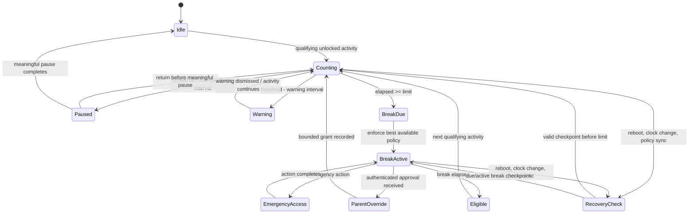

# 12 — Screen-Time and Break Engine

## Purpose and boundary

**FR-STM-01.** The default health rule is 60 minutes of qualifying continuous viewing followed by a 30-minute break. An Owner Parent may configure both durations within product-approved safety ranges. This is a wellbeing control, not an assertion that PCA can universally lock every device.

Qualifying viewing is an interactive, unlocked session in an included app/category. Calls, emergency workflows, parent-exempt apps and explicitly excluded accessibility use do not add to the counter. Merely opening and closing apps, rotating the device, or changing wall time must not reset it.

## Configuration and modes

| Setting | Default | Meaning |
|---|---:|---|
| Continuous-use limit | 60 min | Accumulated qualifying elapsed time before a break is due. |
| Break duration | 30 min | Time before ordinary policy can resume. |
| Qualifying scope | age-profile apps/categories | Included apps/categories; parent may exclude an app. |
| Meaningful pause | policy value | A sufficiently long non-qualifying interval resets the continuous streak; brief screen-off intervals only pause it. |
| Warning cadence | 10, 5, 1 min | Informational notices; may be reduced for accessibility. |
| Emergency / critical allowlist | enabled | Dialer, emergency services and parent-approved safety apps remain reachable. |

Capability labels are mandatory in the UI:

| Enforcement mode | Capability | Product claim |
|---|---|---|
| Android Standard | **VERIFIED_WITH_LIMITATION** | PCA can count and notify, and can apply controls only where granted; it cannot promise an unbypassable device-wide break. |
| Android Protected / managed | **REQUIRES_MANAGED_DEVICE** | Device-owner policy can suspend eligible packages; protected packages such as the default dialer cannot be suspended. |
| iOS Family Controls | **REQUIRES_ENTITLEMENT** | Device Activity thresholds and Managed Settings shields can apply to selected app/category/domain tokens after authorization; this is not a general system lock. |
| PCA foreground experience | **VERIFIED_WITH_LIMITATION** | A PCA break shield governs PCA-controlled experiences, not other apps. |

## State machine and durable accounting

The child stores a tamper-evident local checkpoint containing policy version, monotonic elapsed-time anchors where available, accumulated qualifying duration, current state, boot/session generation and a local audit sequence. Wall clock is used only for human display, schedules and reports. On reboot or a material wall-clock change, the engine conservatively restores the most protective state justified by its last valid checkpoint; it does not silently issue a new hour. If elapsed time is unavailable across reboot, the UI says that recovery is being reconciled and records the uncertainty rather than fabricating precision.

`BreakDue` is an idempotent decision: reprocessing it after duplicate events cannot create extra grants. A parent grant carries a scope, maximum duration, expiry, approver identity and audit identifier; it never permanently disables the health rule. Offline parent approval requests remain pending and do not self-approve.

## Enforcement sequence

1. Calculate against the active locally cached parent policy and checkpoint state.
2. At warning points, issue accessible child notifications without exposing private parent notes.
3. At the threshold, select the strongest available platform action: managed-package suspension, selected iOS Managed Settings shield, or PCA-only shield/notification.
4. Present the break screen, retained timer and permitted emergency actions.
5. When the timer expires, remove only the PCA-imposed action and reevaluate schedules, app limits, bedtime and tamper state before allowing use.

The engine must never use a deceptive overlay to imitate an OS lock screen. It must report the action actually applied: `managed package suspension`, `iOS selected-app shield`, `PCA-only break`, or `notification only`.

## Child experience, emergency and accessibility

The break view contains a countdown, plain-language reason, optional Arabic/English Dhikr/reflection card, an optional touch counter, accessible text scaling and screen-reader labels. The Dhikr counter is motivational by default; time completion—not religious interaction—is the unlock condition. No child is required to complete a devotional action to regain ordinary access.

Emergency access is always visible and includes system emergency calling where the OS permits, a parent-configured safety-app path where supportable, and a clearly logged return to the break. The design does not assume every device allows PCA to launch or exempt every emergency function. Parent override requires a verified parent session or previously established signed authorization; it is scoped and auditable. Parent-facing alerts never contain the child’s devotional interaction count unless the parent deliberately enabled it as a local wellbeing metric.

## Failure handling, privacy and acceptance

Policy revocation, permissions loss, unsupported platform status, process death, reboot, or enforcement failure produces a local protection-status event and parent alert on the next safe sync. It must not pretend enforcement succeeded. Only minimum local records are retained: totals, state transitions, action capability/result, override audit and selected optional wellbeing counters; they are encrypted and governed by the family retention policy. No readable activity timeline is uploaded to PCA infrastructure.

**Acceptance evidence:** simulated monotonic and wall-clock changes cannot reset a streak; an emergency route works during every enforceable state; a restart restores a due/active break; reports identify their enforcement capability; and accessibility testing proves that the break screen can be understood and exited through its permitted emergency path.
