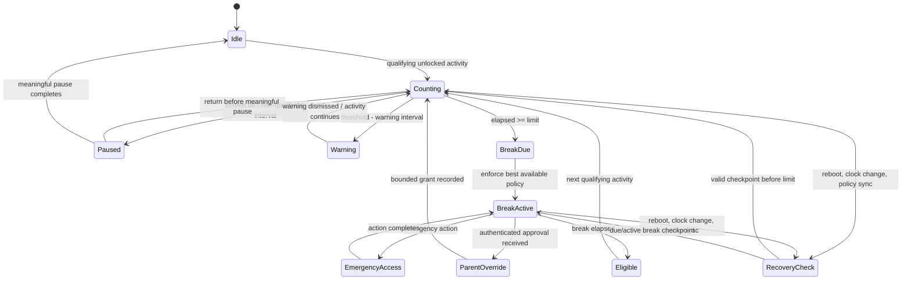

# 12 — Screen-Time and Break Engine

## Purpose and boundary

**FR-STM-01.** The default health rule is 60 minutes of qualifying continuous viewing followed by a 30-minute break. An Owner Parent may configure both durations within product-approved safety ranges. This is a wellbeing control, not an assertion that PCA can universally lock every device.

Qualifying viewing is an interactive, unlocked session in an included app/category. Calls, emergency workflows, parent-exempt apps and explicitly excluded accessibility use do not add to the counter. Merely opening and closing apps, rotating the device, or changing wall time must not reset it. A **continuous-use counter** is accumulated *qualifying monotonic elapsed time*, segmented by a streak: it is not calendar time, total daily usage, or a claim that every visible screen pixel was observed.

## Configuration and modes

| Setting | Default | Meaning |
|---|---:|---|
| Continuous-use limit | 60 min | Accumulated qualifying elapsed time before a break is due. |
| Break duration | 30 min | Time before ordinary policy can resume. |
| Qualifying scope | age-profile apps/categories | Included apps/categories; parent may exclude an app. |
| Meaningful pause | policy value | A sufficiently long non-qualifying interval resets the continuous streak; brief screen-off intervals only pause it. |
| Warning cadence | 10, 5, 1 min | Informational notices; may be reduced for accessibility. |
| Emergency / critical allowlist | enabled | Dialer, emergency services and parent-approved safety apps remain reachable. |

### Authoritative continuous-use event semantics

`meaningfulPause` is a policy-controlled monotonic interval (with a safe product default set during release validation). Only completion of that interval resets the streak to zero. A non-qualifying event does not itself make the interval meaningful; the engine must observe its duration. Where the OS cannot provide reliable event timing, the state remains `PROTECTION_STATUS_UNCERTAIN` and PCA must not claim exact continuous-use accounting.

| Event / condition | Counter and state effect | Required recovery / user-visible result |
|---|---|---|
| Screen turns on while a qualifying included app is interactive | Begin or resume counting after eligibility is confirmed. | Resume the saved streak only if the preceding pause was shorter than `meaningfulPause`. |
| Screen turns off / device locks | Immediately pause accumulation; preserve the streak and a monotonic pause start. | A short interruption resumes the prior streak. If the pause reaches `meaningfulPause`, reset to `Idle` before any later qualifying activity. |
| Short screen-off interruption | Never resets the streak merely because the screen was off. | Resume with the prior accumulated duration; do not add locked time. |
| Incoming or outgoing ordinary call | Pause qualifying accumulation while the call UI/audio call is active; preserve the streak. | When the call ends, reassess the foreground context. A short call resumes; a call lasting `meaningfulPause` resets. |
| Emergency call / emergency workflow | Pause the counter and permit the emergency route regardless of break, schedule, app limit, device mode, or parent setting. | Emergency access is non-removable. No policy, parent override, downgrade, or failed enforcement may block it. On completion, reassess without retroactively charging emergency time. |
| App switch | Continue only if the replacement is eligible and there is no observed non-qualifying interval; otherwise pause. | Switching between eligible apps does not reset or create a new streak. |
| Split screen, multi-window, picture-in-picture | Count only when OS-supported signals establish an included app is interactive/visible under the declared product evidence rule; otherwise pause rather than guess. | The report records limited/uncertain coverage. A PiP video/audio state alone is not automatically qualifying viewing unless the policy explicitly defines it and the platform evidence supports it. |
| Reboot, battery depletion, forced power-off | No elapsed time is invented across the boundary; monotonic-clock generation changes. Restore the durable checkpoint as `RecoveryCheck`. | Preserve a due/active break. For a prior counting streak, resume only the checkpointed accumulated duration and mark the cross-boot gap unknown; do not reset to gain a new hour. |
| Monotonic-clock reset at reboot | Treat every boot as a new monotonic generation; never compare raw monotonic values across generations. | Use signed/durable checkpoint ordering plus boot generation. If checkpoint integrity/timing is insufficient, choose a conservative protection status and notify the parent at safe sync. |
| Timezone change | Does not affect the counter, break duration, or meaningful-pause calculation. | Update presentation/scheduled-policy context only; audit the timezone change. |
| Wall-clock rollback or forward jump | Cannot add, subtract, or reset monotonic qualifying duration. | Detect/audit material changes. Keep the prior protective state; use wall time only for display/schedules and reconcile against trusted anchors when available. |
| Device offline | Continue using cached, signed policy and local checkpointing. | Queue encrypted status/audit delivery; never self-approve a parent request because the parent is unreachable. |
| PCA process killed / OS reclaims process | Accumulation/enforcement is only claimed while the supported component is active. On relaunch, load the durable checkpoint; do not estimate the missing interval. | Enter `RecoveryCheck`/limited-coverage status, restore an already due/active break, and raise a status event if continuity cannot be proven. |
| Required permission or platform capability revoked | Stop relying on the affected evidence/enforcement immediately. Do not silently continue an unsupported count. | Degrade to the explicitly displayed capability (for example notification only), record the reason, and notify the parent on next safe sync. |
| Protected/managed to Standard-mode downgrade | Retain the health state and counter; remove only enforcement powers no longer authorized. | Reevaluate the capability ladder immediately, report the downgrade, and never describe a Standard-mode notice as a managed lock. Emergency access remains available. |
| Parent bonus time | A signed/authenticated, bounded grant may postpone `BreakDue` or temporarily allow a specified eligible scope. | Record approver, scope, duration, expiry and audit ID. It does not erase historical use, permanently disable the rule, bypass a future schedule, or remove emergency access. |
| Parent emergency override | May temporarily permit the child’s ordinary use during a genuine parent-declared emergency, subject to its bounded grant. | It is auditable and expires. It may add an exception, but can never remove or restrict the child’s independent emergency route. |

Capability labels are mandatory in the UI:

| Enforcement mode | Capability | Product claim |
|---|---|---|
| Android Standard | **VERIFIED_WITH_LIMITATION** | PCA can count and notify, and can apply controls only where granted; it cannot promise an unbypassable device-wide break. |
| Android Protected / managed | **REQUIRES_MANAGED_DEVICE** | Device-owner policy can suspend eligible packages; protected packages such as the default dialer cannot be suspended. |
| iOS Family Controls | **REQUIRES_ENTITLEMENT** | Device Activity thresholds and Managed Settings shields can apply to selected app/category/domain tokens after authorization; this is not a general system lock. |
| PCA foreground experience | **VERIFIED_WITH_LIMITATION** | A PCA break shield governs PCA-controlled experiences, not other apps. |

## State machine and durable accounting

The child stores a tamper-evident local checkpoint containing policy version, monotonic elapsed-time anchors where available, accumulated qualifying duration, current state, boot/session generation, pause classification, active grant identifiers, enforcement result and a local audit sequence. Wall clock is used only for human display, schedules and reports. On reboot or a material wall-clock change, the engine conservatively restores the most protective state justified by its last valid checkpoint; it does not silently issue a new hour. If elapsed time is unavailable across reboot, the UI says that recovery is being reconciled and records the uncertainty rather than fabricating precision.

`BreakDue` is an idempotent decision: reprocessing it after duplicate events cannot create extra grants. A parent grant carries a scope, maximum duration, expiry, approver identity and audit identifier; it never permanently disables the health rule. Offline parent approval requests remain pending and do not self-approve.

## Enforcement sequence

1. Calculate against the active locally cached parent policy and checkpoint state.
2. At warning points, issue accessible child notifications without exposing private parent notes.
3. At the threshold, select the strongest available platform action: managed-package suspension, selected iOS Managed Settings shield, or PCA-only shield/notification.
4. Present the break screen, retained timer and permitted emergency actions.
5. When the timer expires, remove only the PCA-imposed action and reevaluate schedules, app limits, bedtime and tamper state before allowing use.

The engine must never use a deceptive overlay to imitate an OS lock screen. It must report the action actually applied: `managed package suspension`, `iOS selected-app shield`, `PCA-only break`, or `notification only`.

## Child experience, emergency and accessibility

The break view contains a countdown, plain-language reason, optional Arabic/English Dhikr/reflection card, an optional touch counter, accessible text scaling and screen-reader labels. The Dhikr counter is motivational by default; time completion—not religious interaction—is the unlock condition. No child is required to complete a devotional action to regain ordinary access.

Emergency access is always visible and includes system emergency calling where the OS permits, a parent-configured safety-app path where supportable, and a clearly logged return to the break. This emergency route is a non-removable invariant: no parent policy, allow/deny list, bonus/override expiry, screen-time setting, managed-mode change, app suspension or PCA failure may disable it. The design does not assume every device allows PCA to launch or exempt every emergency function. Parent override requires a verified parent session or previously established signed authorization; it is scoped and auditable. Parent-facing alerts never contain the child’s devotional interaction count unless the parent deliberately enabled it as a local wellbeing metric.

## Failure handling, privacy and acceptance

Policy revocation, permissions loss, unsupported platform status, process death, reboot, or enforcement failure produces a local protection-status event and parent alert on the next safe sync. It must not pretend enforcement succeeded. Only minimum local records are retained: totals, state transitions, action capability/result, override audit and selected optional wellbeing counters; they are encrypted and governed by the family retention policy. No readable activity timeline is uploaded to PCA infrastructure.

**Acceptance evidence:** exercise every row of the authoritative event table (including calls, power loss, both clock directions, each window mode, offline/process-killed recovery, permission loss, downgrade, and both grant types); simulated monotonic and wall-clock changes cannot reset a streak; an emergency route works during every enforceable state and cannot be removed by policy; a restart restores a due/active break; reports identify their enforcement capability and uncertainty; and accessibility testing proves that the break screen can be understood and exited through its permitted emergency path.
