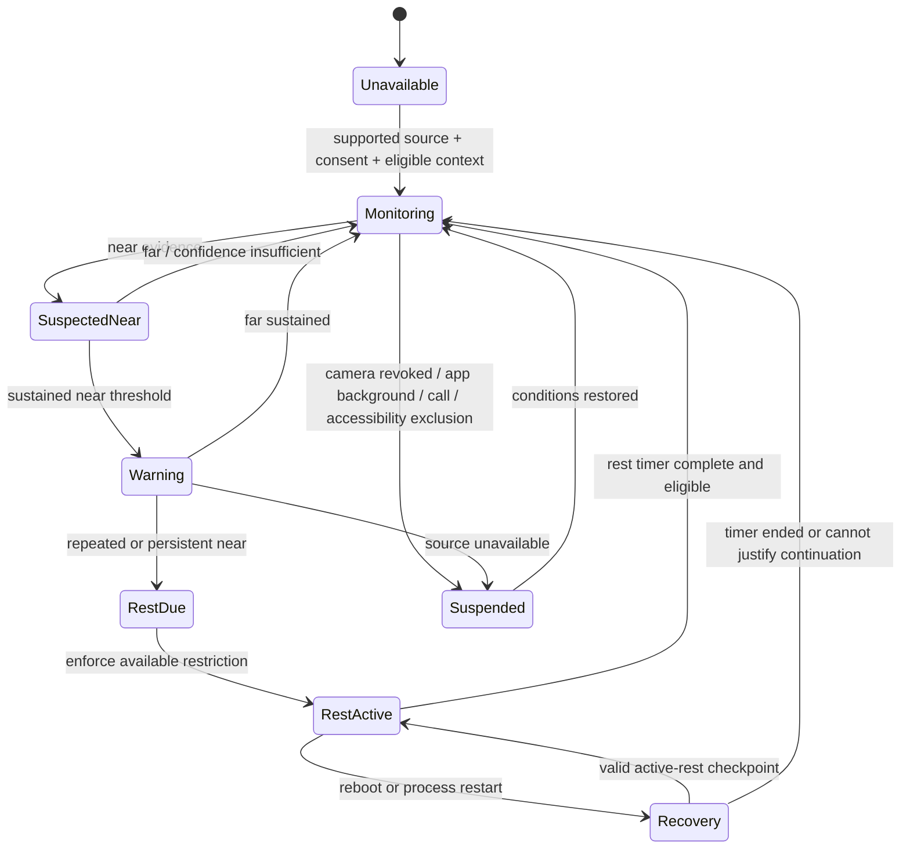

# 13 — Eye-Distance / Proximity Protection

## Safety objective and non-claims

**FR-EYE-01.** PCA encourages a child to move a device farther away after a configurable sustained near-viewing condition, then offers an approximately one-minute eye-rest restriction where it can enforce one. It is not a medical device, does not diagnose vision conditions, and must not represent an ordinary proximity sensor as a centimetre-accurate measurement.

Thresholds are expressed as `near/far` unless a supported depth-capable signal is available. Parent configuration is therefore capability-aware: a centimetre preference is only offered with a supported calibrated source, while all other devices use a conservative sustained-near duration. The parent and child see the sensor class and confidence, not a fabricated distance.

## Evidence hierarchy and platform truth

| Evidence source | Use | Limitation / capability |
|---|---|---|
| Apple Screen Distance | Prefer system guidance on supported TrueDepth iPhone/iPad | **VERIFIED_WITH_LIMITATION**: system-controlled; PCA guides configuration and does not claim a private control API. Apple says it needs Face ID setup and supported TrueDepth hardware. |
| Android proximity sensor | Low-power binary near/far signal | **VERIFIED_WITH_LIMITATION**: placement and range vary; blocked in a pocket, by a hand or call posture; no medical centimetre value. |
| Android Standard camera / face geometry | Optional explicit calibration or PCA foreground/app-context estimation only | **VERIFIED_WITH_LIMITATION**: requires camera permission and an obvious foreground/app-context flow. It is not a reliable baseline for continuous cross-app measurement and is never background surveillance. |
| Android Protected / Device Policy Controller camera enhancement | Potential future capability-gated enhancement | **REQUIRES_MANAGED_DEVICE** and **REQUIRES_FURTHER_VALIDATION**: Device Owner/DPC background-access feasibility can differ, but this does not approve continuous operation. It remains conditional on camera permission, foreground-service and service-type rules, OS version, Google Play policy, battery/thermal impact, explicit child/parent disclosure and privacy review. |
| Depth/TrueDepth public capability | Only if a public, entitled API supports the exact flow | **REQUIRES_FURTHER_OWNER_DECISION** pending device/API validation; never infer access from Face ID or consumer Screen Distance alone. |

The release baseline is low-power proximity/sensor evidence where hardware permits, plus camera use primarily for explicit calibration or foreground estimation. **Continuous background camera operation is never baseline PCA product behavior.** A Protected-Mode camera enhancement cannot ship merely because a DPC exception may be technically available; it needs separate capability, policy, privacy and power validation. No facial-recognition database, face template, identity matching, age inference, raw frame retention or cloud upload is permitted for this feature.

## State machine

The classifier fuses only current samples into an ephemeral `near`, `far`, or `unknown` decision with a coarse confidence bucket. `unknown` is not `near`. A warning requires sustained evidence and a rest requires a second persistence/repetition condition, reducing triggers from a quick phone call, pocket, hand, dark room, mobility aid, or a child deliberately repositioning the device. Default timings are conservative: sustained near for 5–10 seconds triggers a warning; persistent/repeated near may trigger a ~60-second rest. Product research and accessibility review must set the final ranges before release.

## Enforcement and exceptions

The one-minute experience selects the same capability ladder as the screen-time engine: managed Android suspension where eligible, a selected iOS shield where Family Controls applies, or a PCA-only prompt/shield. A system Screen Distance alert may coexist with PCA but must be reported separately; PCA does not try to evade, suppress or duplicate it as though it were PCA enforcement.

Emergency calling, active phone/video calls, navigation/safety workflows, and explicitly configured accessibility exceptions do not receive an automatic PCA rest block. When a safety exception ends, the engine reassesses; it does not retroactively punish the child. A parent can pause the feature, but cannot turn a sensor gap into an assertion that distance is safe.

## Privacy, power and transparency

Sampling follows a duty cycle: use the lowest-power suitable sensor first. In Android Standard Mode, run camera estimation only in an obvious foreground PCA/app-context flow and stop immediately when backgrounded/locked. In Protected/DPC Mode, no camera path is enabled unless its capability gate has passed all listed permission, foreground-service/service-type, OS, Play-policy, battery/thermal, disclosure and privacy checks; a passed gate still does not make continuous background camera baseline behavior. The child-facing page says what is sensed, when, whether frames leave the device (**never** for this feature), and exactly what parents can see.

Persisted data is limited to configuration, capability/consent status, outcome (`warning`, `rest`, `source-unavailable`), timestamp, duration and coarse confidence/source class. It excludes raw sensor streams, camera frames, landmarks and face geometry. Outcomes are encrypted on the family devices, retained under the selected monitoring retention policy, and are not readable by PCA infrastructure. A false-positive report/parent allow-once action is recorded as a policy-audit outcome, not as biometric data.

## Validation

**Acceptance evidence:** test different sensor-equipped and sensorless devices; verify pocket/hand/call and low-light false-positive cases; prove frames/landmarks are not persisted or transmitted; verify Android Standard Mode permits camera only in the declared foreground/app context; prove camera does not become a continuous background baseline after a Protected/DPC enrollment; separately gate any DPC enhancement against permissions, foreground-service rules, OS/Play policy, privacy disclosures and power/thermal tests; verify camera permission denial and backgrounding fail safely; and test screen reader, low-vision, mobility and emergency exemptions with child usability review.
