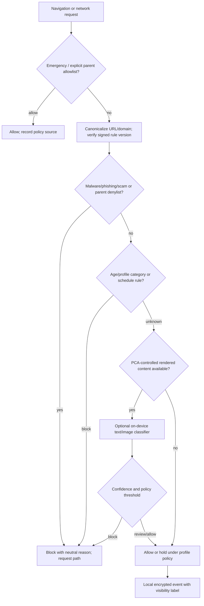

# 14 — Web and Content Filtering Architecture

## Scope and safety rule

**FR-WEB-01.** PCA applies deterministic policy before optional AI. It protects against explicit age-inappropriate sexual material, exploitation/grooming indicators, malware, phishing, scams, suspicious links/downloads and parent-selected categories. Sexual orientation, gender identity, ethnicity, religion or another protected characteristic is never itself a blocked category; explicitness, exploitation risk and age suitability are evaluated consistently regardless of who is represented.

PCA does not make TLS interception/MITM the consumer default. HTTPS traffic ordinarily does not disclose full paths or page text to a network filter; reporting must state what was actually visible.

## Deterministic decision pipeline

1. **Device and resolver rules:** signed malicious-domain, phishing, malware and scam intelligence; parent allow/deny lists; age-profile categories; and safe-search/restricted-mode configuration where the destination/service supports it.
2. **Network layer:** Android local VPN/DNS controls when user consent and platform configuration permit. Always-on/lockdown can improve coverage on eligible Android setups but creates an availability risk if the VPN fails; it is never reported as content inspection. iOS does not receive an equivalent promise from this design.
3. **PCA Safe Browser:** a controlled browser is the only normal path in which PCA can intentionally observe a full URL, page title and rendered content locally. Strict Mode may require it by owner decision; it does not invent visibility into other browsers.
4. **Optional on-device AI:** only after deterministic layers and only for content legitimately rendered in the PCA Safe Browser or other approved local context. It supplements rather than replaces rules.

## Content classification and response

Rules and model labels distinguish explicit adult material, non-explicit educational/health material, violence, gambling, scams and exploitation/grooming risk. A block reason is meaningful but non-graphic (for example, “blocked by your family’s explicit-content rule”). The child can request a review; the parent receives a minimally descriptive request and can allow a site temporarily or permanently. No unsafe preview is embedded in email or push notifications.

AI decisions include model/rule version, modality, confidence band, policy threshold and final disposition. Thresholds are age-profile specific and conservative for high-harm deterministic indicators. Ambiguous AI-only material follows the selected profile policy—allow with an event, or hold for parent review—not a universal opaque block. Parents can override non-mandatory classifications, and overrides feed only family-local policy; family content is never used for model training by default.

Rule and model packages must be signed, versioned, expiry-aware and rollbackable. Failed signature verification leaves the last known valid package active, raises a local integrity alert, and never replaces rules with an unverified package. Model execution must respect latency, battery, thermal and accessibility budgets; it is skipped rather than silently moving raw content to cloud processing. Any future cloud classification requires an explicit owner decision, separate informed parent opt-in, a documented data flow and legal/commercial review.

## Visibility and privacy matrix

| Context | Decision coverage | Parent record |
|---|---|---|
| PCA Safe Browser | URL/category/rules and eligible rendered local content | Full URL/title only under local retention policy; decision reason/source. |
| Android local VPN/DNS | destinations/DNS and policy-controlled traffic only | Domain or endpoint evidence where available; never claim HTTPS path/content. |
| Other Android browser | limited to network/domain controls actually active | Domain-only or unavailable. |
| Safari/other iOS browser | only Family Controls/public OS controls actually selected | No universal browsing-history claim. |

Records are encrypted on child/parent family devices and governed by the selected retention period. PCA infrastructure receives only the minimum encrypted delivery/signalling metadata defined in the privacy architecture; it does not store readable browsing history, blocked URLs, classifier inputs or screenshots. A child-facing transparency page names the active mode and visibility level.

## Failure modes and acceptance

DNS failure, VPN revocation, expired rules, unsupported browser, classifier timeout, user permission loss and conflicting allow/deny policies each create an explicit capability/status event. Parent allowlist takes precedence over category/AI decisions except for non-overridable security policy that must be separately defined and explained; a parent denylist overrides ordinary category allow. The engine must not claim a block that it did not enforce.

**Acceptance evidence:** deterministic malicious/allow/deny precedence tests; HTTPS-path non-visibility tests; Safe Browser URL and local-deletion tests; signed update/rollback tests; multilingual child block and review UI tests; adversarial/false-positive classifier tests; and Android/iOS capability matrix tests showing the displayed visibility label matches reality.
