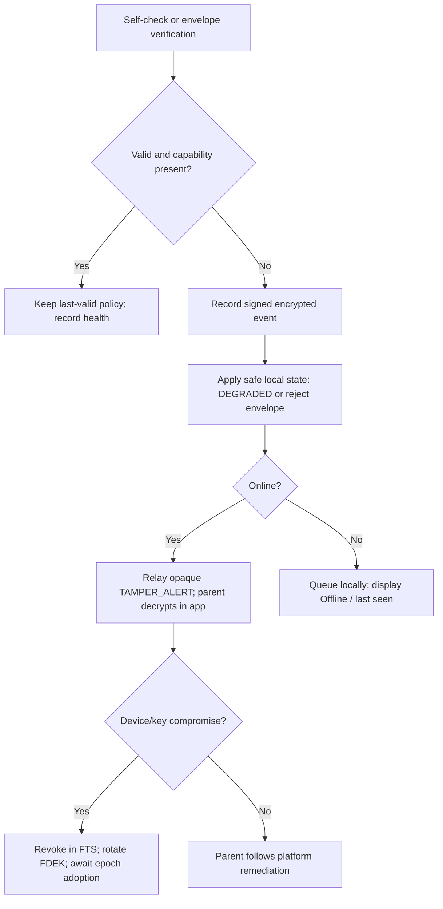

# 21 — Tamper Protection and Recovery

Owning agent: **PCA-DOC-F**. This document turns the cryptographic and lifecycle primitives in docs 08/09 into user-visible tamper handling and recovery. It does not add a bypass, escrow, hidden mode, or remote-wipe claim.

## 1. Security objective and boundaries

PCA-TPR-001: a supported loss of enforcement, authorization, application integrity, or device trust MUST be detected where the platform exposes a reliable signal, locally recorded as a non-sensitive event, and surfaced to an authorized parent after the next authenticated sync. The Child Agent keeps its last-valid signed policy while offline; alert delivery is not a prerequisite for local enforcement.

Detection is a risk signal, not proof of malicious intent. Root/jailbreak, debugging, clock anomalies, and missing hardware backing may increase assurance risk but MUST NOT erase data, accuse a child, lock the parent out, or silently change a family policy. A fully compromised OS can defeat app-level controls: PCA reports that limitation rather than promising tamper-proof operation.

## 2. Tamper state and evidence contract

Each event has `eventId`, `deviceId`, `trustSetEpoch`, `keyEpoch`, UTC detection time, `condition`, `severity`, `evidenceClass`, `localSequence`, `status`, and a signed, encrypted detail payload. The plaintext detail is family data and therefore uses the doc 09 envelope; Relay/push receives only an opaque wake/reference. No URL, location, keystroke, screenshot, or recovery material belongs in an event.

| State | Meaning and child behavior | Parent presentation |
|---|---|---|
| `HEALTHY` | Required capabilities available; latest valid policy applies. | Live/last-confirmed state only. |
| `DEGRADED` | A required capability is absent/revoked or a check fails; retain last-valid policy to the extent the OS permits. | What is unavailable, since when, and corrective action. |
| `SUSPECTED_TAMPER` | Integrity/trust anomaly needs parent attention; do not infer blame. | Risk label plus verified facts, never covert evidence. |
| `RECOVERY_REQUIRED` | Local cryptographic state cannot continue safely. | Recovery path; never a support reset. |
| `EPOCH_STALE` / `DEVICE_OFFLINE` | Device has not adopted current FTS/key epoch. It has no new control authority. | Pending convergence, distinct from completed revocation. |
| `REVOKED` | Device is excluded from the FTS. | Completed trust exclusion; historical local data may remain on a never-reconnecting device. |

Severity is `INFO`, `ACTION_REQUIRED`, or `SECURITY_CRITICAL`. A parent can acknowledge an alert but cannot suppress the underlying state or turn a failed capability into a healthy one.

## 3. Conditions and response

| Condition | Detection | Required response |
|---|---|---|
| Usage, notification, location, VPN/filter, DPC, or Family Controls authorization lost | Platform callback plus periodic self-check | Enter `DEGRADED`; show precise unavailable feature and remediation; send `TAMPER_ALERT` when connected. |
| App signature/package/resource integrity mismatch or unsupported build | Store/platform identity and release metadata verification | Refuse untrusted update/content; retain installed last-valid policy; require supported reinstall/update. |
| Signed envelope invalid, replayed, expired, wrong epoch, or unauthorized sender | Doc 09 §4 independent verification | Reject it, retain last-valid policy, create `SECURITY_CRITICAL` anomaly. |
| Device clock rollback beyond tolerance | Persisted trusted-time high-water mark (doc 11 §5.1) | Do not extend policy/retention expiry; use the greater trusted bound; request time correction. |
| Repeated failed parent step-up authentication | Local rate-limit/audit | Rate-limit and alert authorized parents; never disclose recovery-secret validity. |
| Root/jailbreak/debug/hook/virtualization indicator | Defence-in-depth checks | `SUSPECTED_TAMPER`; retain data and explain reduced assurance. No claim of comprehensive detection. |
| Recovery material/device suspected stolen | Parent declaration or recovery event | Revoke affected DSK/DEK, rotate FTS/FDEK and recovery material as applicable. |

## 4. Platform-specific removal posture

Android Standard Mode has no guaranteed uninstall prevention. `setUninstallBlocked`, package suspension, lock-task, and comparable strong controls require the managed-device authority documented in doc 06. These claims are `REQUIRES_MANAGED_DEVICE`, not a consumer-install feature.

iOS Family Controls behavior is `REQUIRES_ENTITLEMENT` and `VERIFIED_WITH_LIMITATION`: when Apple-authorized parent/guardian child controls apply, the ordinary child removal route can be restricted. PCA does not represent this as universal persistence or rely on an undocumented Settings route. Any lost authorization is `DEGRADED` and the parent receives Apple-supported remediation language only.

PCA-TPR-002: every removal path requires strong parent authentication. There is no company secret password, support-side decryptor, stealth re-enrolment, or child-facing hidden mode.

## 5. Authenticated parent recovery

Terminology is fixed by doc 09: the Recovery Secret (RS) is offline high-entropy material; a reviewed KDF derives an ephemeral RWK; the RWK opens the authenticated recovery envelope. The RS NEVER derives the random FDEK. The envelope contains minimum signed FTS/key material and encrypted FDEK(s), never activity plaintext; PCA may hold an opaque delivery copy only.

1. Replacement parent generates fresh DSK and DEK in secure storage.
2. It fetches the opaque recovery envelope and locally derives RWK from RS, recorded KDF suite and salt.
3. It verifies family binding, envelope ID, suite, epoch and anti-replay fields before opening it.
4. It creates `FTS epoch N+1`, enrolls the new parent, revokes lost/replaced DSK/DEK, creates fresh `FDEK keyEpoch N+1`, and wraps it only to remaining/new authorized DEKs.
5. The one-time `recoveryTransactionId` is signed and accepted once by Relay; signed delivery receipts record progress. No service account proof substitutes for RS.
6. Online devices adopt N+1; others show `DEVICE_OFFLINE`/`EPOCH_STALE` until reconnect. A revoked offline device cannot receive future traffic after convergence, but cannot be remotely wiped without connection.

If RS is lost and no active parent remains, the family is `RECOVERY_REQUIRED` but unrecoverable. This is an explicit product consequence of no escrow, not a support escalation path. RS theft is treated as compromise: use a live parent where possible, rotate RS/recovery envelope, FTS and FDEK.

## 6. Tamper/recovery flow

## 7. Failure handling and acceptance

| Failure | Honest outcome |
|---|---|
| Alert cannot be delivered | Local event remains pending; parent UI is Offline, not silently healthy. |
| Revoked device never reconnects | Its key stays excluded; prior local data cannot be claimed remotely erased. |
| Recovery transaction interrupted | Resume only using the same one-time transaction state; no partial transaction makes a new device authoritative. |
| Clock correction after rollback | Re-evaluate from trusted high-water mark; never resurrect expired data or expired envelopes. |
| Hardware-backed key unavailable | Continue only with documented software-backed protection; show lower assurance, not a false hardware guarantee. |

- [ ] Device tests revoke every required permission/authorization and assert `DEGRADED`, feature-scoped disclosure, and no plaintext push/log.
- [ ] Tests replay, forge, expire, and epoch-downgrade envelopes and verify rejection plus last-valid-policy retention.
- [ ] Lost-parent recovery tests prove RS/RWK use, DSK/DEK separation, FTS/key rotation, one-time transaction handling and revoked-device failure on post-rotation traffic.
- [ ] Offline tests prove `DEVICE_OFFLINE`, `EPOCH_STALE`, pending revocation, and the absence of a remote-wipe claim.

## 8. Doc 33 source handoff

| Handoff ID | Primary source | Claim |
|---|---|---|
| `SRC-H-F-021` | Android [DevicePolicyManager](https://developer.android.com/reference/android/app/admin/DevicePolicyManager), verified 2026-08-10 | Strong uninstall/package controls are managed-device powers. |
| `SRC-H-F-022` | Apple [Family Controls](https://developer.apple.com/documentation/familycontrols), verified 2026-08-10 | Family Controls requires Apple entitlement/authorization; scope is not universal persistence. |
| `SRC-H-F-023` | OWASP [Mobile Application Security Testing Guide](https://mas.owasp.org/MASTG/), verified 2026-08-10 | Root/tamper signals are defence-in-depth testing inputs, not an absolute-compromise guarantee. |

## 9. Dependencies

Doc 09 §§3–5 and §10 are authoritative for DSK, DEK, FDEK, RS/RWK, FTS epochs, envelope verification, and recovery; doc 08 owns lifecycle sequencing; docs 06/07 own platform mechanics; doc 24 owns adversary analysis and doc 28 owns executable test coverage.
