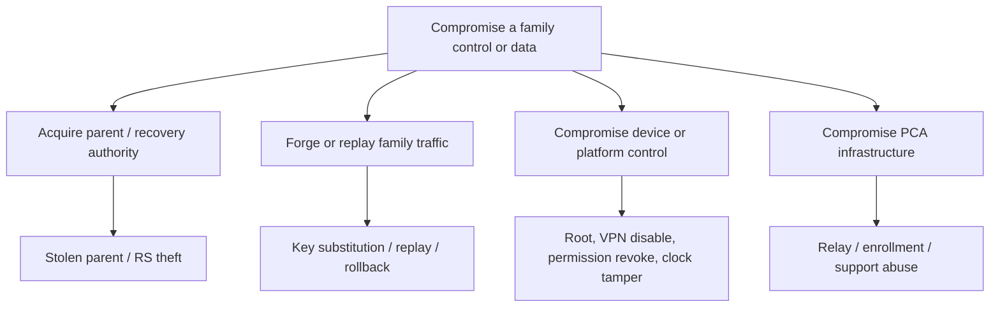

# 24 — Threat Model and Abuse Cases

Owning agent: **PCA-DOC-F**. This threat model red-teams the final doc 09 model: separate DSK (signing) and DEK (key-agreement/encryption) roles; random FDEK by `keyEpoch`; signed FTS by `trustSetEpoch`; RS-derived ephemeral RWK opening an authenticated recovery envelope; no PCA key escrow.

## 1. Assets, trust boundaries and non-goals

Protected assets are parent role authority; DSK/DEK private keys; RS/RWK and recovery envelope; current FTS/FDEK; policy integrity; local activity/location data; and update/model provenance. The adversary may observe networks, control a Relay or Enrollment/Licensing Service, hold a phone, operate a malicious family member account, or control a rooted/jailbroken endpoint.

PCA does not promise protection against a fully OS-compromised device, guaranteed removal prevention in consumer Android mode, remote erase of a device that never reconnects, or recovery when RS and all active parents are lost. It also does not provide covert adult surveillance, secret installation, hidden icon mode, or staff decryption.

## 2. Mandatory red-team scenarios

Every scenario below MUST have an automated test where feasible and a device/manual test otherwise. “Pass” means the stated expected outcome, not merely detection.

| Attack | Test exercise | Expected security result |
|---|---|---|
| Stolen parent | Attacker has unlocked/locked old parent phone | Step-up protection limits access; owner revokes old DSK/DEK, rotates FTS/FDEK; old device cannot control/decrypt post-rotation traffic. |
| Stolen child | Remove child device while offline then reconnect | Parent sees pending revocation; FTS exclusion/FDEK rotation prevent future data/control after adoption; no false remote-wipe claim for historical local data. |
| Recovery-code theft | Obtain RS plus opaque envelope, with/without active device | RS alone is not service-side plaintext; theft triggers RS/envelope/FTS/FDEK rotation when live parent exists; test takeover risk disclosure and one-time recovery replay rejection. |
| Malicious parent | Authorized but abusive adult attempts excessive tracking, role escalation, or covert use | RBAC/step-up/audit apply; scope/disclosure controls prevent hidden adult surveillance. Legitimate owner authority is not incorrectly modeled as an external cryptographic attacker. |
| Malicious support employee | Inspect database/logs or attempt recovery | No plaintext/key escrow/RS/RWK in service/support tooling; least-privilege metadata only; support cannot forge family DSK signatures. |
| Compromised Relay | Read/alter/drop/reorder/replay queued envelopes | Ciphertext remains unreadable; receiver detects signature, replay, expiry, epoch and ordering failures; availability loss becomes Offline/pending, never silent success. |
| Compromised Enrollment Service | Alter account/key-directory/enrollment/recovery availability records | It cannot generate family-valid FTS/policy; fingerprint/FTS verification prevents key substitution; attacker may impair availability/metadata, which is reported and incident-handled. |
| Key-directory substitution | Replace a candidate DEK/DSK in service response | Parent fingerprint confirmation plus signed FTS and recipient validation reject mismatched device identity; no FDEK is wrapped to substituted key. |
| Replay | Reinject valid prior policy/deletion/recovery envelope | Per-sender replay ledger, expiry, semantic version and one-time IDs reject it; deletion remains idempotent, recovery is accepted once. |
| Rollback/downgrade | Deliver valid older policy or vulnerable update/model | Ordinary lower version is rejected; only explicit time-bounded `SIGNED_ROLLBACK` by authorized role works; packages require signed metadata/hash and controlled rollback. |
| Offline revoked device | Keep endpoint disconnected across FTS/key rotation | It remains `DEVICE_OFFLINE`/`EPOCH_STALE`; on reconnect it cannot exercise new authority and cannot decrypt post-rotation ciphertext. |
| Root/jailbreak/debug/hooking | Run representative compromised-device instrumentation | Risk detection and degraded assurance/alert occur where signal exists; no claim that app controls survive attacker OS control. |
| VPN disable | Stop/revoke filter VPN or bypass supported filter path | Feature-specific `DEGRADED` event and parent alert; documented platform authority limits respected. |
| Permission revoke | Revoke usage/location/notification/camera or authorization | Feature stops or degrades safely, parent sees exact capability loss; no data is fabricated or silently treated as live. |
| Time tampering | Move clock backward/forward across policy and retention boundaries | High-water/trusted-time logic prevents expiry extension/resurrection; expired envelopes remain invalid and anomaly is recorded. |
| Malicious rule/model update | Tamper package, signature, threshold or rollout metadata | Verification rejects before activation; retain known-good/deterministic behavior; test staged rollback and source provenance. |

## 3. Attack-tree priorities

Priority-one release blockers: an attacker can forge a family-valid control envelope, recover readable family data from PCA infrastructure, make a revoked key work for post-rotation traffic, bypass critical verification by ordering/replay, or turn an update into unverified code/model activation. Priority-two risks include delayed alerting and reliable feature degradation; these require visible disclosure and tracked mitigation before release.

## 4. Abuse prevention and incident response

PCA is for lawful parent/guardian supervision of a child. Product UX must disclose monitoring, show platform-required notices, support child requests/review, and prevent use as invisible adult tracking. Parent role changes, recovery, revocation, deletion instructions and signed rollback are in the encrypted `ParentActionAudit` and subject to doc 11 retention; audit visibility never grants support staff decryption.

An incident response starts with containment (revoke/rotate affected FTS/key epoch or halt package rollout), preserves only non-sensitive operational evidence, communicates the actual limitation, and requires regression testing before recovery. A security incident does not justify uploading activity plaintext, recovery secrets, screenshots, or device keys to support.

## 5. Verification evidence and source handoff

Doc 28 MUST map each row in Section 2 to test ID, platform coverage, result and residual-risk owner. External penetration testing before production includes service authorization, Relay manipulation, mobile storage/IPC, recovery transaction replay and update supply-chain paths. `SRC-H-F-029`: OWASP [MASVS](https://mas.owasp.org/MASVS/), verified 2026-08-10, is supplied to doc 33 as a primary mobile-security verification baseline; PCA’s explicit expected results above remain the acceptance criteria.

## 6. Dependencies

Docs 05, 08, 09, 11, 21, 22 and 23 define the architecture being tested; docs 25, 27, 28 and 29 own policy, support observability, test execution, and incident/release processes. Any newly identified threat changes the relevant owning document and this matrix; it is not silently patched only in code.

## 7. Parent account authentication after Genesis removal (PCA-DEC-037, 2026-09-24)

`PARENT_AUTHORITY_MODEL = ACCOUNT + VERIFIED EMAIL + PASSWORD + TOTP MFA` and
`COMMERCIAL_OWNER_AUTHORITY = FAMILY ADMINISTRATOR + FRESH TOTP STEP-UP` replace the
device-bound Parent Genesis model. The replacement is **not security-equivalent**; the
decision record (`docs/implementation/decisions/PCA_DEC_037_PARENT_TOTP_MFA_REPLACES_GENESIS.md`)
lists what is weaker.

| Abuse case | Control | Residual risk |
|---|---|---|
| Password stuffing / guessing | scrypt password hash (node:crypto), per-IP + per-email rate limits, generic errors, second factor always required | Low |
| Stolen password, no mailbox, no authenticator | Enrolled: TOTP required on every login. In grace: emailed code required (remembered browser only for the browser that already passed it) | Low |
| Stolen password + mailbox, during the 3-day grace | Attacker can sign in and enroll *their* authenticator (enrollment needs session/ticket + password re-entry) | **Accepted** — grace window by owner decision; MFA_ENROLLED notice goes to the mailbox the attacker controls |
| Stolen password + mailbox, after enrollment | Owner selected a 24-hour server-side hold after password + emailed recovery-code verification. Starting recovery revokes all Parent sessions and other recovery codes; the old factor remains installed while login and sensitive actions are denied. A fresh password + recovery code is required after the deadline before the old factor is revoked and replacement enrollment begins. | **MITIGATED, RESIDUAL RISK OPEN** — the hold gives the legitimate user time to detect and report an unrequested reset, but mailbox compromise remains a recovery path. No safe cancellation mechanism exists in the current architecture; a support contact/cancellation process remains follow-up. |
| TOTP brute force | 5 failures / 15 min lock (row-locked counter, shared across login, step-up, enrollment) + route rate limits | Low (≈5 guesses per 15 min against 10^6) |
| TOTP replay (shoulder-surf, log leak) | Forward-only accepted-counter claim; the login code can never authorize a commercial step-up | Low |
| Real-time phishing proxy (password + TOTP relayed) | None specific (TOTP is phishable) | **Accepted** — mitigated only by the SameSite=Strict cookie scope and notices |
| Session hijack → attacker binds own authenticator | Enrollment re-authenticates with email + password; an ACTIVE factor is replaced only via recovery | Low |
| Session hijack → money movement | Every sensitive commercial mutation needs a fresh TOTP step-up grant (single use, one operation, one family, 5 min) | Low |
| Viewer/child/other-family admin performs billing action | Authority checks family match + ACTIVE ADMINISTRATOR before consuming any grant | Low |
| Clearing browser data / changing clock to reset grace | Grace is server-side, started once, never extended | None |
| Concurrent first logins create duplicate families | Row lock + UNIQUE `families.provisioned_for_account_id` | None (proven on MySQL) |
| TOTP secret disclosure at rest | AES-256-GCM, separate `PCA_PARENT_MFA_ENC_KEY` realm; secret never logged or stored in browser storage; otpauth URI returned once with `no-store` | Key-custody dependent (Key Vault) |
| Email notice abuse / enumeration | Register, recovery-request and password-reset answers are identical whatever the account state | Low |
| Microsoft/Azure login prompt mistaken for PCA | Parent Web makes no Microsoft identity request (verified 2026-09-24); EasyAuth disabled | None for Parents |
