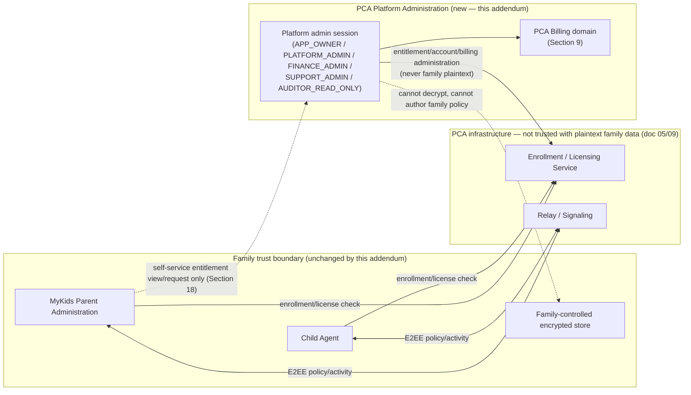

# PCA Addendum 002 — Platform Administration and Billing

## Control

| Field | Value |
|---|---|
| Addendum ID | PCA-ADDENDUM-002 |
| Authority | `PCA-DEC-022 = OWNER_APPROVED` (Free Starter entitlement default), `PCA-DEC-023 = OWNER_APPROVED` (entitlement-count separation), `PCA-DEC-024 = OWNER_APPROVED` (commercial pricing/currency/quote model) — see `31_RISK_DECISION_REGISTER.md` |
| Status | AUTHORING COMPLETE; ARCHITECTURE ONLY — NOT YET IMPLEMENTED; no `PCA-PA-*`/`PCA-BILL-*`/`PCA-MYKIDS-BILL-*` source exists in this repository as of this addendum's authoring date |
| Baseline | A-100 Architecture v1.0; its 199 normative requirements remain immutable. This addendum is additional authority layered on top of, not a replacement for, `PCA_ARCHITECTURE_MASTER_v1.0.md` and `docs/architecture/00_DOCUMENT_CONTROL.md` through `34_ARCHITECTURE_COMPLETION_GATE.md` |
| Scope | A new, independent Platform Administration + Billing/Commerce programme: platform-operator administration surface, family entitlement management, device-slot concurrency control, and the full billing/payment/settlement domain |
| Out of scope | Any change to the Child Agent, family E2EE trust boundary, family RBAC (doc 02/18), or the Family Trust Set (doc 09). This addendum grants **no** new authority over family activity data, family policy, or family cryptographic material to any platform-side role. It does not implement, and does not authorize implementation of, any capability described here — see Section 21 (Implementation Programme V2) for phase gating |
| Authoring date | 2026-08-13 |
| Owning agent | PCA-DOC-REALIGN-1 (documentation-only; no source code authored or modified) |

This controlled implementation addendum defines a new product plane that does not exist in source today (confirmed by repository survey: no `billing`, `payment`, `invoice`, `subscription`, `stripe`, or `paypal` backend module exists anywhere in `backend/src/`; `parent-web/src/pages/Subscription.tsx` is a static 14-line placeholder with hardcoded values and no API calls). It is authoritative for future implementation of that plane. It does not amend, renumber, reinterpret, or count as part of the accepted A-100 199-requirement inventory, and it does not amend Addendum 001. Its exact normative inventory is `PCA-ADD-PA-001` through `PCA-ADD-PA-054` (51 distinct Platform Administration requirement IDs; numbering is intentionally non-contiguous in places, consistent with the accepted baseline's own numbering convention, e.g. doc 03's `PCA-FR-045`→`PCA-FR-050` gap) and `PCA-ADD-BILL-001` through `PCA-ADD-BILL-047` (47 distinct Billing requirement IDs, including lettered sub-item `PCA-ADD-BILL-005A` per doc 00 Section 7's extend-rather-than-renumber convention), for a combined 98 new normative requirements. Implementation mapping, once implementation begins, is maintained in `docs/implementation/PCA_IMPLEMENTATION_TRACEABILITY.md` following the same discipline Addendum 001 established (no requirement is implemented merely by appearing in a document).

**Pricing authority note (owner amendment, `PCA-DEC-024`):** no dollar or currency figure anywhere in this document is a fixed or hardcoded price. Every numeric example used for illustration below is explicitly labeled "illustrative example only." The App Owner (`APP_OWNER`/`FINANCE_ADMIN` roles, Section 3) exclusively controls all real prices at runtime through Platform Administration → Billing Management (Section 16, `PCA-ADD-BILL-044`); no price is ever fixed in architecture documentation or hardcoded in source.

---

## 1. Purpose and scope

PCA's accepted architecture baseline (doc 01–34) defines a two-sided product: a Family Owner/parent administration surface ("MyKids") and a Child Agent, connected through an E2EE-only trust boundary that PCA's own infrastructure cannot read into (doc 05, doc 09). That baseline deliberately says almost nothing about how PCA-the-company operates its own commercial and operational back office — account entitlement, billing, payment processing, settlement, or internal platform-operator tooling — beyond a minimal, schema-constrained Enrollment/Licensing Service (doc 05 Section 3.3) that is explicitly forbidden from ever holding a field capable of carrying family activity data (`PCA-FR-136`).

This addendum specifies that back office as its own, fully-designed architecture: **PCA Platform Administration** (an internal, operator-facing product) and **PCA Billing** (the commercial/payment domain it administers). Both are new source domains — no code for either exists in this repository today. This document is written to the same rigor as the accepted baseline specifically so that, when implementation eventually begins, it does not have to be invented ad hoc by whichever engineer picks it up first.

This addendum does not change, weaken, or reinterpret any accepted requirement in docs 00–34. Where this addendum's design touches a concept the baseline already owns (RBAC, audit, E2EE, retention), it explicitly cross-references the owning baseline document and never silently redefines it.

---

## 2. Trust boundary (three independent product planes)

PCA operates **three architecturally independent product planes**, and this separation is the load-bearing design decision this entire addendum builds on:

1. **Child Agent** — the on-device enforcement executor (doc 05 Section 3.2). Unchanged by this addendum.
2. **MyKids Parent Administration** — the family-facing product (doc 05 Section 3.1, doc 18). Unchanged in its own authority by this addendum, except for the additive commercial self-service surface defined in Section 18 below.
3. **PCA Platform Administration** — a new, internal, operator-facing plane defined by this addendum. It administers PCA's commercial relationship with families (accounts, entitlements, licenses, billing) and PCA's own service operation, and it is not a family role, not a parent role, and not part of the Family Trust Set.

**PCA-ADD-PA-001** Platform Administration MUST be implemented as an operationally and architecturally separate application/service surface from MyKids — distinct authentication realm, distinct session type, distinct authorization model (Section 4), and, where practical, distinct deployment/hosting boundary — not a hidden admin mode bolted onto the parent web app.

**PCA-ADD-PA-002** No Platform Administration role of any kind is a parent role. A platform admin account MUST NOT be usable to log into MyKids as if it were a family member, and a parent/Family Owner account MUST NOT be usable to log into Platform Administration merely by holding a family role.

**PCA-ADD-PA-003** Parents MUST NEVER be able to authenticate into Platform Administration. There is no shared login surface, no "admin mode" toggle inside the MyKids app, and no account-linking mechanism that grants a family account platform-operator authority as a side effect of any family action (subscription purchase, support escalation, etc.).

**PCA-ADD-PA-004** Platform administrators, by virtue of administering the service, MUST NEVER receive family E2EE authority: no Platform Administration role or session may hold, derive, request, or be issued a Family Data Encryption Key (FDEK), a Device Signing Key (DSK), a Device Key-Agreement Key (DEK), the Family Root Recovery Secret, or any key material defined in doc 09 Section 3. This is the same "no support master key" invariant doc 09 Section 1/PCA-SEC-015 establishes for support staff, restated here as binding on every Platform Administration role without exception.

**PCA-ADD-PA-005** A Platform Administration action MUST NEVER be capable of directly creating, modifying, or deleting family policy, family activity data, or a child device's Child Agent state. Platform Administration's authority is over the *commercial and operational shell* around a family account (Sections 3, 6, 9, 15), never over the family's own encrypted content or policy — this restates doc 05 Section 9 and doc 09 Section 5.2's server-knowledge boundary as a binding constraint on this new plane, not just on the Enrollment/Licensing Service and Relay.

### 2.1 Trust boundary diagram

**PCA-ADD-PA-006** The context diagram in Section 2.1 is the canonical trust-boundary diagram for this addendum; any future document describing Platform Administration or Billing MUST remain consistent with it or raise a doc 00 Section 9-style conflict rather than silently redrawing the boundary.

---

## 3. Platform Administration roles

Platform Administration defines its own role set, entirely separate from doc 02's family roles. At minimum, five roles are required, each with an explicit permission boundary and an explicit, non-negotiable prohibition list.

### 3.1 APP_OWNER

**Purpose**: ultimate platform/commercial administrative authority — the operator-side analogue of a Family Owner, but for the *company's* administration of the service, not for any single family.

**Permissions**: all platform/commercial administration capability defined in this addendum — account/entitlement administration (Section 6), billing/payment administration (Section 9–14), platform dashboard and reporting (Section 15), platform settings (Section 16) including sensitive settings, admin role/account management (creating/removing other Platform Administration accounts and assigning roles below APP_OWNER), and full audit visibility (Section 17).

**PCA-ADD-PA-007** There MUST be at least one, and the product SHOULD support more than one, `APP_OWNER` account, but every `APP_OWNER`-granting action MUST itself be an audited, step-up-authenticated action (Section 4) — `APP_OWNER` is not a bootstrap-only role that becomes ungoverned after initial setup.

### 3.2 PLATFORM_ADMIN

**Purpose**: day-to-day operational administration of accounts, licenses, enrollment limits, plans, and service settings where doing so does not touch financial instruments or sensitive banking configuration.

**Permissions**: account status administration (suspend/reactivate, Section 6), device/parent-member entitlement quantity administration (Section 6–7) within owner-configured bounds, plan assignment (moving a family between non-financial-instrument-affecting plan tiers, subject to Section 9's billing-domain boundary), service settings that are not classified sensitive (Section 16), and read access to the platform dashboard (Section 15).

**Prohibited**: MUST NOT access raw payment instrument data, MUST NOT initiate refunds or view full settlement/bank configuration (Section 3.3's domain), MUST NOT create or modify other Platform Administration accounts' roles.

### 3.3 FINANCE_ADMIN

**Purpose**: billing, invoicing, refunds, payment status, and settlement/reconciliation administration.

**Permissions**: full read/administration of the Billing domain (Section 9) — invoices, payment attempts/transactions, refunds, disputes, settlement accounts and batches (Section 14), price books and plans' financial terms — and read access to the account/entitlement data needed to correlate billing records to families (family/account opaque identifiers, plan, entitlement state) but not to family activity or policy content (which does not exist in this plane per Section 2's boundary regardless of role).

**Prohibited**: MUST NOT change enrollment/device-limit entitlement quantities outside of what a billing-driven plan change implies, MUST NOT create/modify Platform Administration accounts, MUST NOT change non-financial service settings (branding, feature flags).

### 3.4 SUPPORT_ADMIN

**Purpose**: first-line support for account, license, and enrollment metadata problems — the Platform Administration analogue of doc 02 Section 4.2's PCA Support Agent role, restated and bound by this addendum's stricter role separation.

**Permissions**: read access to account/license/enrollment metadata (account status, plan, entitlement counts and usage, device-slot state per Section 8, increase-request status per Section 7) sufficient to resolve a support ticket, and the ability to perform narrowly scoped, audited support actions explicitly enumerated in platform settings (e.g., resend an invitation-adjacent notification, re-trigger an entitlement sync) — never a raw data-mutation console.

**Prohibited**: MUST NOT view payment instrument data, invoices, refunds, or settlement data (Section 3.3's domain); MUST NOT change entitlement quantities beyond an owner-configured, narrow self-service-equivalent action if one is explicitly granted; MUST NOT access any family activity, policy, or E2EE content — this is architecturally impossible per Section 2, not merely role-restricted, but is restated here for clarity since this role is the most likely to be socially engineered (doc 02 Section 10's "Support Agent social-engineered" failure mode applies equally here).

### 3.5 AUDITOR_READ_ONLY

**Purpose**: independent, read-only platform audit and reporting access — for internal compliance, external audit, or ownership oversight, without any capability to take action.

**Permissions**: read-only access to the platform audit log (Section 17), platform dashboard (Section 15), and billing/entitlement records needed for audit and reporting. No write/mutate capability of any kind, on any resource, under any circumstance.

**PCA-ADD-PA-008** `AUDITOR_READ_ONLY` MUST be enforced as read-only at the authorization layer, not merely by UI omission — the same "UI hiding is never authorization" principle doc 18 Section 1 establishes for family RBAC applies identically here.

### 3.6 Cross-role invariant

**PCA-ADD-PA-009** No Platform Administration role defined in this section, including `APP_OWNER`, may ever decrypt or directly view: child browsing history, child location history, child app/YouTube usage, child wellbeing/eye-distance/screen-time content, family policy content, family private keys (DSK/DEK/FDEK), or the Family Root Recovery Secret / recovery envelope contents. This is a structural property (no such data exists in Platform Administration's data model, Section 9, Section 15) — restated as an explicit role-table invariant so it cannot be silently reintroduced role-by-role during implementation.

### 3.7 Role permission matrix

| Capability area | APP_OWNER | PLATFORM_ADMIN | FINANCE_ADMIN | SUPPORT_ADMIN | AUDITOR_READ_ONLY |
|---|---:|---:|---:|---:|---:|
| Manage Platform Administration accounts/roles | yes | no | no | no | no |
| Account status (suspend/reactivate) | yes | yes | no | no (view only) | no |
| Entitlement quantity administration (Section 6–7) | yes | yes | no (plan-driven only) | no (view only) | no |
| Invoices/refunds/payment status/settlement (Section 9–14) | yes | no | yes | no | view only |
| Sensitive platform settings (Section 16) | yes | no (non-sensitive only) | no | no | view only |
| Platform dashboard (Section 15) | yes | yes | yes | yes (support-relevant subset) | yes |
| Support-scoped account/license/enrollment metadata | yes | yes | view only | yes | view only |
| Platform audit log (Section 17) | yes | own actions + relevant | own actions + relevant | own actions | full read-only |
| Decrypt/view any family activity, policy, or key material | **no** | **no** | **no** | **no** | **no** |

---

## 4. Platform Administration authority (separation from family RBAC)

**PCA-ADD-PA-010** Authentication and authorization for Platform Administration roles (Section 3) MUST be architecturally separate from: doc 02/18 family RBAC, parent service-account family scopes, child device trust (doc 08), and the Family Trust Set (doc 09 Section 3.2). Platform Administration MUST NOT share an identity provider realm, session token type, or authorization-claim schema with any family-facing session in a way that would let a claim minted for one plane be replayed as authority in the other.

**PCA-ADD-PA-011** A bare `isAdmin=true` (or equivalent single boolean) flag on a parent/family account record MUST NEVER be sufficient, by itself, to grant Platform Administration authority. This pattern is explicitly rejected: Platform Administration identity MUST be a first-class account type with its own role assignment (Section 3), not a flag layered onto a family account schema.

**PCA-ADD-PA-012** Platform Administration authority requires all of the following, none of which may be individually sufficient:

- a dedicated Platform Administration account (**PCA-ADD-PA-013**) — a distinct identity record, never a repurposed family/parent account record;
- a dedicated session type (**PCA-ADD-PA-014**) — distinct token/session identity, audience-scoped so a Platform Administration session token is rejected by any family-facing (MyKids/Enrollment/Relay) endpoint and vice versa;
- dedicated RBAC (**PCA-ADD-PA-015**) — the role set and permission matrix in Section 3, enforced server-side on every request, independent of doc 18's family permission matrix;
- multi-factor authentication (**PCA-ADD-PA-016**) — MFA is mandatory (not optional/configurable-off) for every Platform Administration account, at every login, with no "remember this device forever" bypass exceeding a bounded, re-verified window;
- step-up authentication for sensitive actions (**PCA-ADD-PA-017**) — refund issuance, settlement/bank configuration changes, admin role grants, account suspension/reactivation of a family account, and entitlement-limit overrides all require a fresh step-up (short-lived re-authentication), mirroring doc 18 Section 4's family step-up pattern but as an independent implementation, not a shared code path with family-plane step-up that could conflate the two planes' trust levels;
- audit logging (**PCA-ADD-PA-018**) — every Platform Administration authentication event and every state-changing action is recorded per Section 17, independent of doc 18 Section 5's family `ParentActionAudit`.

**PCA-ADD-PA-019** Platform Administration sessions MUST support administrator-initiated and forced (e.g., role-removal-triggered) session revocation, mirroring doc 04 `PCA-NFR-008`'s family session-revocation requirement but implemented as an independent capability in this plane.

**PCA-ADD-PA-020** Rate-limiting and lockout on Platform Administration authentication attempts is mandatory (mirroring `PCA-NFR-009`), and — because a Platform Administration account compromise has a materially different (commercial/operational, not family-privacy) blast radius than a family account compromise — failed-login and lockout events on `APP_OWNER`/`FINANCE_ADMIN` accounts specifically MUST generate an immediate alert to other `APP_OWNER` accounts, not merely a logged event.

---

## 5. Free Starter entitlement

**Owner decision (`PCA-DEC-022`, recorded in doc 31)**: every newly registered parent/family account begins on a **FREE_STARTER** entitlement tier: `parentMemberLimit = 1`, `managedDeviceLimit = 1`, **price = FREE** (`amountMinor = 0`, no `Subscription`/`Invoice` charge ever generated for the FREE_STARTER tier itself). Any increase above `managedDeviceLimit = 1` is **potentially billable** — it is priced per the price-book model in Section 9/`PCA-ADD-BILL-002` and is never free by default once requested above the starter allowance, though the App Owner retains discretion to approve a specific increase request at no charge (Section 7) as an explicit, audited exception rather than a silent default.

**PCA-ADD-PA-021** FREE_STARTER is a **new starter tier introduced by this addendum**. It does not delete, contradict, or supersede the accepted architecture baseline's requirement that a normal/paid family tier support broader family structures — specifically `PCA-FR-004A` (doc 03 Section A: "the product MUST support at least 2 parent roles and at least 2 children with at least 1 device each on the base family tier") and doc 02 Section 5's family-structure model (1 Family Owner, 0..N Administrators, 0..N Viewers, 1..N children, 1..N devices per child "subject to the family's subscription/license tier"). `PCA-FR-004A`'s "base family tier" language is interpreted, by this addendum, as referring to the family's **paid/standard** tier, not to the newly introduced FREE_STARTER entry tier — FREE_STARTER is a deliberately narrower on-ramp tier that exists *below* the base tier `PCA-FR-004A` describes, not a redefinition of it.

**PCA-ADD-PA-022** A family on FREE_STARTER MUST be clearly, continuously informed (in MyKids, per Section 18) that it is on a limited entry tier, exactly what its current limits are, and how to request more (Section 7) or upgrade to a paid/standard plan that satisfies `PCA-FR-004A`'s broader family-structure requirement. FREE_STARTER MUST NOT be presented as if it were the product's normal/full family capability.

**PCA-ADD-PA-023** Downgrading an existing family from a paid/standard plan to FREE_STARTER (e.g., on subscription lapse) MUST NOT silently remove already-enrolled parent members or child devices in excess of the new limit. Excess members/devices become **over-limit but not force-removed**: they remain enrolled and functional, but no *new* member/device may be added until the family is back within its entitlement (Section 6), and the family is clearly shown its over-limit state. Forced removal of an existing family member or child device is never an automatic entitlement-driven action — removal remains an explicit, authorized family action (doc 08 Section 8) or an explicit, audited, notice-bearing Platform Administration action taken only for cause (e.g., fraud, chargeback) under `FINANCE_ADMIN`/`APP_OWNER` authority with the family notified.

**PCA-ADD-PA-024** The FREE_STARTER default (`parentMemberLimit = 1`, `managedDeviceLimit = 1`) and any future change to those default numbers MUST be implemented as Platform Administration configuration (Section 16), not a hardcoded literal, consistent with `PCA-NFR-054`'s configuration-not-hardcoded-literal principle.

---

## 6. Entitlement model

**PCA-ADD-PA-025** Entitlement quantity MUST be modeled as (at minimum) two separate counters, never collapsed into one ambiguous "user/phone" count:

- **`parentMemberLimit`** — the maximum number of parent/guardian roles (Family Owner + Administrators + Viewers, doc 02 Section 3) the family's current entitlement permits;
- **`managedDeviceLimit`** — the maximum number of enrolled child devices (doc 08 Section 3) the family's current entitlement permits.

These two counters are independent: a plan may raise one without the other, and neither is derived from the other. "One user, one phone" is explicitly rejected as a data model — a family of one parent monitoring three children's devices, and a family of three parents monitoring one shared child device, are different entitlement-usage shapes that a single combined counter cannot represent correctly.

**PCA-ADD-PA-026** Platform Administration controls **entitlement quantity** only (the two limits above, per plan/account). It does not, and architecturally cannot, control *which* specific people or devices occupy those slots — that is exclusively a MyKids/family decision (doc 02 role invitation, doc 08 device enrollment).

**PCA-ADD-PA-027** MyKids controls actual family membership (inviting/removing parent roles within `parentMemberLimit`, per doc 02/18) and device enrollment (per doc 08, within `managedDeviceLimit`) strictly within the entitlement Platform Administration has committed. MyKids MUST reject a family-initiated invite or enrollment that would exceed the current entitlement, directing the family to the increase-request flow (Section 7) or plan upgrade (Section 18) instead of allowing an over-limit action silently.

**PCA-ADD-PA-028** Platform Administration MUST NOT create a child device, initiate a device enrollment, or invite a parent member on behalf of a family. Platform Administration's authority is strictly entitlement-quantity administration (raising/lowering the two limits, Section 3.1–3.3); the act of consuming that entitlement (who actually joins, which device actually enrolls) remains exclusively a family-initiated, doc 08/18-governed action. This preserves the doc 05 Section 9 trust boundary: Platform Administration never needs, and must never be given, a code path that originates a family enrollment/invitation.

**PCA-ADD-PA-054** Paid/priced upgrades defined by this addendum (Section 7, Section 9's `PriceBook`) apply exclusively to `managedDeviceLimit`. `parentMemberLimit` increases remain governed by the same increase-request mechanism (Section 7) but are, as of this addendum, **out of commercial scope** — no price book, quote, or charge applies to raising `parentMemberLimit`; a `parentMemberLimit` increase request is approved or denied by Platform Administration at no charge unless and until a future, explicit owner decision introduces parent-member pricing (which would require its own `PCA-DEC-*` entry in doc 31, not an inferred extension of this section). This distinction MUST be preserved in the increase-request data model (Section 7) — the two limit types are never priced by a shared code path that assumes both are billable.

**PCA-ADD-PA-029** Entitlement state exposed to MyKids (for the self-service surface in Section 18) MUST include, at minimum: current `parentMemberLimit`, current `managedDeviceLimit`, current used-count of each, plan/tier identifier, and any pending increase request state (Section 7) — all as opaque account/entitlement metadata per doc 05 Section 3.3's Enrollment/Licensing Service boundary, never as a channel that also carries family activity content.

---

## 7. Increase request flow

**PCA-ADD-PA-030** MyKids MUST support a parent-initiated device-entitlement increase request (`REQUEST_MORE_DEVICES`) and, symmetrically, a parent-member increase request (Section 6), with the following full lifecycle state set — this supersedes any simpler four-state model and is binding for both request types (billable `managedDeviceLimit` requests and non-billable `parentMemberLimit` requests, `PCA-ADD-PA-054`):

`PENDING` → `QUOTED` → `PAYMENT_PENDING` → `APPROVED` | `DENIED` | `CANCELLED`

- **`PENDING`** — request created, not yet priced/decided.
- **`QUOTED`** — a price has been attached (Section 9's `PriceBook` lookup for a standard quantity, or an App-Owner-issued `Quote` for a non-standard/custom quantity, `PCA-ADD-BILL-045`) and is awaiting the parent's decision to pay. `parentMemberLimit` requests (never priced, `PCA-ADD-PA-054`) MAY skip directly from `PENDING` to `APPROVED`/`DENIED` without ever entering `QUOTED`/`PAYMENT_PENDING`.
- **`PAYMENT_PENDING`** — parent has proceeded to checkout for the quoted amount; awaiting authoritative server-side payment confirmation (Section 13). A request MUST NOT be `APPROVED` while in this state merely because a client-side checkout redirect reported success (`PCA-ADD-BILL-035`).
- **`APPROVED`** — terminal success state; the entitlement counter has been atomically raised (`PCA-ADD-PA-032`).
- **`DENIED`** — terminal decision state (Platform Administration decision, or a payment that definitively failed and was not retried).
- **`CANCELLED`** — parent-initiated withdrawal, valid from `PENDING` or `QUOTED` (and from `PAYMENT_PENDING` only if the payment itself is also cancelled per Section 9's Payment lifecycle, never leaving an orphaned in-flight payment).

**PCA-ADD-PA-031** A request MUST record, at every state: requesting family (opaque account ID), requested/target quantity (`targetDeviceLimit` or target parent-member count), current limit at request time, current state, and a timestamp per transition. Once `QUOTED`, it additionally records the price-quote snapshot (`PCA-ADD-BILL-043`). It MUST NOT carry family activity or policy content — it is account/entitlement metadata (doc 05 Section 3.3 boundary), same as every other Platform Administration-visible record.

**PCA-ADD-PA-032** Approval MUST atomically raise the relevant entitlement counter (Section 6) as part of the same transaction/operation that transitions the request to `APPROVED` — an approved-but-not-applied request is a defect state the implementation must not be able to represent. For a billable `managedDeviceLimit` request, `APPROVED` is reached **only** after the associated payment reaches its `CONFIRMED` state (Section 9's Payment lifecycle) via authoritative server-side/webhook confirmation — never from a client redirect alone (`PCA-ADD-BILL-035`) and never from a Platform Administration action alone unless it is an explicit no-charge override (`PCA-ADD-PA-054`'s exception path, itself audited as `LIMIT_REQUEST_APPROVED` with a no-charge reason code).

**PCA-ADD-PA-049** `managedDeviceLimit` is always **server/admin-authoritative**. MyKids (the parent-facing client) MUST NEVER be capable of directly writing `managedDeviceLimit` — every increase reaches the entitlement record only through (a) this request lifecycle's `APPROVED` transition, driven by verified payment or an explicit audited admin action, or (b) a direct Platform Administration action under `PLATFORM_ADMIN`/`APP_OWNER` authority (Section 3). No client-supplied value for `managedDeviceLimit` is ever trusted or accepted by the entitlement-write endpoint.

**PCA-ADD-PA-050** Two upgrade paths are supported for a `managedDeviceLimit` increase request:

- **Standard priced upgrade** — the requested `targetDeviceLimit`, for the family's commercial market and currency (Section 9), has a published, active `PriceBook` row. The request moves `PENDING` → `QUOTED` automatically (price resolved from the price book, no manual App Owner step) → parent proceeds to checkout → `PAYMENT_PENDING` → on verified payment confirmation, `APPROVED` and the entitlement is raised automatically.
- **Custom quantity** — the requested `targetDeviceLimit` has no published price-book row for the family's market/currency. The request enters a distinguished `PENDING_ADMIN_QUOTE` condition (modeled as `PENDING` with an explicit "awaiting quote" flag, or as a distinct state if the implementation prefers — either is acceptable provided the family-visible status is unambiguous) until `FINANCE_ADMIN`/`APP_OWNER` issues a one-off `Quote` (`PCA-ADD-BILL-045`) for that specific request; the request then moves to `QUOTED`, the parent is notified a quote is ready, and the flow continues identically to the standard path from `QUOTED` onward.

**PCA-ADD-PA-033** Platform Administration MAY support a **temporary entitlement** — a time-bounded increase (e.g., a trial or goodwill grant) that automatically reverts to the family's prior committed entitlement at expiry. If implemented, a temporary entitlement expiring MUST follow the same over-limit-but-not-force-removed behavior as `PCA-ADD-PA-023`, and the family MUST be notified in advance of expiry, not surprised by a silent reversion.

**PCA-ADD-PA-034** MyKids may enroll a parent member or child device only up to the **currently committed** entitlement (the durable limit, not a request still `PENDING`/`QUOTED`/`PAYMENT_PENDING`) — a non-`APPROVED` increase request grants no additional capacity until it transitions to `APPROVED` (`PCA-ADD-PA-032`).

**PCA-ADD-PA-035** Denial of an increase request MUST include a reason category shown to the family (e.g., "requires custom quote review," "payment failed," "policy limit") and MUST NOT silently disappear — the family-facing state must distinguish every lifecycle state in `PCA-ADD-PA-030` at all times (mirroring doc 05 Section 7's Live/Offline/Sync-overdue state-distinctness discipline, applied here to entitlement-request state).

---

## 8. Concurrency-safe device slots

This is a correctness-critical section: entitlement enforcement must be safe under concurrent enrollment attempts, not merely correct in the single-request case.

**PCA-ADD-PA-036** The architecture MUST model device-slot consumption as a four-stage pipeline, each stage with an explicit, queryable state, so that "how many slots are actually free right now" is always a well-defined question:

1. **Entitlement** — the durable `managedDeviceLimit` (Section 6), the ceiling.
2. **Slot reservation** — a short-lived, atomically-created hold against the entitlement, created at the moment an enrollment invitation is issued (doc 08 Section 4's "Request one-time enrollment token" step) and bound to that specific invitation.
3. **Invitation/enrollment in progress** — the reserved slot persists through the doc 08 Section 4 pairing sequence (token issued → device key submitted → parent confirms → policy delivered).
4. **Consumed** — the slot converts from "reserved" to "permanently consumed" only when the device reaches `ACTIVE` in doc 08 Section 3's lifecycle state machine (first policy delivered and applied). Until then it remains a reservation, not a consumption.

**PCA-ADD-PA-037** A slot reservation MUST be released (returned to "available") when its bound invitation is `EXPIRED`, `REVOKED` (Addendum 001's `PCA-ADD-ENR-005` invitation lifecycle states), or when the doc 08 enrollment attempt otherwise fails to reach `ACTIVE` within the invitation's validity window. A released reservation MUST make its slot immediately available to a subsequent enrollment attempt — reservations MUST NOT leak (permanently consume capacity without ever producing an `ACTIVE` device).

**PCA-ADD-PA-038** The architecture explicitly REQUIRES transactional/locking discipline for slot reservation and MUST NOT rely on a "count current devices, compare to limit, then insert" (count-then-insert) pattern, which is a classic time-of-check-to-time-of-use (TOCTOU) race: two concurrent enrollment attempts against a family with exactly one remaining slot MUST NOT both succeed. The reservation step (`PCA-ADD-PA-036` stage 2) MUST be implemented as a single atomic operation — e.g., a database-level conditional increment/row-lock/unique-constraint pattern ("reserve if `reserved_count + active_count < limit`, atomically") — such that the second of two simultaneous reservation attempts against the last slot deterministically fails with a clear "no slots available" outcome rather than both succeeding and only being reconciled after the fact.

**PCA-ADD-PA-039** A test suite for this component MUST include a concurrent-reservation race test (N simultaneous reservation attempts against a family with fewer than N available slots; exactly the available-slot count must succeed) as a release-blocking correctness test, analogous in spirit to doc 28 Section 3's "concurrent redeem" test requirement for Addendum 001's invitation redemption (`PCA-ADD-ENR-006`).

**PCA-ADD-PA-040** Slot reservation and consumption state changes are Platform Administration/Enrollment-Service-owned metadata (doc 05 Section 3.3 boundary) and MUST be visible in the entitlement-usage view (`PCA-ADD-PA-029`) as "used" (active) vs. "held" (reserved-pending) separately, so a family/support agent can distinguish "you have 2 active devices and 1 pending invitation holding your last slot" from "you have 3 active devices."

### 8.1 Composition with payment-driven entitlement increases

A paid `managedDeviceLimit` increase (Section 7) raises the *ceiling* this section's reservation pipeline operates against — it is a distinct operation from reserving/consuming a slot, but the two MUST compose safely under concurrency and under webhook redelivery:

**PCA-ADD-BILL-046** Payment-confirmed entitlement activation (the `APPROVED` transition in `PCA-ADD-PA-032`, driven by a `CONFIRMED` payment event) MUST be idempotent using the same discipline `PCA-ADD-BILL-031` requires for general webhook event processing: the entitlement-raise operation is keyed to an idempotency key derived from the payment/provider event ID (not from the increase-request ID alone, since a request could theoretically receive more than one terminal payment event under a provider retry). A duplicate delivery of the same "payment confirmed" event MUST NOT raise `managedDeviceLimit` a second time — the operation is "set/raise `managedDeviceLimit` to at least `targetDeviceLimit` for this specific approved request," applied at most once per request, not an unconditional additive increment that a replay could double-apply.

**PCA-ADD-BILL-047** A slot reservation (`PCA-ADD-PA-036` stage 2) that was created and held *before* a paid increase's `APPROVED` transition remains valid and is unaffected by the ceiling change; the ceiling increase only affects the availability computation for *new* reservation attempts made after it lands (`PCA-ADD-PA-038`'s atomic reserve-if-under-limit check simply now evaluates against the new, higher limit). No existing reservation is retroactively invalidated or re-validated by an entitlement change in either direction.

---

## 9. Billing domain entities

The Billing domain is a distinct data-model boundary from the family/entitlement model above, correlated to it only through opaque account/family identifiers. It defines the following entities at a data-model/responsibility level appropriate to a controlled architecture document (concrete schema is an implementation-time artifact, not specified here):

- **`Plan`** (**PCA-ADD-BILL-001**) — a named commercial offering (e.g., FREE_STARTER, Family Standard, Family Plus) carrying default `parentMemberLimit`/`managedDeviceLimit` (Section 6), billing cadence (monthly/annual/one-time), and a reference to the applicable Price Book. Plans are versioned; changing a plan's terms creates a new plan version rather than mutating history out from under existing subscribers.
- **`CommercialMarket`** (**PCA-ADD-BILL-045**) — a named commercial market segment the App Owner prices independently: `YEMEN`, `GULF`, or `GLOBAL`/`OTHER` (the catch-all default). A family/account is assigned a commercial market (derived from registration region/locale, itself an App-Owner-configurable mapping rule, not hardcoded per-family logic) which in turn determines its default charge currency per `PCA-ADD-BILL-019`'s market-to-currency mapping. `CommercialMarket` exists specifically so the App Owner can price the same `targetDeviceLimit` differently by market without inventing a parallel Plan per region.
- **`PriceBook`** (**PCA-ADD-BILL-002**) — the App-Owner-maintained pricing table for device-entitlement increases (Section 7), keyed by **commercial market** (`PCA-ADD-BILL-045`), **currency** (Section 10), **target managed-device limit** (`targetDeviceLimit` — the specific quantity being priced, e.g., "raise `managedDeviceLimit` to 2," "...to 3," not an abstract per-unit rate unless the App Owner chooses to model it that way internally), and an **effective/versioned price** (`amountMinor` + an explicit `priceBookVersion` and effective-from/effective-to timestamps). A `PriceBook` row is looked up by `(commercialMarket, currencyCode, targetDeviceLimit)` at quote time (`PCA-ADD-PA-050`'s standard path); no row for a given combination means that combination requires the custom-quantity/`Quote` path. Price Books are versioned and time-bounded so historical invoices/quotes remain reproducible against the exact price that was actually offered, and a later App Owner price change never mutates a price a parent already saw or paid (`PCA-ADD-BILL-043`).
- **`Quote`** (**PCA-ADD-BILL-005A**) — a one-off, App-Owner-issued price for a custom-quantity increase request (`PCA-ADD-PA-050`'s custom path) that has no matching `PriceBook` row. Carries: the increase request it was issued for, `targetDeviceLimit`, `amountMinor`, `currencyCode`, issuing actor (`FINANCE_ADMIN`/`APP_OWNER`), issuance timestamp, and an expiry (a `Quote` is not open-ended — an expired, unaccepted `Quote` returns its request to a re-quotable state rather than remaining perpetually payable at a stale price). A `Quote` is functionally a single-use, single-request `PriceBook` row and is snapshotted into the request exactly as a `PriceBook` lookup result would be (`PCA-ADD-BILL-043`).
- **`Subscription`** (**PCA-ADD-BILL-003**) — a family's active commercial relationship to a Plan: status (`TRIALING` | `ACTIVE` | `PAST_DUE` | `CANCELED` | `EXPIRED`), current period start/end, renewal behavior, and a reference to the Payment Method used for renewal (Section 9, `PaymentMethod`). A family has at most one active `Subscription` at a time; FREE_STARTER MAY be modeled either as an implicit no-`Subscription` default state or as a zero-cost `Subscription` — either is acceptable provided the family-visible behavior (Section 5, Section 18) is identical.
- **`Invoice`** (**PCA-ADD-BILL-004**) — a billed amount for a period/event, with a status (`DRAFT` | `OPEN` | `PAID` | `VOID` | `UNCOLLECTIBLE`), currency, and one or more `InvoiceLine` entries.
- **`InvoiceLine`** (**PCA-ADD-BILL-005**) — a single charged item on an Invoice (e.g., "Family Standard — monthly," "Prorated upgrade credit," "Temporary entitlement increase fee" if ever charged) with `amountMinor` (Section 10) and a reference to the Plan/Price Book term it derives from.
- **`PaymentAttempt`** (**PCA-ADD-BILL-006**) — a single attempt to collect payment for an Invoice or a device-entitlement increase (Section 7) via a specific Payment Method/Provider. Its lifecycle status is, at minimum: `CREATED` (attempt initiated, provider checkout/session not yet resolved) → `PENDING` (provider processing, e.g., awaiting 3-D-Secure-style completion) → `CONFIRMED` | `FAILED` | `CANCELLED`, with a `CONFIRMED` attempt's settled record captured as a `PaymentTransaction`. A previously `CONFIRMED` transaction may later be `REFUNDED` (recorded via `Refund`, below, not by mutating the original attempt's terminal status). An Invoice or increase-request may have multiple `PaymentAttempt`s (e.g., a failed card retried). Every `PaymentAttempt` carries a provider-reference (Section 13) and, where it originates from a device-entitlement increase request, the exact price snapshot it was created against (`PCA-ADD-BILL-043`).
- **`PaymentTransaction`** (**PCA-ADD-BILL-007**) — the settled financial record of a `CONFIRMED` `PaymentAttempt`: amount actually captured, currency, provider transaction reference, and timestamp. This is the record `Refund` (below) references and reduces; a `PaymentTransaction` that is subsequently refunded is marked accordingly but is never deleted or mutated in place, preserving an auditable financial history.
- **`PaymentMethod`** (**PCA-ADD-BILL-008**) — a tokenized, provider-safe reference to a family's payment instrument (Section 12) — never raw card data (Section 11). Carries only a display-safe label (e.g., "Visa ····4242"), an expiry indicator where applicable, and the provider token reference.
- **`Refund`** (**PCA-ADD-BILL-009**) — a full or partial reversal of a `PaymentTransaction`, with amount, reason category, initiating Platform Administration actor (`FINANCE_ADMIN`/`APP_OWNER`, Section 3.3), and provider-reference/status.
- **`Dispute`** (**PCA-ADD-BILL-010**) — a chargeback/dispute record correlated to a `PaymentTransaction`, with status (`OPEN` | `UNDER_REVIEW` | `WON` | `LOST`) and evidence-submission tracking, since disputes carry their own provider-driven deadlines and evidentiary requirements distinct from an ordinary `Refund`.
- **`ProviderEvent`** (**PCA-ADD-BILL-011**) — a raw, provider-signed inbound event (webhook payload metadata, not full raw payload retention required — Section 13) used to drive `PaymentAttempt`/`PaymentTransaction`/`Dispute` state transitions idempotently.
- **`SettlementAccount`** (**PCA-ADD-BILL-012**) — a bank/settlement destination PCA receives funds into (Section 14), scoped by settlement currency.
- **`SettlementBatch`** (**PCA-ADD-BILL-013**) — a provider payout/settlement event covering a set of `PaymentTransaction`s, with expected gross, fees, and net (Section 14).
- **`Reconciliation`** (**PCA-ADD-BILL-014**) — the record tying a `SettlementBatch`'s received amount back to the sum of its constituent `PaymentTransaction`s/`Refund`s, with a computed difference and a resolution status (Section 14).

**PCA-ADD-BILL-043** Every commercial quote presented to a parent (whether a `PriceBook` lookup result or a one-off `Quote`) MUST be **snapshotted** at the moment it is attached to an increase request (`QUOTED` transition, `PCA-ADD-PA-030`) and carried through the rest of that request's lifecycle immutably: `targetDeviceLimit`, `amountMinor`, `currencyCode`, and `priceBookVersion` (or `Quote` ID, for the custom path). A later App Owner price change (a new `PriceBook` version, or the `Quote` itself being superseded) MUST NOT mutate an in-flight `PAYMENT_PENDING` request's already-quoted price — the parent always pays exactly the snapshotted amount they were shown, never a price that moved underneath them between quote and payment.

**PCA-ADD-BILL-044** Price-book administration (creating/editing `PriceBook` rows, versions, and `CommercialMarket` assignment rules) is restricted to `FINANCE_ADMIN` and `APP_OWNER` authority (Section 3.3, 3.1), consistent with Section 16's platform-settings access model — `PLATFORM_ADMIN` and `SUPPORT_ADMIN` may view active prices (to answer a support question) but may not change them.

**PCA-ADD-BILL-015** Every Billing domain entity that is money-bearing (`Invoice`, `InvoiceLine`, `PaymentAttempt`, `PaymentTransaction`, `Refund`, `SettlementBatch`, `Reconciliation`) MUST carry an explicit currency code alongside every amount field (Section 10) — no entity may have an amount field without a co-located, explicit currency field, even where a system-wide default currency exists.

**PCA-ADD-BILL-016** No Billing domain entity may hold a family activity, policy, or E2EE key-material field — the same schema-level constraint `PCA-FR-136`/`PCA-SEC-023` impose on the Enrollment/Licensing Service and Relay applies identically to every table introduced by this section.

---

## 10. Money model

**PCA-ADD-BILL-017** No floating-point representation of money is permitted anywhere in the Billing domain — not in storage, not in transport, not in intermediate computation. Every monetary amount is represented as **`amountMinor`**, an integer/bigint count of the currency's minor unit (e.g., cents for USD, fils for YER where applicable, halalas for SAR), together with an explicit **`currencyCode`** conforming to ISO 4217.

**PCA-ADD-BILL-018** Currency-specific minor-unit exponents (e.g., 2 decimal places for USD/EUR/SAR, the applicable exponent for YER) MUST be handled via a single, centrally maintained currency-metadata table/module, not hardcoded per call site, so a currency's exponent is defined once and reused consistently across invoicing, payment, and settlement calculations.

**PCA-ADD-BILL-019** Initial commercial currencies supported by the architecture are **USD (global/default), SAR (configured Gulf market), and YER (Yemen only)**. `EUR` is explicitly **out of initial scope** by owner decision (`PCA-DEC-024`) — earlier drafting of this addendum considered a four-currency (USD/YER/EUR/SAR) initial set; that is superseded by this three-currency list. Commercial market (`CommercialMarket`, `PCA-ADD-BILL-045`) maps to default charge currency as follows: `YEMEN` → `YER`, `GULF` → `SAR`, `GLOBAL`/`OTHER` → `USD`. Adding a further currency or market is an additive configuration change (new currency-metadata entry, `PriceBook` entries for the new market/currency combination, and — if it is to be a settlement currency — a `SettlementAccount`, Section 14) and MUST NOT require a schema change to the money-representation model itself (`amountMinor` + `currencyCode` already generalizes to any ISO 4217 currency).

**PCA-ADD-BILL-020** **USD is the primary reporting currency** for platform dashboard aggregates and cross-currency financial reporting (Section 15). **No automatic/real-time FX conversion is required for initial release**: the App Owner defines explicit market prices per currency directly in the `PriceBook` (`PCA-ADD-BILL-002`) rather than the system deriving a SAR or YER price from a USD price via a live exchange rate. Where the platform dashboard rolls up multi-currency totals into a single USD-normalized figure for reporting purposes only (Section 15), it MUST use an explicitly recorded, timestamped, administrator-visible rate for that reporting period — never a live/uncontrolled rate silently applied — and this rollup conversion never rewrites or reprices any individual `Invoice`/`PaymentTransaction`'s own currency and amount, which remain exactly as charged.

**PCA-ADD-BILL-021** **Customer charge currency** (the currency an `Invoice`/`PaymentTransaction` is denominated and collected in, determined by the family's `CommercialMarket`, `PCA-ADD-BILL-019`) and **settlement currency** (the currency PCA actually receives into a `SettlementAccount`, Section 14) are explicitly separate concepts and MUST NOT be assumed equal. A family may be charged in SAR while PCA's settlement account for that payment provider/region receives USD or another settlement currency net of provider conversion — the `SettlementBatch`/`Reconciliation` entities (Section 9, Section 14) exist specifically to make that relationship (gross charged, provider FX/fees, net settled) auditable rather than assumed.

**PCA-ADD-BILL-022** The specific set of currencies actually enabled for customer charging (`SUPPORTED_CHARGE_CURRENCIES`) and for settlement (`SUPPORTED_SETTLEMENT_CURRENCIES`) are external commercial gates (Section 19), not automatically "all three initial currencies on day one" — a currency listed in `PCA-ADD-BILL-019` is an architecturally supported currency, not a claim that a payment provider/merchant account currently accepts charges or settlement in it.

---

## 11. Payment security

**PCA-ADD-BILL-023** PCA MUST NEVER store, in any datastore it operates (production, backup, log, analytics, or support-tooling), any of the following: a full Primary Account Number (PAN), a card verification code (CVV/CVC), raw card-magnetic-stripe/chip data, a bank account's raw credential (full account/routing number combination sufficient to initiate a debit) outside a `SettlementAccount` configuration record scoped per Section 14's access control, or an unredacted payment-provider API secret/private key outside the secret infrastructure named in `PCA-ADD-BILL-025`.

**PCA-ADD-BILL-024** PCA's own systems (Billing domain, Platform Administration, MyKids) MUST hold only **provider-safe references and tokenized metadata**: a `PaymentMethod`'s provider token reference and display-safe label (`PCA-ADD-BILL-008`), never the underlying instrument. Checkout/card-collection UI MUST use a provider-hosted or provider-tokenized mechanism (e.g., a provider-hosted payment page, a provider client-side tokenization SDK/iframe) such that raw card data is transmitted directly from the payer's browser/device to the payment provider and never transits or is parseable by PCA's own servers.

**PCA-ADD-BILL-025** Provider API secrets (API keys, webhook signing secrets, OAuth client secrets) MUST be stored exclusively in dedicated secret infrastructure (e.g., a secrets manager/vault with access-controlled, audited retrieval) and MUST NEVER be committed to Git, embedded in a mobile/web client bundle, or placed in a plaintext configuration file checked into the repository — mirroring `PCA-NFR-005`'s "no hardcoded secrets" principle, restated here as binding on the Billing domain's provider integration specifically because a leaked payment-provider secret has a direct financial-fraud blast radius distinct from a leaked family-payload key (which doc 09 already makes cryptographically inert to a central-server compromise).

**PCA-ADD-BILL-026** Any diagnostic, log, or support-tooling surface touching the Billing domain MUST be included in the same privacy-absence testing discipline doc 28 Section 4 requires for family data — the absence corpus for Billing specifically MUST include full PAN, CVV, raw bank credentials, and unredacted provider secrets, tested the same way doc 28 Section 4 tests for FDEK/recovery-secret absence in family-plane telemetry.

---

## 12. Payment provider abstraction

**PCA-ADD-BILL-027** The architecture MUST NOT hardcode PCA's entire commercial/billing model to one specific payment provider's API shape. A conceptual provider-interface boundary is required, at minimum exposing:

- `createCheckout(amount, currency, familyRef, ...)` — initiate a collectible charge/checkout session;
- `verifyWebhook(rawPayload, signatureHeader)` — cryptographically verify an inbound provider event before trusting it (Section 13);
- `queryPayment(providerRef)` — authoritative server-to-server status query for a payment, independent of any client-reported outcome;
- `refund(paymentRef, amountMinor, reason)` — issue a full/partial refund;

or an equivalent set of operations covering the same responsibilities. Every Billing domain component (Invoice collection, Refund issuance, Dispute handling) interacts with payment providers only through this abstraction, never through provider-SDK calls scattered directly through business logic — this is the Billing-domain analogue of `PCA-NFR-050`'s "policy/domain logic separated from OS-specific adapters" principle.

**PCA-ADD-BILL-028** The provider-interface abstraction exists to bound *implementation* risk (swapping/adding a provider is an adapter change, not a domain-model rewrite); it does NOT itself resolve which specific payment provider(s) PCA is commercially eligible to use in which region/currency. Concrete provider eligibility and merchant-account availability remain external commercial gates (`PAYMENT_PROVIDER_SELECTION`, `MERCHANT_ACCOUNT_APPROVAL`, Section 19) — this addendum authorizes the *shape* of the integration, not a specific vendor relationship.

**PCA-ADD-BILL-029** Where more than one payment provider is eventually integrated (e.g., for regional coverage), `ProviderEvent` (`PCA-ADD-BILL-011`) and every provider-facing identifier MUST record which provider it originated from, so multi-provider operation is a first-class, auditable state rather than an assumption baked into a single global provider config.

---

## 13. Webhook security

**PCA-ADD-BILL-030** Every inbound payment-provider webhook/event MUST be cryptographically signature-verified against the provider's documented signing mechanism before any part of its payload is trusted or acted upon — an unverified or verification-failed event MUST be rejected and MUST NOT drive any `PaymentAttempt`/`PaymentTransaction`/`Dispute` state change.

**PCA-ADD-BILL-031** Event processing MUST be idempotent: a `ProviderEvent` carries the provider's own event ID, and re-delivery of the same event ID (providers commonly retry webhook delivery) MUST produce the same end state without double-applying a state transition (e.g., must not mark an already-`SUCCEEDED` `PaymentAttempt` as newly succeeded a second time, must not double-credit a refund).

**PCA-ADD-BILL-032** Replay protection MUST be enforced independently of, and in addition to, idempotency: a webhook payload captured and replayed outside its original delivery (e.g., by a network attacker who does not have write access to the provider) MUST be rejected — signature verification (`PCA-ADD-BILL-030`) combined with a provider-supplied timestamp/nonce check (rejecting events outside a bounded freshness window) satisfies this.

**PCA-ADD-BILL-033** Event ordering is not assumed reliable: the Billing domain MUST tolerate out-of-order webhook delivery (e.g., a "payment succeeded" event arriving before or after a "payment attempt created" event) by driving state transitions off the provider's own authoritative status (via `queryPayment`, `PCA-ADD-BILL-027`) rather than trusting the *sequence* in which events happen to arrive as proof of the *sequence* in which they happened.

**PCA-ADD-BILL-034** Every webhook-driven amount/currency claim MUST be validated against the `Invoice`/`PaymentAttempt` it claims to resolve (amount and currency match what was actually requested) before being accepted — a webhook reporting success for a different amount/currency than what PCA itself initiated MUST be treated as an anomaly (rejected, logged, alerted), never silently reconciled to "close enough."

**PCA-ADD-BILL-035** **Server-side status authority is absolute**: the Billing domain's own server-to-server verification (webhook per `PCA-ADD-BILL-030`–034, or an explicit `queryPayment` call) is the only source of truth for "did this payment succeed." A client-side redirect to a "success" URL after checkout is a UX convenience only and is explicitly **NOT** sufficient proof of payment — no entitlement, invoice-paid state, or subscription activation may be granted purely because a browser/app redirect indicated success; it must always be confirmed server-side before being treated as fact.

---

## 14. Settlement and banking

**PCA-ADD-BILL-036** A `SettlementAccount` (`PCA-ADD-BILL-012`) carries: an internal reference ID, a bank/settlement-provider reference (account identifier as provided by the bank/payment processor — itself subject to `PCA-ADD-BILL-023`'s no-raw-credential-storage-outside-this-scope rule and the access control in this section), and a settlement currency.

**PCA-ADD-BILL-037** A `SettlementBatch` (`PCA-ADD-BILL-013`) carries, at minimum: settlement account reference, settlement currency, batch period, **expected gross** (sum of constituent `PaymentTransaction` amounts converted to settlement currency at the provider's stated rate), **fees** (provider/processing fees deducted), **net** (expected gross minus fees), **received** (the amount actually confirmed received into the `SettlementAccount`), and **difference** (received minus net — ideally zero; a nonzero difference is an open reconciliation item).

**PCA-ADD-BILL-038** `Reconciliation` (`PCA-ADD-BILL-014`) status is one of `MATCHED` (difference is zero within a configured tolerance), `UNDER_INVESTIGATION` (nonzero difference, not yet explained), or `RESOLVED` (nonzero difference, explained and recorded — e.g., a provider fee-schedule change, a delayed transaction). No `SettlementBatch` may be treated as closed/final while its `Reconciliation` status is `UNDER_INVESTIGATION`.

Settlement/bank configuration (`SettlementAccount` records, provider settlement credentials) is visible only to `FINANCE_ADMIN` and `APP_OWNER` authority (Section 3.3, 3.1) — no other Platform Administration role, including `PLATFORM_ADMIN` or `SUPPORT_ADMIN`, may view it (Section 3.7's matrix). Readable bank/payment secrets MUST NEVER be treated as ordinary configuration output: a settlement/bank configuration read API MUST return masked/display-safe representations (e.g., last 4 digits of an account reference) by default, with full-value access itself being a step-up-gated, audited action (mirroring `PCA-ADD-PA-017`), not a normal GET response.

---

## 15. Platform dashboard

**PCA-ADD-PA-041** The Platform Administration dashboard is explicitly scoped to **operational/commercial metadata only**. Permitted content includes: parent-account totals and growth trend, active vs. suspended account counts, subscription counts by plan/status, device-entitlement utilization (aggregate used/limit across the platform and per-plan), parent-member-entitlement utilization, open/pending increase requests (Section 7) and their aging, invoice and payment summary metrics (volume, success/failure rate, presented primarily as a per-currency breakdown — USD/SAR/YER shown separately — with an optional USD-normalized rollup per `PCA-ADD-BILL-020`'s explicitly-recorded-rate discipline, never a forced live conversion), refund volume/rate, settlement status summary (Section 14), service health indicators (the doc 27-style operational signal set — crash/error rate, capability-activation failure, latency buckets — reused from the existing observability boundary, never child activity content), and enrollment/payment exception queues (e.g., stuck `PaymentAttempt`s, unresolved `Reconciliation` items).

**PCA-ADD-PA-042** The Platform Administration dashboard is explicitly **PROHIBITED** from ever surfacing a family-activity dashboard of any kind: no aggregate or per-family view of what a child does, browses, where they are, their screen time, or any content-level signal derived from family activity may appear anywhere in Platform Administration, in any role, under any justification (including "aggregate/anonymized" — doc 04 `PCA-NFR-014`'s separate-consent aggregate-telemetry allowance is scoped to *product-quality* telemetry the family opts into, and even then never surfaces to Platform Administration as a per-family or family-identifiable view). This restates and extends doc 09 Section 5.2's server-knowledge boundary as a UI-surface-level prohibition, not merely a data-storage one — even if some future integration error caused such data to transiently exist somewhere in PCA infrastructure, Platform Administration's own UI/API layer must not be capable of rendering it.

---

## 16. Platform settings

**PCA-ADD-PA-043** Platform settings, administered per the role matrix (Section 3.7), include: branding/support metadata (support contact info, legal entity display data), FREE_STARTER defaults (`parentMemberLimit`/`managedDeviceLimit`, `PCA-ADD-PA-024`), enabled currencies (`PCA-ADD-BILL-019`/022), Price Book/Plan configuration references, payment-provider configuration references (provider selection/credentials-by-reference, never raw secrets per `PCA-ADD-BILL-025`), settlement configuration (`SettlementAccount` references, access-gated per Section 14), notification settings (which platform events trigger which internal/family-facing notices), maintenance-mode control, and feature flags scoped to Platform Administration/Billing functionality.

**PCA-ADD-PA-044** Sensitive settings (payment-provider credentials-by-reference, settlement account configuration, any field that was ever a secret) MUST NEVER be returned in plaintext in any read response after being saved — **write-only semantics**: the save/update API accepts the value, the read/list API returns only a masked indicator ("configured," a redacted last-4, a last-updated timestamp/actor) never the raw value, mirroring `PCA-ADD-BILL-038`'s masked-by-default settlement configuration rule as a general platform-settings principle, not a settlement-specific one.

---

## 17. Admin audit

**PCA-ADD-PA-045** Platform Administration maintains its own append-only, integrity-protected audit log — architecturally independent of doc 18 Section 5's family `ParentActionAudit` (different plane, Section 2) but following the same "immutable-in-practice, opaque event ID, actor, timestamp, action type, target, result" contract doc 18 Section 5 establishes for its own domain. At minimum, the following event types MUST be recorded: `ADMIN_LOGIN`, `ADMIN_LOGIN_FAILED`, `ADMIN_CREATED`, `ADMIN_ROLE_CHANGED`, `ACCOUNT_SUSPENDED`, `ACCOUNT_REACTIVATED`, `DEVICE_LIMIT_CHANGED`, `LIMIT_REQUEST_APPROVED`, `LIMIT_REQUEST_DENIED`, `PLAN_CHANGED`, `PAYMENT_REFUNDED`, `BANK_SETTING_CHANGED`, `SETTING_CHANGED`, and — added by the `PCA-DEC-024` pricing/currency amendment — `PRICE_BOOK_CHANGED` (any `PriceBook` row/version create/edit, `PCA-ADD-BILL-044`), `QUOTE_ISSUED` (a custom `Quote` issued, `PCA-ADD-BILL-005A`), `PAYMENT_CONFIRMED` (a `PaymentAttempt` reaching `CONFIRMED`, correlated to its increase request), `ENTITLEMENT_INCREASED` (the `APPROVED`-transition entitlement write, `PCA-ADD-PA-032`, recording whether it was payment-driven or a no-charge admin override), and `PAYMENT_REFUNDED`/`ROLLED_BACK` (a `Refund` issued against a payment that had already driven an entitlement increase, cross-referenced to whether the entitlement was subsequently reduced or left in place as a business decision — either outcome MUST be the explicit, audited result of a decision, never an implicit side effect of the refund alone).

**PCA-ADD-PA-046** The Platform Administration audit log MUST NEVER record: card secrets or any Section 11-prohibited raw payment instrument data, family plaintext of any kind (browsing/location/usage/policy content), or family cryptographic key material. Free-text fields (e.g., a refund reason, a suspension reason) are length-limited and sanitized before storage, mirroring doc 18 Section 5's free-text-minimization rule for the family audit contract. The audit log itself is readable in full only by `APP_OWNER` and `AUDITOR_READ_ONLY` (Section 3.7); other roles see the subset relevant to their own actions and domain (e.g., `FINANCE_ADMIN` sees billing-domain audit entries).

---

## 18. MyKids commercial self-service (Parent Web addition)

This is the one additive surface this addendum introduces into the existing MyKids/Parent Web product (doc 18), and it is strictly a *consumer* of Platform Administration's entitlement/billing state, never a producer of platform-admin authority.

**PCA-ADD-BILL-039** MyKids MUST provide a commercial self-service surface, reachable from the existing panel navigation (doc 18 Section 6 already lists "subscription" as a panel navigation item), presenting: current plan (including FREE_STARTER, `PCA-ADD-PA-022`), device-entitlement usage (`used`/`limit` per `PCA-ADD-PA-029`), parent-member-entitlement usage, a "request additional slots" action (Section 7's flow) and current request status, invoice history and downloadable receipts, a payment-method entry point (via the provider-hosted/tokenized mechanism, `PCA-ADD-BILL-024` — never a raw card form rendered by MyKids itself), and renewal state (next renewal date, amount, currency).

### 18.1 Device-entitlement increase self-service flow

The device-entitlement increase self-service flow is a specific, fully-ordered sequence within `PCA-ADD-BILL-039`'s surface, binding on the implementation:

1. Parent views their **current `managedDeviceLimit` allowance** (used/limit, per `PCA-ADD-PA-029`).
2. Parent **chooses or requests an increased target quantity** (`targetDeviceLimit`), creating a `PENDING` increase request (Section 7).
3. The system resolves and shows the parent **the exact active price before payment**: for a standard quantity, an automatic `PriceBook` lookup (`PCA-ADD-PA-050`'s standard path, request moves to `QUOTED`); for a custom quantity with no published price, the parent is shown a "pending quote review" state until `FINANCE_ADMIN`/`APP_OWNER` issues a `Quote` (the custom path), at which point the parent is notified and shown the exact quoted price. In both cases the parent sees the full `amountMinor`/`currencyCode` snapshot (`PCA-ADD-BILL-043`) before being asked to pay — no "confirm and we'll charge you" ambiguity.
4. Parent **proceeds to payment** (provider-hosted/tokenized checkout, `PCA-ADD-BILL-024`); the request moves to `PAYMENT_PENDING`.
5. **Entitlement MUST NOT increase until authoritative server-side payment confirmation is verified** (Section 13's webhook/`queryPayment` discipline, `PCA-ADD-BILL-035`) — a client-side "you're all set!" redirect page is a UX affordance only and carries no authority to raise `managedDeviceLimit` (`PCA-ADD-PA-049`).
6. Upon verified confirmation, `managedDeviceLimit` increases atomically (`PCA-ADD-PA-032`) and the request reaches `APPROVED`.
7. The parent **receives a confirmation notification** (per doc 19's notification channel, privacy-preserving/metadata-minimized per doc 09 Section 6's push-payload constraints — the notification says "your device allowance increased," never anything requiring the notification payload itself to carry payment detail).
8. **MyKids immediately reflects the new allowance** in the self-service surface and anywhere else the entitlement usage view (`PCA-ADD-PA-029`) is shown, with no stale-cache delay beyond ordinary sync latency (mirroring doc 05 Section 7's freshness-state discipline — if there is any propagation delay, the UI shows a "processing" state rather than silently showing the old limit as if it were still current).

**PCA-ADD-PA-047** *(cross-referenced from Section 6)* A parent, from MyKids, cannot directly alter their family's committed entitlement limits (`parentMemberLimit`/`managedDeviceLimit`) — that quantity is exclusively a Platform Administration-controlled value (Section 6). MyKids can only *request* a change (Section 7) or *purchase* a plan whose defaults imply a different committed entitlement (a plan upgrade/downgrade flowing through the Billing domain, Section 9, and applied to the entitlement record by the same atomic mechanism `PCA-ADD-PA-032` requires for increase-request approval).

**PCA-ADD-BILL-040** Who may access the commercial self-service surface within a family follows doc 18 Section 2's existing role table for billing-adjacent actions ("Change retention / delete history / export... yes + step-up" pattern) — billing/subscription administration is Family-Owner-only-plus-step-up by default, consistent with doc 02 Section 3.1 already listing "billing/license settings" among Family Owner permissions; this addendum does not expand billing authority to Administrator or Viewer roles.

---

## 19. External gates

The following gates are **not closed** by this addendum, and this addendum's existence — including any future source code implementing it — does not by itself close any of them. A gate closes only through the external process it names (owner decision, vendor approval, physical device validation, or a dedicated review), never through documentation or code volume alone.

### 19.1 Gates preserved from the accepted baseline (unchanged by this addendum)

`CRYPTO_SECURITY_REVIEW`, `ANDROID_REAL_DEVICE_UAT`, `IOS_MAC_XCODE`, `IOS_FAMILY_CONTROLS_ENTITLEMENT`, `IOS_PHYSICAL_DEVICE`, `YOUTUBE_MODE_B_POLICY_REVIEW`, `CLOUD_AI_OWNER_DECISION`.

### 19.2 New platform-commercial gates introduced by this addendum

- **`PAYMENT_PROVIDER_SELECTION`** — which payment provider(s) PCA actually integrates with is an owner/commercial decision, not an architecture decision; Section 12's provider abstraction is designed to make this decision low-cost to make and revisit, not to pre-empt it.
- **`MERCHANT_ACCOUNT_APPROVAL`** — PCA must be approved as a merchant by its selected provider(s) and, where applicable, by underlying card networks/banking partners, for each intended region/currency; this is external to PCA's own engineering and cannot be self-certified.
- **`SUPPORTED_CHARGE_CURRENCIES`** — which of the architecturally-supported currencies (`PCA-ADD-BILL-019`) are actually enabled for customer charging is gated on `MERCHANT_ACCOUNT_APPROVAL` and provider capability per region, per `PCA-ADD-BILL-022`.
- **`SUPPORTED_SETTLEMENT_CURRENCIES`** — which currencies PCA can actually receive settlement in is similarly gated on banking-partner/provider capability, per `PCA-ADD-BILL-022`.
- **`SETTLEMENT_BANK_CONFIGURATION`** — the actual bank account(s)/settlement destination(s) (`SettlementAccount`, Section 14) require real banking-relationship setup (account opening, verification) external to this architecture.
- **`PAYMENT_PRODUCTION_CERTIFICATION`** — production go-live for real-money payment processing requires the provider's own production certification/review process (commonly including a security questionnaire, PCI-DSS scope confirmation for PCA's tokenization-only posture per Section 11, and a live-transaction test), independent of and in addition to PCA's own internal `PCA-BILL-UAT` (Section 21).

**PCA-ADD-BILL-041** No Billing domain capability described in this addendum may be enabled in production, and no marketing/product surface may claim real-money payment capability, while any gate in Section 19.2 relevant to the claimed capability remains open. Billing source code existing in the repository is explicitly not evidence that any Section 19.2 gate is closed — the same "documentation/code volume is not a gate-closing event" principle the accepted baseline already applies to `CRYPTO_SECURITY_REVIEW` etc. (doc 31) applies identically here.

---

## 20. Safety, privacy, and security invariants

No design change introduced by this addendum may, at any implementation stage, introduce any of the following. This section is a permanent boundary restated from the accepted baseline's own non-negotiable invariants (doc 01 Section 5, doc 09 Section 1) and extended to explicitly cover this addendum's new plane:

- **No covert surveillance** — Platform Administration's dashboard/audit/support tooling (Sections 15, 17, and Section 3's `SUPPORT_ADMIN` role) may never become a vector for viewing family activity content, regardless of role or justification (restated from Section 15.2/Section 3.6).
- **No platform-admin decryption bypass** — no Platform Administration role or tooling may ever be granted, derive, or request family E2EE key material (restated from `PCA-ADD-PA-004`, doc 09 Section 1).
- **No support master key** — Platform Administration introduces no key-escrow, no "temporarily decrypt for troubleshooting" capability, and no alternate recovery path around doc 09 Section 10's authenticated recovery transaction (restated from `PCA-SEC-015`).
- **No TLS MITM** — nothing in the Billing domain's payment-provider integration (Section 12) introduces or requires interception of family-plane or Child Agent traffic; the Billing domain's network surface is entirely separate from, and has no interaction with, the E2EE family sync path (doc 05 Section 6).
- **No plaintext family activity on central services** — the Billing/Platform Administration data model (Section 9, Section 15) contains no schema field, table, log, or API contract capable of holding a doc 09 Section 5.2 data class, exactly as `PCA-FR-136`/`PCA-SEC-023` already require of the Enrollment/Licensing Service and Relay.
- **No secret payment storage** — restated from Section 11 (`PCA-ADD-BILL-023`–026) as a permanent boundary, not merely a section-scoped requirement: PCA never becomes a store of raw card/bank credentials regardless of any future feature pressure to "just cache the card details for convenience."

---

## 21. Implementation Programme V2

Implementation of this addendum has not begun; every workstream below starts at the earliest stage of all three completion tiers (Section 22). This section extends `docs/architecture/30_IMPLEMENTATION_PROGRAMME.md`'s phase model with the workstreams this addendum requires, using the same three-tier discipline that document's realigned version (Section 22 below, and doc 30 itself) now uses for the accepted-baseline phases.

| Workstream | Scope | SOURCE_COMPLETE | VALIDATED_COMPLETE | PRODUCTION_READY | Notes |
|---|---|---|---|---|---|
| **PCA-PA-1** — Admin Identity/RBAC/Audit | Sections 3, 4, 17: Platform Administration accounts, role model, MFA/step-up, session separation, audit log | NOT_STARTED | NOT_STARTED | NOT_STARTED | Foundational — every other PA/BILL workstream depends on this existing first |
| **PCA-PA-2** — Entitlements/Enrollment Limits | Sections 5–8: FREE_STARTER, entitlement model, increase-request flow, concurrency-safe slot reservation | NOT_STARTED | NOT_STARTED | NOT_STARTED | Depends on PCA-PA-1; slot-concurrency correctness (`PCA-ADD-PA-038`/039) is release-blocking within this workstream |
| **PCA-PA-3** — Platform Admin Web | Operator-facing UI for Sections 3, 6, 7, 15, 16, 17 | NOT_STARTED | NOT_STARTED | NOT_STARTED | Depends on PCA-PA-1/2 |
| **PCA-BILL-1** — Billing Core | Section 9 entities (including `PriceBook`/`Quote`/`CommercialMarket`, `PCA-ADD-BILL-002`/`005A`/`045`), Section 10 money model, price-book versioning and quote-snapshot immutability (`PCA-ADD-BILL-043`) | NOT_STARTED | NOT_STARTED | NOT_STARTED | Depends on PCA-PA-1 (Billing domain is administered through Platform Administration RBAC); explicitly includes the App-Owner-maintained price book (market × currency × target-device-limit × version) and the standard-vs-custom-quote resolution logic (`PCA-ADD-PA-050`) as in-scope deliverables, not a later add-on |
| **PCA-BILL-2** — Payment Provider | Sections 11–13: provider-safe tokenization, provider abstraction, webhook security, and idempotent payment-confirmed entitlement activation (`PCA-ADD-BILL-046`, composed with the concurrency-safe slot model in Section 8.1) | NOT_STARTED | NOT_STARTED | NOT_STARTED | Blocked externally on `PAYMENT_PROVIDER_SELECTION` (Section 19.2) before a concrete adapter can be built, though the abstraction interface (Section 12) can be designed provider-agnostically first; the idempotency-key-on-provider-event-ID design (`PCA-ADD-BILL-046`) is a release-blocking correctness item within this workstream, tested the same way `PCA-ADD-PA-039`'s concurrency-race test is release-blocking for PCA-PA-2 |
| **PCA-BILL-3** — Settlements/Reconciliation | Section 14 | NOT_STARTED | NOT_STARTED | NOT_STARTED | Blocked externally on `SETTLEMENT_BANK_CONFIGURATION`/`SUPPORTED_SETTLEMENT_CURRENCIES` for production use; the data model/reconciliation logic can be built and tested against provider sandbox data first |
| **PCA-MYKIDS-BILL-1** — Parent Self-Service | Section 18 additions to Parent Web, including the full ordered self-service flow in Section 18.1 (view allowance → choose/request quantity → see exact price → pay → server-verified confirmation → entitlement increase → notification → immediate UI reflection) | NOT_STARTED | NOT_STARTED | NOT_STARTED | Depends on PCA-PA-2 and PCA-BILL-1; note `parent-web/src/pages/Subscription.tsx` currently exists only as a static placeholder and is not a starting implementation of this workstream |
| **PCA-PA-4** — Operations/Reporting | Section 15 dashboard, cross-currency reporting (`PCA-ADD-BILL-020`) | NOT_STARTED | NOT_STARTED | NOT_STARTED | Depends on PCA-PA-1/2 and PCA-BILL-1 |
| **PCA-PA-5** — Security/Financial Red Team | Threat-model extension of doc 24 covering Sections 4, 11–13, 17 (admin-authority compromise, payment/webhook forgery, settlement tampering) | NOT_STARTED | NOT_STARTED | NOT_STARTED | Required before PCA-BILL-UAT; must include the concurrency-race test (`PCA-ADD-PA-039`) and a webhook-forgery/replay test (`PCA-ADD-BILL-030`–035) as mandatory scenarios, mirroring doc 24 Section 2's mandatory-scenario discipline |
| **PCA-PA-6** — UX/i18n/a11y | Arabic/English + accessibility parity for Platform Admin Web and MyKids Section 18 additions, per doc 20/26 discipline | NOT_STARTED | NOT_STARTED | NOT_STARTED | Platform Admin Web is internal/operator-facing; MyKids Section 18 additions MUST meet the same doc 20 bar as the rest of MyKids since it is family-facing |
| **PCA-PA-UAT** | Platform Administration acceptance/UAT | NOT_STARTED | NOT_STARTED | NOT_STARTED | Depends on PCA-PA-1 through PCA-PA-6 |
| **PCA-BILL-UAT** | Billing acceptance/UAT, including a full sandbox-provider end-to-end payment/refund/webhook/settlement drill | NOT_STARTED | NOT_STARTED | NOT_STARTED | Depends on PCA-BILL-1 through PCA-BILL-3, PCA-MYKIDS-BILL-1, and PCA-PA-5; production go-live additionally requires all Section 19.2 gates closed |

**PCA-ADD-PA-048** No workstream in this table may be reported as `VALIDATED_COMPLETE` without recorded, reproducible test evidence (mirroring doc 28's evidence discipline), and none may be reported as `PRODUCTION_READY` while any applicable Section 19 gate remains open — `PRODUCTION_READY` for `PCA-BILL-*` workstreams specifically requires all of Section 19.2 to be closed, not merely `PCA-BILL-UAT` to pass internally.

---

## 22. Completion definitions

This addendum, and the realigned accepted-baseline status documents it accompanies (`docs/architecture/30_IMPLEMENTATION_PROGRAMME.md`, `31_RISK_DECISION_REGISTER.md`, `32_TRACEABILITY_ACCEPTANCE_MATRIX.md`), use three distinct completion definitions everywhere status is reported. They are never collapsed into one ambiguous "100% done" claim:

- **`SOURCE_COMPLETE`** — code exists in the repository implementing the requirement. This is a statement about presence, not correctness: source can exist and still be buggy, untested, or incomplete in edge cases.
- **`VALIDATED_COMPLETE`** — the implementation has been tested and verified against its acceptance criteria (doc 28's test layers, or this addendum's equivalent future test plan) with recorded, reproducible evidence. A requirement can be `SOURCE_COMPLETE` without being `VALIDATED_COMPLETE`.
- **`PRODUCTION_READY`** — the requirement has cleared every applicable external gate (doc 31's preserved gates, Section 19's new platform-commercial gates) and every applicable release criterion (doc 25 evidence pack, doc 28 release gates, doc 29 go/no-go) in addition to being `VALIDATED_COMPLETE`. A requirement can be `VALIDATED_COMPLETE` in a test/sandbox environment without being `PRODUCTION_READY` — most commonly because an external gate outside engineering's control (merchant approval, entitlement grant, physical device validation) has not yet closed.

As of this addendum's authoring date, every `PCA-PA-*`/`PCA-BILL-*`/`PCA-MYKIDS-BILL-*` requirement is at the earliest of all three tiers: no source exists (confirmed by repository survey), so none can be `VALIDATED_COMPLETE` or `PRODUCTION_READY` either. This is stated plainly, per Section 21's table, rather than implied.

---

## Related accepted architecture

- [Product vision and scope](../../architecture/01_PRODUCT_VISION_SCOPE.md) — Section 7 commercial principle; entitlement/FREE_STARTER must remain consistent with the no-ads/no-data-monetization commitment.
- [Stakeholders, personas and roles](../../architecture/02_STAKEHOLDERS_PERSONAS_ROLES.md) — Section 3.1 Family Owner billing/license permissions; Section 4 PCA-side role model this addendum's Platform Administration roles are deliberately kept separate from.
- [Functional requirements](../../architecture/03_FUNCTIONAL_REQUIREMENTS.md) — `PCA-FR-004A` (base family tier structure, Section 5 of this addendum); Section M privacy/transparency requirements this addendum's dashboard/audit boundary (Sections 15, 17) must remain consistent with.
- [System context architecture](../../architecture/05_SYSTEM_CONTEXT_ARCHITECTURE.md) — the Enrollment/Licensing Service data-boundary constraint (`PCA-FR-136`, `PCA-FR-137`) this addendum's Billing/entitlement metadata must satisfy.
- [Security, privacy and E2EE](../../architecture/09_SECURITY_PRIVACY_E2EE.md) — Section 5 server-knowledge boundary; the "no support master key"/no-key-escrow principle this addendum's Section 4/20 restate for Platform Administration specifically.
- [Parent control panel and RBAC](../../architecture/18_PARENT_CONTROL_PANEL_RBAC.md) — the family RBAC/step-up/audit model this addendum's Section 4 deliberately does not share code paths with, and Section 18's self-service surface extends.
- [Threat model and abuse cases](../../architecture/24_THREAT_MODEL_ABUSE_CASES.md) — owning document for the PCA-PA-5 red-team workstream (Section 21).
- [Implementation programme](../../architecture/30_IMPLEMENTATION_PROGRAMME.md) — realigned baseline programme this addendum's Section 21 extends.
- [Risk and decision register](../../architecture/31_RISK_DECISION_REGISTER.md) — `PCA-DEC-022`/`PCA-DEC-023` and the new risks this addendum introduces.
- [PCA Addendum 001 — Secure Invite, Protected Enrollment](PCA_ADDENDUM_001_SECURE_INVITE_PROTECTED_ENROLLMENT.md) — sibling addendum whose `PCA-ADD-ENR-*` invitation/enrollment model this addendum's Section 8 slot-reservation design builds on without modifying.
